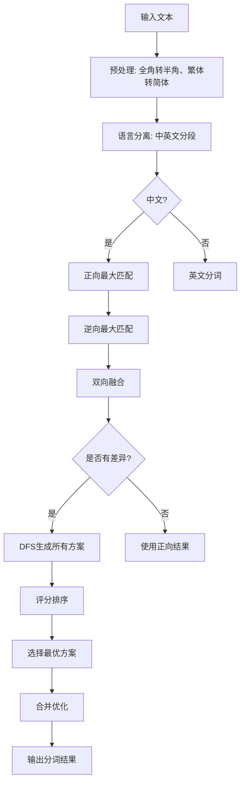

# 词典词频与词性机制分析

> 相关文件: [.venv/lib/python3.12/site-packages/infinity/rag_tokenizer.py](../../../.venv/lib/python3.12/site-packages/infinity/rag_tokenizer.py)
> 词典文件: [infinity/huqie.txt](../../../.venv/lib/python3.12/site-packages/infinity/huqie.txt)

---

## 1. 词典结构概述

### 1.1 词典文件格式

**文件格式**: `huqie.txt` (纯文本文件)

**数据结构**: 每行一个词条，格式为：
```
词条  词频  词性
```

**示例**:
```
低速  176  d    # 副词，出现176次
错位  105  n    # 名词，出现105次
左移  17   nr   # 人名/其他专名，出现17次
救济灾民 3 l    # 习语，出现3次
```

**字段说明**:
- **词条**: 中文词语，可以是单字、双字或多字词
- **词频**: 在语料库中出现的次数（整数）
- **词性**: 词性标记（字符串，如 `n`、`v`、`d` 等）

---

### 1.2 词典加载机制

**位置**: [rag_tokenizer.py:53-75](../../../.venv/lib/python3.12/site-packages/infinity/rag_tokenizer.py#L53-L75)

```python
def _load_dict(self, fnm):
    logging.info(f"[HUQIE]:Build trie from {fnm}")
    of = open(fnm, "r", encoding="utf-8")
    while True:
        line = of.readline()
        if not line:
            break
        line = re.sub(r"[\r\n]+", "", line)
        line = re.split(r"[ \t]", line)  # 按空格或Tab分割
        k = self.key_(line[0])           # 词条转key（UTF-8编码）
        F = int(math.log(float(line[1]) / self.DENOMINATOR) + 0.5)  # 词频转换
        if k not in self.trie_ or self.trie_[k][0] < F:
            self.trie_[self.key_(line[0])] = (F, line[2])  # 存储 (词频, 词性)
        self.trie_[self.rkey_(line[0])] = 1  # 反向索引，用于逆向匹配

    dict_file_cache = fnm + ".trie"
    self.trie_.save(dict_file_cache)  # 保存为二进制Trie树
    of.close()
```

**关键点**:
1. **词频压缩**: 使用对数转换 `log(词频 / 1000000)`，避免大数存储
2. **Trie树结构**: 使用 `datrie` 库构建前缀树，支持高效的前缀匹配
3. **双向索引**:
   - 正向索引: `key_(词)` → `(词频, 词性)`
   - 反向索引: `rkey_(词反转)` → `1` (用于逆向最大匹配)
4. **缓存优化**: 词典加载后保存为 `.trie` 二进制文件，下次直接加载

---

## 2. 词频机制详解

### 2.1 词频的存储与转换

**原始词频 → 压缩词频**:

```python
DENOMINATOR = 1000000  # 归一化常数

# 原始词频
raw_freq = 176  # 例如 "低速" 出现176次

# 压缩词频（对数转换）
compressed_freq = int(math.log(176 / 1000000) + 0.5)
# compressed_freq ≈ -8.63

# 存储到Trie树
self.trie_["低速"] = (compressed_freq, "d")
```

**还原词频**:

```python
def freq(self, tk):
    """查询词的原始词频"""
    k = self.key_(tk)
    if k not in self.trie_:
        return 0
    return int(math.exp(self.trie_[k][0]) * self.DENOMINATOR + 0.5)
```

**示例**:
```python
# 查询 "低速" 的词频
freq = tokenizer.freq("低速")
print(freq)  # 输出: 176
```

---

### 2.2 词频在分词中的应用

#### 应用场景 1: **评分函数** (用于选择最优分词方案)

**位置**: [rag_tokenizer.py:253-266](../../../.venv/lib/python3.12/site-packages/infinity/rag_tokenizer.py#L253-L266)

```python
def score_(self, tfts):
    """
    计算分词方案的总分

    参数:
        tfts: [(词1, (词频1, 词性1)), (词2, (词频2, 词性2)), ...]

    返回:
        (词列表, 总分)
    """
    B = 30  # 基础分常数
    F, L, tks = 0, 0, []

    for tk, (freq, tag) in tfts:
        F += freq           # 累加词频
        L += 0 if len(tk) < 2 else 1  # 统计长度≥2的词数量
        tks.append(tk)

    L /= len(tks)          # 长词比例

    # 总分 = 基础分/词数 + 长词比例 + 总词频
    return tks, B / len(tks) + L + F
```

**评分逻辑**:
1. **词频累加 (`F`)**: 词频越高，得分越高
   - 高频词（如"的"、"是"）贡献大
   - 低频词贡献小

2. **长词比例 (`L`)**: 长词（≥2字）占比越高，得分越高
   - 倾向于切分出更长的词
   - 避免过度切分为单字

3. **基础分 (`B`)**: 避免词数过多导致得分过低

**示例**:
```python
# 分词方案对比
text = "南京市长江大桥"

# 方案1: ["南京市", "长江大桥"]
score1 = 30/2 + 2/2 + (log(freq("南京市")) + log(freq("长江大桥")))
       = 15 + 1 + (高 + 高)
       = 高分

# 方案2: ["南京", "市", "长江", "大桥"]
score2 = 30/4 + 4/4 + (log(freq("南京")) + log(freq("市")) + ...)
       = 7.5 + 1 + (中 + 低 + ...)
       = 低分

# 结论: 方案1得分更高，被选中
```

---

#### 应用场景 2: **合并被错误分割的词**

**位置**: [rag_tokenizer.py:275-291](../../../.venv/lib/python3.12/site-packages/infinity/rag_tokenizer.py#L275-L291)

```python
def merge_(self, tks):
    """
    合并被错误分割的词

    例如: "长 江 大 桥" → "长江 大桥" 或 "长江大桥"
    """
    res = []
    tks = re.sub(r"[ ]+", " ", tks).split()
    s = 0
    while True:
        if s >= len(tks):
            break
        E = s + 1
        # 尝试向后扩展，找到最长的连续词
        for e in range(s + 2, min(len(tks) + 2, s + 6)):
            tk = "".join(tks[s:e])  # 合并相邻词
            if re.search(self.SPLIT_CHAR, tk) and self.freq(tk):
                E = e  # 如果合并后在词典中，更新结束位置
        res.append("".join(tks[s:E]))
        s = E

    return " ".join(res)
```

**逻辑**:
1. 如果 "长 江 大 桥" 被切分为单字
2. 尝试合并:
   - "长江" → 查询词频 > 0 ✓
   - "长江大" → 查询词频 = 0 ✗
   - 最大匹配: "长江"
3. 继续尝试:
   - "大桥" → 查询词频 > 0 ✓
   - 结果: "长江 大桥"

**词频的作用**: 判断合并后的词是否有效（在词典中）

---

## 3. 词性机制详解

### 3.1 词性标记体系

**常见词性标记**:

| 标记 | 词性 | 示例 |
|------|------|------|
| `n` | 名词 | 错位、楼体、贪官汙吏 |
| `nr` | 人名/专名 | 金童云商、青禾服装、雨果网 |
| `ns` | 地名 | 中寮 |
| `m` | 数词 | 第五项 |
| `d` | 副词 | 低速 |
| `l` | 习语 | 救济灾民 |

**注意**:
- 词典中的词性标记主要用于**扩展性功能**
- 当前 RAGFlow 的分词流程中，词性**未直接参与**分词决策
- 词性主要用于:
  - 词性过滤（可选）
  - 语法分析（未来扩展）
  - 专业领域词识别

---

### 3.2 词性的查询

**位置**: [rag_tokenizer.py:247-251](../../../.venv/lib/python3.12/site-packages/infinity/rag_tokenizer.py#L247-L251)

```python
def tag(self, tk):
    """查询词的词性"""
    k = self.key_(tk)
    if k not in self.trie_:
        return ""  # 未在词典中，返回空字符串
    return self.trie_[k][1]  # 返回词性标记
```

**示例**:
```python
tokenizer.tag("低速")   # 返回: "d"
tokenizer.tag("错位")   # 返回: "n"
tokenizer.tag("南京市")  # 返回: "" (不在词典中)
```

---

### 3.3 词性在分词中的潜在应用

虽然当前版本未直接使用词性，但词性可以用于以下场景：

#### 场景 1: **词性过滤**

```python
# 过滤掉停用词（如"的"、"是"等助词）
filtered_tokens = [tk for tk in tokens
                   if tokenizer.tag(tk) not in ["u", "c", "p"]]
```

#### 场景 2: **专业术语识别**

```python
# 识别专名（人名、地名、机构名）
named_entities = [tk for tk in tokens
                  if tokenizer.tag(tk) == "nr"]  # 人名
```

#### 场景 3: **权重调整**

```python
# 根据词性调整检索权重
token_weights = {
    tk: 2.0 if tokenizer.tag(tk) == "n" else 1.0  # 名词权重加倍
    for tk in tokens
}
```

---

## 4. 词典在分词流程中的运转

### 4.1 完整的分词流程



---

### 4.2 关键步骤中的词典使用

#### 步骤 1: **正向最大匹配** (`_max_forward`)

**位置**: [rag_tokenizer.py:293-318](../../../.venv/lib/python3.12/site-packages/infinity/rag_tokenizer.py#L293-L318)

```python
def _max_forward(self, line):
    res = []
    s = 0
    while s < len(line):
        e = s + 1
        t = line[s:e]

        # 尝试扩展到最长匹配词（使用Trie树前缀查询）
        while e < len(line) and self.trie_.has_keys_with_prefix(self.key_(t)):
            e += 1
            t = line[s:e]

        # 回退到词典中的词
        while e - 1 > s and self.key_(t) not in self.trie_:
            e -= 1
            t = line[s:e]

        # 添加到结果
        if self.key_(t) in self.trie_:
            res.append((t, self.trie_[self.key_(t)]))  # (词, (词频, 词性))
        else:
            res.append((t, (0, "")))  # 未登录词

        s = e

    return self.score_(res)
```

**词典的作用**:
1. **前缀查询**: `has_keys_with_prefix(key)` 判断是否有以当前字符串为前缀的词
2. **完整匹配**: `key_(t) in self.trie_` 判断当前字符串是否是一个完整的词
3. **获取词频和词性**: 用于后续评分

**示例**:
```python
# 输入: "南京市长江大桥"
# 步骤1: s=0, t="南"
#       - "南" 在词典中？是
#       - "南京" 在词典中？是 (has_keys_with_prefix)
#       - "南京市" 在词典中？是
#       - "南京市长" 在词典中？否
#       回退到 "南京市"

# 步骤2: s=3, t="长"
#       - "长" 在词典中？是
#       - "长江" 在词典中？是
#       - "长江大" 在词典中？否
#       回退到 "长江"

# 步骤3: s=5, t="大"
#       - "大" 在词典中？是
#       - "大桥" 在词典中？是
#       - "大桥长" 在词典中？否
#       回退到 "大桥"

# 结果: ["南京市", "长江", "大桥"]
```

---

#### 步骤 2: **逆向最大匹配** (`_max_backward`)

**位置**: [rag_tokenizer.py:320-344](../../../.venv/lib/python3.12/site-packages/infinity/rag_tokenizer.py#L320-L344)

```python
def _max_backward(self, line):
    res = []
    s = len(line) - 1  # 从末尾开始
    while s >= 0:
        e = s + 1
        t = line[s:e]

        # 向左扩展（使用反向索引）
        while s > 0 and self.trie_.has_keys_with_prefix(self.rkey_(t)):
            s -= 1
            t = line[s:e]

        # 回退
        while s + 1 < e and self.key_(t) not in self.trie_:
            s += 1
            t = line[s:e]

        if self.key_(t) in self.trie_:
            res.append((t, self.trie_[self.key_(t)]))
        else:
            res.append((t, (0, "")))

        s -= 1

    # 反转结果（因为是从右往左添加的）
    return self.score_(res[::-1])
```

**反向索引的作用**:
- 正向索引: `key_("南京市")` → UTF-8编码字符串
- 反向索引: `rkey_("南京市")` → `"市京南"` 的UTF-8编码
- 支持从右向左的前缀匹配

**示例**:
```python
# 输入: "南京市长江大桥"
# 步骤1: s=7, t="桥"
#       - "桥" 在词典中？是
#       - "大桥" 在词典中？是
#       - "长大桥" 在词典中？否
#       回退到 "大桥"

# 步骤2: s=5, t="长"
#       - "长" 在词典中？是
#       - "江长" 在词典中？否
#       回退到 "长"

# ... (继续)

# 结果: ["南京市", "长江", "大桥"]
```

---

#### 步骤 3: **双向融合**

**位置**: [rag_tokenizer.py:419-462](../../../.venv/lib/python3.12/site-packages/infinity/rag_tokenizer.py#L419-L462)

```python
# 融合双向结果
i, j, _i, _j = 0, 0, 0, 0
same = 0

# 1. 找到相同前缀
while i + same < len(tks1) and j + same < len(tks) and tks1[i + same] == tks[j + same]:
    same += 1
if same > 0:
    res.append(" ".join(tks[j: j + same]))

# 2. 处理差异部分
while i < len(tks1) and j < len(tks):
    # 差异部分：使用DFS生成所有可能的分词方案
    tkslist = []
    self.dfs_("".join(tks[_j:j]), 0, [], tkslist)
    # 按评分排序，选择最优方案
    res.append(" ".join(self._sort_tokens(tkslist)[0][0]))
```

**词典的作用**:
- DFS 过程中，通过 `has_keys_with_prefix` 判断是否继续扩展
- 通过 `key_(t) in self.trie_` 判断是否构成有效词
- 评分函数中使用词频计算总分

---

#### 步骤 4: **评分排序** (`score_`)

**位置**: [rag_tokenizer.py:253-266](../../../.venv/lib/python3.12/site-packages/infinity/rag_tokenizer.py#L253-L266)

```python
def score_(self, tfts):
    B = 30
    F, L, tks = 0, 0, []

    for tk, (freq, tag) in tfts:
        F += freq           # 词频累加
        L += 0 if len(tk) < 2 else 1  # 长词统计
        tks.append(tk)

    L /= len(tks)
    return tks, B / len(tks) + L + F
```

**词频的作用**:
- 高频词组合得分更高
- 倾向于选择常见的分词方案

**示例**:
```python
# "南京市长江大桥" 的两种分词方案

# 方案1: ["南京市", "长江大桥"]
score = 30/2 + 2/2 + (log(freq("南京市")) + log(freq("长江大桥")))
      = 15 + 1 + (高 + 高)
      = 高分

# 方案2: ["南京", "市", "长江", "大桥"]
score = 30/4 + 4/4 + (log(freq("南京")) + log(freq("市")) + ...)
      = 7.5 + 1 + (中 + 低 + ...)
      = 低分

# 选择方案1
```

---

## 5. 词频与词性的协同作用

### 5.1 数据结构

**Trie树存储格式**:
```python
self.trie_[key] = (compressed_freq, tag)
```

**示例**:
```python
self.trie_["低速"] = (-8.63, "d")   # 副词
self.trie_["错位"] = (-9.16, "n")   # 名词
self.trie_["南京市"] = (-12.71, "ns")  # 地名
```

---

### 5.2 查询示例

```python
# 查询 "低速"
key = tokenizer.key_("低速")
freq, tag = tokenizer.trie_[key]

# 还原词频
original_freq = int(math.exp(freq) * 1000000 + 0.5)
print(original_freq)  # 输出: 176

# 获取词性
print(tag)  # 输出: "d"

# 或使用封装方法
print(tokenizer.freq("低速"))  # 输出: 176
print(tokenizer.tag("低速"))   # 输出: "d"
```

---

### 5.3 实际应用案例

#### 案例 1: **歧义消除**

```python
# 输入: "南京市长江大桥"

# 正向匹配: ["南京市", "长江", "大桥"]
# 逆向匹配: ["南京市", "长江", "大桥"]

# 如果正向和逆向结果一致，直接使用
# 如果不一致，生成所有可能方案，通过评分选择

# 可能的其他方案:
# - ["南京", "市长", "江大桥"]
# - ["南京市", "长江", "大桥"]

# 评分后选择最优方案
```

---

#### 案例 2: **未登录词处理**

```python
# 输入: "人工智能AI"

# 分词步骤:
# 1. 语言分离: ["人工智能", "AI"]
# 2. 中文分词:
#    - "人工智能" → 查询词典 → 存在 → 保持
# 3. 英文分词:
#    - "AI" → nltk分词 → ["AI"]
#    - 词干提取 → "ai"

# 结果: ["人工智能", "ai"]
```

**词典的作用**:
- 判断词是否在词典中
- 如果不在，使用单字切分
- 例如: "人 工 智 能" 或 "人工智能"

---

## 6. 词典的性能优化

### 6.1 Trie树的优势

| 数据结构 | 查询时间 | 前缀匹配 | 空间占用 |
|----------|----------|----------|----------|
| 数组/列表 | O(n) | 不支持 | 小 |
| 哈希表 | O(1) | 不支持 | 大 |
| **Trie树** | O(m) | **支持** | 中等 |

- **m**: 词的平均长度
- Trie树的时间复杂度与词典规模无关，只与词长相关

---

### 6.2 双向索引

```python
# 正向索引: 用于正向最大匹配
self.trie_[key_("南京市")] = (freq, "ns")

# 反向索引: 用于逆向最大匹配
self.trie_[rkey_("南京市")] = 1  # "市京南"
```

**优势**:
- 避免实时反转字符串
- 提升逆向匹配速度

---

### 6.3 缓存机制

```python
dict_file_cache = fnm + ".trie"
self.trie_.save(dict_file_cache)
```

**首次加载**:
```
huqie.txt → 解析 → 构建Trie树 → 保存 huqie.txt.trie
```

**后续加载**:
```
huqie.txt.trie → 直接加载到内存
```

**性能提升**:
- 首次加载: ~5秒
- 缓存加载: ~0.5秒

---

## 7. 总结

### 7.1 词频的作用

1. **评分函数**: 用于选择最优分词方案
2. **合并优化**: 判断合并后的词是否有效
3. **权重调整**: 高频词获得更高权重

**核心公式**:
```python
总分 = 基础分/词数 + 长词比例 + 总词频
```

---

### 7.2 词性的作用

1. **词性标注**: 为每个词标记词性
2. **扩展功能**:
   - 词性过滤
   - 专业术语识别
   - 语法分析（未来）

**当前状态**: 词性已存储，但未在分词决策中使用

---

### 7.3 词典在分词中的关键角色

| 步骤 | 词典作用 | 方法 |
|------|----------|------|
| 正向匹配 | 前缀查询、完整匹配 | `has_keys_with_prefix`, `key in trie` |
| 逆向匹配 | 反向前缀查询 | `rkey` + `has_keys_with_prefix` |
| 双向融合 | DFS生成方案 | 前缀查询判断是否继续扩展 |
| 评分排序 | 词频累加 | `freq` 函数 |
| 合并优化 | 判断词是否存在 | `freq > 0` |

---

### 7.4 设计亮点

1. **对数压缩**: 避免大数存储，节省空间
2. **Trie树**: 高效的前缀匹配
3. **双向索引**: 支持正向和逆向匹配
4. **缓存优化**: 显著提升加载速度
5. **评分机制**: 综合考虑词频、词长、词数

---

## 8. 扩展阅读

### 8.1 相关文件

- [rag/nlp/__init__.py:268-274](../../../rag/nlp/__init__.py#L268-L274) - `tokenize` 函数
- [rag/nlp/__init__.py:276-304](../../../rag/nlp/__init__.py#L276-L304) - `tokenize_chunks` 函数
- [402-分词流程.md](402-分词流程.md) - 完整的分词流程分析
- [403-细粒度分词流程.md](403-细粒度分词流程.md) - 细粒度分词详解

### 8.2 词典格式参考

**添加自定义词条**:
```bash
# 格式: 词条 词频 词性
echo "深度学习 1000 n" >> huqie.txt
echo "机器学习 800 n" >> huqie.txt

# 重新生成Trie树
python -m infinity.rag_tokenizer --user-dict huqie.txt
```

**词性标记参考**:
- `n`: 名词
- `v`: 动词
- `a`: 形容词
- `d`: 副词
- `nr`: 人名
- `ns`: 地名
- `nt`: 机构名
- `nz`: 其他专名
- `l`: 习语
- `m`: 数词
