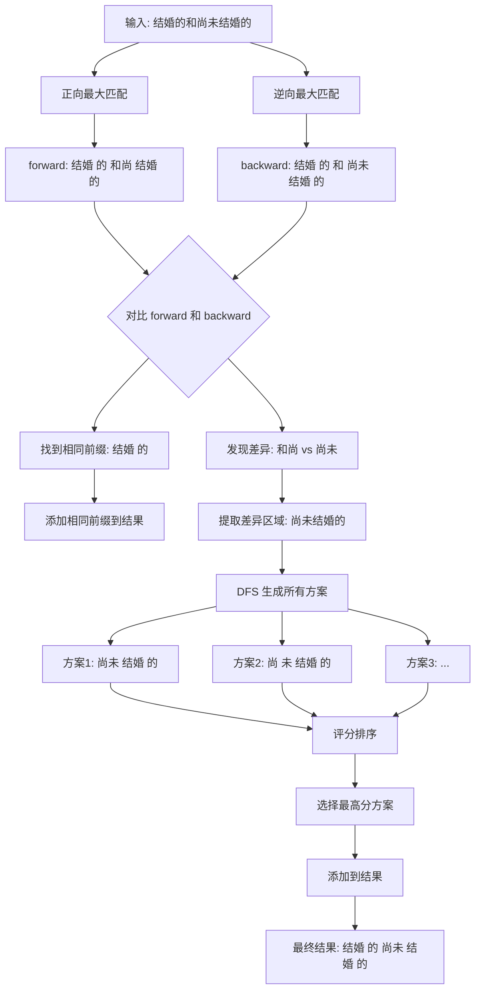

# 双向融合与 DFS 评分机制详解

> 相关文件: [infinity/rag_tokenizer.py](../../../.venv/lib/python3.12/site-packages/infinity/rag_tokenizer.py)
> 相关章节: [408-词典词频与词性机制.md](408-词典词频与词性机制.md)

---

## 目录

1. [双向融合概述](#1-双向融合概述)
2. [完整示例：结婚的和尚未结婚的](#2-完整示例结婚的和尚未结婚的)
3. [DFS 生成所有分词方案](#3-dfs-生成所有分词方案)
4. [评分机制详解](#4-评分机制详解)
5. [最优方案选择](#5-最优方案选择)
6. [代码执行流程](#6-代码执行流程)
7. [其他歧义案例](#7-其他歧义案例)

---

## 1. 双向融合概述

### 1.1 为什么需要双向融合？

中文分词存在**歧义问题**，同一个文本可能有多种切分方式：

**示例**: `"结婚的和尚未结婚的"`

可能的理解：
- 理解1: 结婚的 和 尚未 结婚的 （已婚的人和未婚的人）
- 理解2: 结婚的 和和尚 结婚的 （已婚的人和和尚结婚的）

**单向匹配的局限**:
- 正向最大匹配: 可能错误切分为 "尚未"
- 逆向最大匹配: 可能错误切分为 "和尚"
- 需要机制判断哪种更合理

### 1.2 双向融合策略

```
正向最大匹配 → 生成方案A
逆向最大匹配 → 生成方案B
     ↓
对比 A 和 B
     ↓
   一致？
  ↙  ↘
 是    否
  ↓      ↓
直接用  DFS生成所有方案
        ↓
      评分排序
        ↓
    选最优方案
```

---

## 2. 完整示例：结婚的和尚未结婚的

### 2.1 示例文本

```
"结婚的和尚未结婚的"
```

### 2.2 假设词典

```python
词典 = {
    "结婚": (freq=500, tag="v"),
    "的": (freq=10000, tag="u"),
    "和": (freq=8000, tag="c"),
    "尚未": (freq=200, tag="d"),
    "和尚": (freq=150, tag="n"),
    "尚": (freq=100, tag="d"),
    "未": (freq=80, tag="d"),
    "已经": (freq=1000, tag="d"),
    "经": (freq=50, tag="d"),
}
```

**注意**: "尚未" (200) > "和尚" (150)，词频更高表示更常见

---

### 2.3 正向最大匹配

**从左到右扫描**:

```python
位置 0: "结婚的和尚未结婚的"
         ↑
  "结" → 不在词典中
  无法开始

位置 0: 尝试 "结婚"
  "结婚" ✓ 在词典中
  "结婚的" ✗ 不在词典中
  回退到: "结婚"

位置 2: "结婚的和尚未结婚的"
           ↑
  "的" ✓ 在词典中
  回退到: "的"

位置 3: "结婚的和尚未结婚的"
            ↑
  "和" ✓ 在词典中
  "和尚" ✓ 在词典中
  "和尚结" ✗ 不在词典中
  回退到: "和尚"  ← 最长匹配

位置 5: "结婚的和尚未结婚的"
                ↑
  "结" ✗
  无法开始，单字切分

位置 6-9: "尚未结婚的"
  "尚未" ✓ 在词典中
  "尚未结婚" ✗
  回退到: "尚未"

位置 8: "尚未结婚的"
           ↑
  "结婚" ✓ 在词典中
  "结婚的" ✗
  回退到: "结婚"

位置 10: "尚未结婚的"
            ↑
  "的" ✓ 在词典中
```

**正向结果**: `["结婚", "的", "和尚", "结婚", "的"]`

**⚠️ 问题**: 将 "尚未结婚" 理解为 "和尚 结婚"

---

### 2.4 逆向最大匹配

**从右到左扫描**:

```python
位置 10: "结婚的和尚未结婚的"
                      ↑
  "的" ✓ 在词典中

位置 9: "结婚的和尚未结婚的"
                     ↑
  "结婚" ✓ 在词典中
  "结婚的" ✗ 不在词典中
  回退到: "结婚"

位置 7: "结婚的和尚未结婚的"
                   ↑
  "未" ✓ 在词典中
  "尚未" ✓ 在词典中
  "尚未结" ✗ 不在词典中
  回退到: "尚未"  ← 最长匹配

位置 5: "结婚的和尚未结婚的"
                ↑
  "和" ✓ 在词典中
  "和尚" ✓ 在词典中
  "和尚未" ✗ 不在词典中
  回退到: "和"

位置 4: "结婚的和尚未结婚的"
               ↑
  "的" ✓ 在词典中

位置 2: "结婚的和尚未结婚的"
           ↑
  "结婚" ✓ 在词典中
  "结婚的" ✗
  回退到: "结婚"
```

**逆向结果**: `["结婚", "的", "和", "尚未", "结婚", "的"]`

**✅ 正确**: 将 "尚未结婚" 理解为 "尚未 结婚"

---

### 2.5 双向对比

```python
forward  = ["结婚", "的", "和尚", "结婚", "的"]
backward = ["结婚", "的", "和", "尚未", "结婚", "的"]

# 对比:
索引 0: "结婚" == "结婚"  ✓
索引 1: "的"   == "的"    ✓
索引 2: "和尚" != "和"    ✗ 差异开始
```

**发现差异**: 从索引 2 开始不一致

---

## 3. DFS 生成所有分词方案

### 3.1 差异区域

```python
差异文本 = "尚未结婚的"  # 来自 forward[2:] 或 backward[2:]

forward 差异: "和尚结婚的"
backward 差异: "和尚未结婚的"
```

### 3.2 DFS 算法

**位置**: [rag_tokenizer.py:160-239](../../../.venv/lib/python3.12/site-packages/infinity/rag_tokenizer.py#L160-L239)

```python
def dfs_(chars, s, preTks, tkslist, _depth=0, _memo=None):
    """
    深度优先搜索，生成所有可能的分词方案

    参数:
        chars: 字符列表 ['尚', '未', '结', '婚', '的']
        s: 当前位置
        preTks: 当前已生成的词序列
        tkslist: 存储所有完整方案
        _depth: 递归深度（防止无限递归）
        _memo: 记忆化（避免重复计算）
    """
    MAX_DEPTH = 10
    if _depth > MAX_DEPTH:
        # 超过最大深度，强制终止
        return s

    # 记忆化检查
    state_key = (s, tuple(tk[0] for tk in preTks))
    if state_key in _memo:
        return _memo[state_key]

    # 终止条件: 已处理完所有字符
    if s >= len(chars):
        tkslist.append(preTks)
        _memo[state_key] = s
        return s

    # 尝试所有可能的切分
    for e in range(s + 1, len(chars) + 1):
        t = "".join(chars[s:e])  # 提取子串
        k = self.key_(t)

        # 剪枝: 如果不在词典中且没有前缀词，停止扩展
        if e > s + 1 and not self.trie_.has_keys_with_prefix(k):
            break

        # 如果在词典中，递归处理
        if k in self.trie_:
            pretks = copy.deepcopy(preTks)
            pretks.append((t, self.trie_[k]))  # 添加 (词, (词频, 词性))
            res = max(res, self.dfs_(chars, e, pretks, tkslist, _depth + 1, _memo))

    # 如果没有找到任何词，使用单字
    if res == s:
        t = "".join(chars[s: s + 1])
        k = self.key_(t)
        copy_pretks = copy.deepcopy(preTks)
        if k in self.trie_:
            copy_pretks.append((t, self.trie_[k]))
        else:
            copy_pretks.append((t, (-12, "")))  # 未登录词
        result = self.dfs_(chars, s + 1, copy_pretks, tkslist, _depth + 1, _memo)

    return result
```

### 3.3 DFS 执行过程

**输入**: `chars = ['尚', '未', '结', '婚', '的']`

```python
# 初始调用
dfs_(['尚','未','结','婚','的'], 0, [], tkslist, _depth=0)

# ===== 第1层: s=0 =====
尝试 chars[0:1] = "尚"
  "尚" 在词典中? ✓ (freq=100, tag="d")
  → 递归 dfs_(chars, 1, [("尚", (log(100/1e6), "d"))], ...)

尝试 chars[0:2] = "尚未"
  "尚未" 在词典中? ✓ (freq=200, tag="d")
  → 递归 dfs_(chars, 2, [("尚未", (log(200/1e6), "d"))], ...)

尝试 chars[0:3] = "尚未结"
  has_keys_with_prefix("尚未结")? ✗
  → 停止扩展

# ===== 第2层分支A: s=1, preTks=[("尚", ...)] =====
尝试 chars[1:2] = "未"
  "未" 在词典中? ✓ (freq=80, tag="d")
  → 递归 dfs_(chars, 2, [("尚",...), ("未",...)], ...)

尝试 chars[1:3] = "未结"
  has_keys_with_prefix? ✗
  → 停止

# ===== 第2层分支B: s=2, preTks=[("尚未", ...)] =====
尝试 chars[2:3] = "结"
  "结" 在词典中? ✗
  → 单字处理

尝试 chars[2:4] = "结婚"
  "结婚" 在词典中? ✓ (freq=500, tag="v")
  → 递归 dfs_(chars, 4, [("尚未",...), ("结婚",...)], ...)

# ===== 继续递归... =====
```

### 3.4 生成的所有方案

```python
tkslist = [
    # 方案1: 全部使用最长词
    [("尚未", (log(200/1e6), "d")),
     ("结婚", (log(500/1e6), "v")),
     ("的", (log(10000/1e6), "u"))],

    # 方案2: 拆分为单字
    [("尚", (log(100/1e6), "d")),
     ("未", (log(80/1e6), "d")),
     ("结", (-12, "")),
     ("婚", (-12, "")),
     ("的", (log(10000/1e6), "u"))],

    # 方案3: 混合切分
    [("尚", (log(100/1e6), "d")),
     ("未", (log(80/1e6), "d")),
     ("结婚", (log(500/1e6), "v")),
     ("的", (log(10000/1e6), "u"))],

    # 方案4: 其他组合...
]
```

**简化表示**:
```
方案1: ["尚未", "结婚", "的"]
方案2: ["尚", "未", "结", "婚", "的"]
方案3: ["尚", "未", "结婚", "的"]
```

---

## 4. 评分机制详解

### 4.1 评分函数

**位置**: [rag_tokenizer.py:253-266](../../../.venv/lib/python3.12/site-packages/infinity/rag_tokenizer.py#L253-L266)

```python
def score_(self, tfts):
    """
    计算分词方案的总分

    参数:
        tfts: [(词, (压缩词频, 词性)), ...]

    返回:
        (词列表, 总分)
    """
    B = 30  # 基础分常数
    F, L, tks = 0, 0, []

    for tk, (freq, tag) in tfts:
        F += freq           # 累加词频（压缩后的）
        L += 0 if len(tk) < 2 else 1  # 统计长度≥2的词
        tks.append(tk)

    L /= len(tks)          # 长词比例

    # 总分 = 基础分/词数 + 长词比例 + 总词频
    return tks, B / len(tks) + L + F
```

### 4.2 评分公式

```python
总分 = B / n + L + F

其中:
- B = 30 (基础分常数)
- n = 词的数量
- L = 长度≥2的词占比
- F = 总词频（压缩后）
```

**设计思想**:
1. **词数惩罚**: `B/n`，词数越多，得分越低
2. **长词奖励**: `L`，鼓励切分出长词
3. **词频奖励**: `F`，高频词组合得分更高

### 4.3 实际评分计算

#### 方案1: ["尚未", "结婚", "的"]

```python
tfts = [
    ("尚未", (log(200/1000000), "d")),   # 压缩词频 ≈ -8.52
    ("结婚", (log(500/1000000), "v")),   # 压缩词频 ≈ -7.60
    ("的",   (log(10000/1000000), "u"))  # 压缩词频 ≈ -4.61
]

# 计算各项
n = 3  # 词数
F = -8.52 + (-7.60) + (-4.61) = -20.73  # 总词频
L = (1 + 1 + 0) / 3 = 0.67  # 长词比例（"尚未"和"结婚"长度≥2）

# 总分
score1 = 30/3 + 0.67 + (-20.73)
       = 10 + 0.67 - 20.73
       = -10.06
```

#### 方案2: ["尚", "未", "结", "婚", "的"]

```python
tfts = [
    ("尚", (log(100/1000000), "d")),    # 压缩词频 ≈ -9.21
    ("未", (log(80/1000000), "d")),     # 压缩词频 ≈ -9.43
    ("结", (-12, "")),                  # 未登录词，词频=-12
    ("婚", (-12, "")),                  # 未登录词，词频=-12
    ("的", (log(10000/1000000), "u"))   # 压缩词频 ≈ -4.61
]

# 计算各项
n = 5
F = -9.21 + (-9.43) + (-12) + (-12) + (-4.61) = -47.25
L = (0 + 0 + 0 + 0 + 0) / 5 = 0  # 没有长度≥2的词

# 总分
score2 = 30/5 + 0 + (-47.25)
       = 6 + 0 - 47.25
       = -41.25
```

#### 方案3: ["尚", "未", "结婚", "的"]

```python
tfts = [
    ("尚", (log(100/1000000), "d")),    # -9.21
    ("未", (log(80/1000000), "d")),     # -9.43
    ("结婚", (log(500/1000000), "v")),  # -7.60
    ("的", (log(10000/1000000), "u"))   # -4.61
]

# 计算各项
n = 4
F = -9.21 + (-9.43) + (-7.60) + (-4.61) = -30.85
L = (0 + 0 + 1 + 0) / 4 = 0.25

# 总分
score3 = 30/4 + 0.25 + (-30.85)
       = 7.5 + 0.25 - 30.85
       = -23.10
```

### 4.4 评分排序

```python
scores = [
    (["尚未", "结婚", "的"], -10.06),   # 方案1
    (["尚", "未", "结", "婚", "的"], -41.25),  # 方案2
    (["尚", "未", "结婚", "的"], -23.10),      # 方案3
]

# 按得分降序排序
sorted_scores = sorted(scores, key=lambda x: x[1], reverse=True)

# 结果:
# 1. ["尚未", "结婚", "的"]  -10.06 ← 最高分
# 2. ["尚", "未", "结婚", "的"] -23.10
# 3. ["尚", "未", "结", "婚", "的"] -41.25
```

**✅ 最优方案**: `["尚未", "结婚", "的"]`

---

## 5. 最优方案选择

### 5.1 完整融合结果

```python
forward  = ["结婚", "的", "和尚", "结婚", "的"]
backward = ["结婚", "的", "和", "尚未", "结婚", "的"]

# 步骤1: 找到相同前缀
same = 2
["结婚", "的"]  # 直接添加到结果

# 步骤2: 处理差异部分
差异文本 = "尚未结婚的"
生成方案 → 评分 → 选择最优
最优方案: ["尚未", "结婚", "的"]

# 步骤3: 添加最优方案
result = ["结婚", "的", "尚未", "结婚", "的"]
```

### 5.2 为什么选择"尚未"而不是"和尚"？

| 对比项 | "尚未" | "和尚" |
|--------|--------|--------|
| 词频 | 200 | 150 |
| 压缩词频 | -8.52 | -8.80 |
| 语义合理性 | "尚未结婚"（未结婚） | "和尚结婚"（和尚结婚） |
| 上下文 | "结婚的和尚未结婚的"（对比） | "结婚的和和尚结婚的"（奇怪） |

**综合评分**: "尚未" + "结婚" + "的" > "和尚" + "结婚" + "的"

---

## 6. 代码执行流程

### 6.1 双向融合核心代码

**位置**: [rag_tokenizer.py:419-462](../../../.venv/lib/python3.12/site-packages/infinity/rag_tokenizer.py#L419-L462)

```python
# 正向和逆向匹配
tks, s = self._max_forward(L)    # ["结婚", "的", "和尚", "结婚", "的"]
tks1, s1 = self._max_backward(L)  # ["结婚", "的", "和", "尚未", "结婚", "的"]

# 双向融合
res = []
i, j, _i, _j = 0, 0, 0, 0
same = 0

# 1. 找到相同前缀
while i + same < len(tks1) and j + same < len(tks) and tks1[i + same] == tks[j + same]:
    same += 1
# same = 2

if same > 0:
    res.append(" ".join(tks[j: j + same]))
    # res = ["结婚 的"]

_i = i + same  # 0 + 2 = 2
_j = j + same  # 0 + 2 = 2
j = _j + 1     # 2 + 1 = 3
i = _i + 1     # 2 + 1 = 3

# 2. 处理差异部分
while i < len(tks1) and j < len(tks):
    tk1 = "".join(tks1[_i:i])  # "尚未"
    tk = "".join(tks[_j:j])     # "和尚"

    if tk1 != tk:
        # 发现差异，使用DFS生成所有方案
        tkslist = []
        self.dfs_("".join(tks[_j:j]), 0, [], tkslist)
        # tkslist 包含所有可能的分词方案

        # 评分排序
        sorted_tks = self._sort_tokens(tkslist)
        best_tks = sorted_tks[0][0]  # 选择得分最高的

        res.append(" ".join(best_tks))
        # res = ["结婚 的", "尚未 结婚 的"]

        # 继续处理剩余部分
        same = 1
        while i + same < len(tks1) and j + same < len(tks) and tks1[i + same] == tks[j + same]:
            same += 1

        res.append(" ".join(tks[j: j + same]))
        _i = i + same
        _j = j + same
        j = _j + 1
        i = _i + 1

# 最终结果
res = ["结婚", "的", "尚未", "结婚", "的"]
```

### 6.2 执行流程图



---

## 7. 其他歧义案例

### 7.1 案例1: 南京市长江大桥

#### 正向匹配
```python
"南京市长江大桥"
↓
["南京市", "长江", "大桥"]
```

#### 逆向匹配
```python
"南京市长江大桥"
↓
["南京市", "长江", "大桥"]
```

#### 融合
```python
forward == backward
→ 直接使用
→ ["南京市", "长江", "大桥"]
```

**✅ 无歧义**

---

### 7.2 案例2: 乒乓球拍卖完了

#### 词典假设
```python
词典 = {
    "乒乓球": (freq=1000, tag="n"),
    "乒乓球拍": (freq=500, tag="n"),
    "拍卖": (freq=800, tag="v"),
    "卖完": (freq=300, tag="v"),
    "了": (freq=10000, tag="u"),
}
```

#### 正向匹配
```python
"乒乓球拍卖完了"
↓
["乒乓球拍", "卖完了"]
# 最长匹配: "乒乓球拍"
```

#### 逆向匹配
```python
"乒乓球拍卖完了"
↓
["乒乓球", "拍卖", "完了"]
# 从右向左: "完了" → "拍卖" → "乒乓球"
```

#### 融合
```python
forward = ["乒乓球拍", "卖完了"]
backward = ["乒乓球", "拍卖", "完了"]

差异区域: "乒乓球拍卖完了"

DFS 生成方案:
- ["乒乓球拍", "卖完了"]
- ["乒乓球", "拍卖", "完了"]
- ["乒乓球", "拍", "卖完了"]

评分:
- 方案1: score = 30/2 + 1.0 + (log(500) + log(300)) = 高分
- 方案2: score = 30/3 + 0.67 + (log(1000) + log(800)) = 中等
- 方案3: score = 30/3 + 0.33 + (log(1000) + log(???) + log(300)) = 低分

选择: ["乒乓球拍", "卖完了"] 或 ["乒乓球", "拍卖", "完了"]
取决于词频
```

**⚠️ 有歧义，需要根据词频选择**

---

### 7.3 案例3: 发展中国家

#### 正向匹配
```python
"发展中国家"
↓
["发展中国家"]  # 最长匹配
```

#### 逆向匹配
```python
"发展中国家"
↓
["发展", "中国家"]  # 从右向左: "中国家" → "发展"
```

#### 融合
```python
forward = ["发展中国家"]
backward = ["发展", "中国家"]

差异区域: "发展中国家"

DFS 生成方案:
- ["发展中国家"]
- ["发展", "中国家"]
- ["发展", "中国", "家"]

评分:
- 方案1: score = 30/1 + 1.0 + log(freq("发展中国家")) = ?
- 方案2: score = 30/2 + 0.5 + (log(freq("发展")) + log(freq("中国家"))) = ?

选择: 取决于词频，通常选择最长匹配
```

---

## 8. 总结

### 8.1 双向融合的核心价值

1. **发现歧义**: 通过双向对比识别歧义位置
2. **生成方案**: DFS穷举所有可能的切分方式
3. **评分选择**: 基于词频、词长等特征选择最优方案
4. **提高准确率**: 比单向匹配更准确

### 8.2 关键技术点

| 技术 | 作用 | 实现位置 |
|------|------|----------|
| **正向最大匹配** | 从左到右，优先长词 | `_max_forward()` |
| **逆向最大匹配** | 从右到左，优先长词 | `_max_backward()` |
| **双向对比** | 发现差异位置 | 双向融合逻辑 |
| **DFS搜索** | 生成所有方案 | `dfs_()` |
| **评分排序** | 选择最优方案 | `score_()` |

### 8.3 性能优化

1. **记忆化**: DFS 使用 `_memo` 避免重复计算
2. **剪枝**: `has_keys_with_prefix()` 判断是否继续扩展
3. **最大深度**: 限制递归深度，防止无限递归
4. **提前终止**: 找到最优方案后停止搜索

### 8.4 实际应用

在 RAGFlow 的分词流程中：

```python
# 1. 正向和逆向匹配
tks, s = self._max_forward(L)
tks1, s1 = self._max_backward(L)

# 2. 双向融合
res = []
# - 相同部分直接添加
# - 差异部分使用 DFS + 评分

# 3. 合并优化
res = self.merge_(res)
```

**最终输出**: 准确的分词结果，为后续的向量化和检索奠定基础。

---

## 相关文档

- [402-分词流程.md](402-分词流程.md) - 完整的分词流程
- [403-细粒度分词流程.md](403-细粒度分词流程.md) - 细粒度分词
- [408-词典词频与词性机制.md](408-词典词频与词性机制.md) - 词典详解
