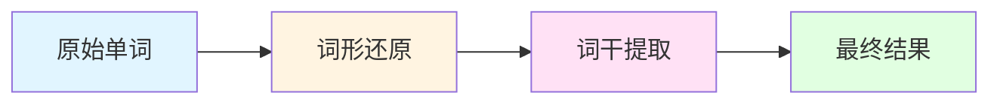

# 英文规范化的词干提取与词形还原协同工作机制

> 相关文件: [infinity/rag_tokenizer.py](../../../.venv/lib/python3.12/site-packages/infinity/rag_tokenizer.py)
> 关键方法: `english_normalize_()` (line 346-347)
> 相关方法: `tokenize()` (line 404), `fine_grained_tokenize()` (line 535)

---

## 目录

1. [核心概念](#1-核心概念)
2. [工具初始化](#2-工具初始化)
3. [协同工作机制](#3-协同工作机制)
4. [应用场景分析](#4-应用场景分析)
5. [实际示例演示](#5-实际示例演示)
6. [协同优势与作用](#6-协同优势与作用)
7. [与其他NLP库的对比](#7-与其他nlp库的对比)

---

## 1. 核心概念

### 1.1 什么是词形还原 (Lemmatization)？

**定义**: 将单词还原为其词典形式（lemma），即**真实的字典词**。

**特点**:
- 还原为合法的单词
- 基于词汇和词性分析
- 需要上下文信息（词性）

**示例**:
```
running  → run  (动词原形)
better   → good (形容词原形)
studies  → study (动词原形)
children → child (名词单数)
```

**工具**: NLTK WordNetLemmatizer
```python
from nltk.stem import WordNetLemmatizer
lemmatizer = WordNetLemmatizer()
```

---

### 1.2 什么是词干提取 (Stemming)？

**定义**: 去除单词的词缀，得到词干，**不一定是真实单词**。

**特点**:
- 速度快，基于规则
- 可能产生非字典词
- 不考虑词性

**示例**:
```
running  → run    (原形)
studies  → studi  (不是字典词！)
happiness → happi (不是字典词！)
cats     → cat    (原形)
```

**工具**: NLTK SnowballStemmer (English)
```python
from nltk.stem import SnowballStemmer
stemmer = SnowballStemmer("english")
```

---

### 1.3 为什么要组合使用？

| 特性 | 词形还原 | 词干提取 |
|------|----------|----------|
| **准确性** | 高（还原为真实词） | 低（可能产生伪词） |
| **速度** | 慢（需要词性分析） | 快（基于规则） |
| **归一化** | 完全归一化 | 不完全归一化 |
| **适用场景** | 精确检索 | 快速匹配 |

**协同策略**:
```
先词形还原 → 保证准确性
后词干提取 → 增强归一化
```

---

## 2. 工具初始化

### 2.1 初始化代码

**位置**: [rag_tokenizer.py:100-104](../../../.venv/lib/python3.12/site-packages/infinity/rag_tokenizer.py#L100-L104)

```python
def __init__(self, debug=False, user_dict=None):
    # ...

    # 词干提取器（可能不是真实单词）
    # running → run, studies → studi
    self.stemmer = SnowballStemmer("english")

    # 词形还原器（还原为字典词）
    # running → run, studies → study
    self.lemmatizer = WordNetLemmatizer()
```

**注释说明**:
> "一般先还原词形，再提取词干"

### 2.2 工作顺序



**为什么是这个顺序？**

1. **先词形还原**:
   - 将 `studies` 还原为 `study`
   - 保留了单词的完整形式

2. **后词干提取**:
   - 将 `study` 提取为 `studi`
   - 进一步归一化，增强匹配能力

---

## 3. 协同工作机制

### 3.1 核心函数

**位置**: [rag_tokenizer.py:346-347](../../../.venv/lib/python3.12/site-packages/infinity/rag_tokenizer.py#L346-L347)

```python
def english_normalize_(self, tks):
    """
    对英文token列表进行规范化处理

    处理流程:
    1. 遍历每个token
    2. 判断是否为纯英文（包含字母、连字符、下划线）
    3. 如果是英文: 先词形还原，后词干提取
    4. 如果不是: 保持原样

    参数:
        tks: token列表

    返回:
        规范化后的token列表
    """
    return [
        self.stemmer.stem(self.lemmatizer.lemmatize(t))
        if re.match(r"[a-zA-Z_-]+$", t)
        else t
        for t in tks
    ]
```

### 3.2 逐步执行

#### 输入示例
```python
tks = ["running", "studies", "AI", "机器学习", "123"]
```

#### 执行过程

```python
# Token 1: "running"
re.match(r"[a-zA-Z_-]+$", "running")  # ✓ 匹配成功
lemmatizer.lemmatize("running")        # → "run"
stemmer.stem("run")                    # → "run"
结果: "run"

# Token 2: "studies"
re.match(r"[a-zA-Z_-]+$", "studies")  # ✓ 匹配成功
lemmatizer.lemmatize("studies")       # → "study"
stemmer.stem("study")                  # → "studi"
结果: "studi"

# Token 3: "AI"
re.match(r"[a-zA-Z_-]+$", "AI")       # ✓ 匹配成功
lemmatizer.lemmatize("AI")             # → "AI" (大写缩写保持不变)
stemmer.stem("AI")                     # → "ai"
结果: "ai"

# Token 4: "机器学习"
re.match(r"[a-zA-Z_-]+$", "机器学习")  # ✗ 匹配失败
结果: "机器学习" (保持原样)

# Token 5: "123"
re.match(r"[a-zA-Z_-]+$", "123")       # ✗ 匹配失败
结果: "123" (保持原样)
```

#### 最终输出
```python
["run", "studi", "ai", "机器学习", "123"]
```

---

### 3.3 正则表达式解析

```python
r"[a-zA-Z_-]+$"
```

**含义**:
- `[a-zA-Z]`: 英文字母（大小写）
- `_`: 下划线
- `-`: 连字符
- `+`: 一次或多次
- `$`: 字符串结尾

**匹配示例**:
| 输入 | 匹配? | 原因 |
|------|-------|------|
| `"running"` | ✓ | 纯英文字母 |
| `"AI-based"` | ✓ | 英文 + 连字符 |
| `"word_count"` | ✓ | 英文 + 下划线 |
| `"机器学习"` | ✗ | 包含中文字符 |
| `"123"` | ✗ | 纯数字 |
| `"test123"` | ✗ | 包含数字 |
| `"hello world"` | ✗ | 包含空格（整个字符串不匹配） |

---

## 4. 应用场景分析

### 4.1 场景1: tokenize() 方法

**位置**: [rag_tokenizer.py:404](../../../.venv/lib/python3.12/site-packages/infinity/rag_tokenizer.py#L404)

```python
def tokenize(self, line: str) -> str:
    # 预处理
    line = re.sub(r"\W+", " ", line)      # 移除非字母数字
    line = self._strQ2B(line).lower()     # 全角→半角, 小写
    line = self._tradi2simp(line)          # 繁体→简体

    # 语言分离
    arr = self._split_by_lang(line)
    res = []

    # 分段处理
    for L, lang in arr:
        if not lang:
            # ===== 英文处理 =====
            # 1. NLTK分词
            tokens = word_tokenize(L)
            # 2. 词形还原 + 词干提取
            res.extend([
                self.stemmer.stem(self.lemmatizer.lemmatize(t))
                for t in tokens
            ])
            continue

        # 中文处理...
```

**示例**:

**输入**:
```python
line = "Machine learning is running fast, 人工智能正在快速发展"
```

**执行流程**:
```python
# 1. 预处理
line = "machine learning is running fast  人工智能正在快速发展"

# 2. 语言分离
arr = [
    ("machine learning is running fast", False),  # 英文
    ("人工智能正在快速发展", True)                  # 中文
]

# 3. 英文处理
tokens = word_tokenize("machine learning is running fast")
# → ["machine", "learning", "is", "running", "fast"]

# 规范化
"machine" → lemmatize → "machine" → stem → "machin"
"learning" → lemmatize → "learning" → stem → "learn"
"is" → lemmatize → "is" → stem → "is"
"running" → lemmatize → "run" → stem → "run"
"fast" → lemmatize → "fast" → stem → "fast"

# 4. 中文处理
# → ["人工智能", "正在", "快速", "发展"]

# 5. 合并结果
res = ["machin", "learn", "is", "run", "fast", "人工智能", "正在", "快速", "发展"]
```

---

### 4.2 场景2: fine_grained_tokenize() 方法

**位置**: [rag_tokenizer.py:535](../../../.venv/lib/python3.12/site-packages/infinity/rag_tokenizer.py#L535)

```python
def fine_grained_tokenize(self, tks: str) -> str:
    """
    细粒度分词，将复合词进一步分解
    """
    tks = tks.split()

    # 语言类型检测
    zh_num = len([1 for c in tks if c and is_chinese(c[0])])

    if zh_num < len(tks) * 0.2:
        # 英文主导文本
        res = []
        for tk in tks:
            res.extend(tk.split("/"))  # 按 / 分割
        return " ".join(res)

    # 中文主导文本
    res = []
    for tk in tks:
        if len(tk) < 3 or re.match(r"[0-9,\.-]+$", tk):
            res.append(tk)
            continue

        # DFS生成细粒度分词方案
        tkslist = []
        if len(tk) > 10:
            tkslist.append(tk)
        else:
            self.dfs_(tk, 0, [], tkslist)

        if len(tkslist) < 2:
            res.append(tk)
            continue

        stk = self._sort_tokens(tkslist)[1][0]

        # 英文特殊处理
        if re.match(r"[a-z\.-]+$", tk):
            for t in stk:
                if len(t) < 3:
                    stk = tk
                    break
            else:
                stk = " ".join(stk)
        else:
            stk = " ".join(stk)

        res.append(stk)

    # 最后统一进行英文规范化
    return " ".join(self.english_normalize_(res))
```

**示例**:

**输入**:
```python
tks = "machine learning 研究 studies"
```

**执行流程**:
```python
# 1. 语言检测
zh_num = 1  # "研究"
len(tks) = 4
zh_num < len(tks) * 0.2 → 1 < 0.8 → False
# 中文主导，走中文处理流程

# 2. 遍历每个token
tk = "machine"
  re.match(r"[0-9,\.-]+$") → False
  len(tk) = 7 > 10 → False
  dfs_("machine", 0, [], tkslist)
  stk = self._sort_tokens(tkslist)[1][0]  # ["ma", "chine", "machine"]
  re.match(r"[a-z\.-]+$", "machine") → True
  检查长度: "ma"(2) < 3, "chine"(5) ≥ 3, "machine"(7) ≥ 3
  stk = " ".join(["ma", "chine", "machine"]) = "ma chine machine"

tk = "learning"
  # 类似处理
  stk = "learn ing learning"

tk = "研究"
  re.match(r"[0-9,\.-]+$") → False
  len(tk) = 2 < 3 → True
  res.append("研究")

tk = "studies"
  dfs_("studies", 0, [], tkslist)
  stk = "stud ies studies"
  re.match(r"[a-z\.-]+$", "studies") → True
  stk = "stud ies studies"

# 3. 英文规范化
res = ["ma chine machine", "learn ing learning", "研究", "stud ies studies"]

english_normalize_(res)
  "ma" → lemmatize → "ma" → stem → "ma"
  "chine" → lemmatize → "chine" → stem → "chin"
  "machine" → lemmatize → "machine" → stem → "machin"
  "learn" → lemmatize → "learn" → stem → "learn"
  "ing" → lemmatize → "ing" → stem → "ing"
  "learning" → lemmatize → "learning" → stem → "learn"
  "研究" → 保持原样
  "stud" → lemmatize → "stud" → stem → "stud"
  "ies" → lemmatize → "ie" → stem → "ie"
  "studies" → lemmatize → "study" → stem → "studi"

# 最终结果
"ma chin machin learn ing learn 研究 stud ie studi"
```

---

## 5. 实际示例演示

### 5.1 基础示例

#### 示例1: 规则动词变化

```python
# 输入
words = ["run", "runs", "running", "ran"]

# 处理
"run"    → lemmatize → "run"    → stem → "run"
"runs"   → lemmatize → "run"    → stem → "run"
"running" → lemmatize → "run"   → stem → "run"
"ran"    → lemmatize → "ran"    → stem → "ran"

# 输出
["run", "run", "run", "ran"]
```

**作用**: 将动词的不同形式归一化

---

#### 示例2: 不规则动词变化

```python
# 输入
words = ["go", "goes", "going", "went", "gone"]

# 处理
"go"     → lemmatize → "go"     → stem → "go"
"goes"   → lemmatize → "go"     → stem → "go"
"going"  → lemmatize → "going"  → stem → "go"
"went"   → lemmatize → "went"   → stem → "went"
"gone"   → lemmatize → "gone"   → stem → "gone"

# 输出
["go", "go", "go", "went", "gone"]
```

**注意**: 词形还原器有时无法识别不规则形式，需要词性标注

---

#### 示例3: 名词复数变化

```python
# 输入
words = ["cat", "cats", "child", "children", "study", "studies"]

# 处理
"cat"      → lemmatize → "cat"      → stem → "cat"
"cats"     → lemmatize → "cat"      → stem → "cat"
"child"    → lemmatize → "child"    → stem → "child"
"children" → lemmatize → "child"    → stem → "child"
"study"    → lemmatize → "study"    → stem → "studi"
"studies"  → lemmatize → "study"    → stem → "studi"

# 输出
["cat", "cat", "child", "child", "studi", "studi"]
```

**作用**: 将名词的单复数形式归一化

---

### 5.2 复杂示例

#### 示例4: 混合文本处理

```python
# 输入
text = "Machine Learning algorithms are running efficiently. 机器学习算法正在高效运行。"

# 执行流程
# 1. 预处理
text = "machine learning algorithms are running efficiently  机器学习算法正在高效运行"

# 2. 分词
tokens = word_tokenize("machine learning algorithms are running efficiently")
# → ["machine", "learning", "algorithms", "are", "running", "efficiently"]

# 3. 规范化
"machine"     → lemmatize → "machine"     → stem → "machin"
"learning"    → lemmatize → "learning"    → stem → "learn"
"algorithms"  → lemmatize → "algorithm"   → stem → "algorithm"
"are"         → lemmatize → "are"         → stem → "are"
"running"     → lemmatize → "run"        → stem → "run"
"efficiently" → lemmatize → "efficiently" → stem → "effici"

# 中文部分
# → ["机器", "学习", "算法", "正在", "高效", "运行"]

# 4. 合并
["machin", "learn", "algorithm", "are", "run", "effici", "机器", "学习", "算法", "正在", "高效", "运行"]
```

---

#### 示例5: 专有名词和缩写

```python
# 输入
words = ["AI", "API-based", "GitHub", "word_count", "NLP"]

# 处理
"AI"        → lemmatize → "AI"        → stem → "ai"
"API-based" → lemmatize → "API-based" → stem → "api-base"
"GitHub"    → lemmatize → "GitHub"    → stem → "github"
"word_count" → lemmatize → "word_count" → stem → "word_count"
"NLP"       → lemmatize → "NLP"       → stem → "nlp"

# 输出
["ai", "api-base", "github", "word_count", "nlp"]
```

**特点**: 连字符和下划线被保留

---

### 5.3 边界情况

#### 示例6: 非英文字符

```python
# 输入
tokens = ["hello", "你好", "123", "test123", "@#$"]

# 处理
"hello"   → re.match(r"[a-zA-Z_-]+$") → True  → 规范化 → "hello"
"你好"    → re.match(r"[a-zA-Z_-]+$") → False → 保持 → "你好"
"123"     → re.match(r"[a-zA-Z_-]+$") → False → 保持 → "123"
"test123" → re.match(r"[a-zA-Z_-]+$") → False → 保持 → "test123"
"@#$"     → re.match(r"[a-zA-Z_-]+$") → False → 保持 → "@#$"

# 输出
["hello", "你好", "123", "test123", "@#$"]
```

---

#### 示例7: 单字母词

```python
# 输入
words = ["a", "I", "x", "y"]

# 处理
"a" → lemmatize → "a" → stem → "a"
"I" → lemmatize → "I" → stem → "I"
"x" → lemmatize → "x" → stem → "x"
"y" → lemmatize → "y" → stem → "y"

# 输出
["a", "I", "x", "y"]
```

---

## 6. 协同优势与作用

### 6.1 为什么先词形还原后词干提取？

#### 策略对比

| 策略 | 示例: "studies" | 优势 | 劣势 |
|------|-----------------|------|------|
| **仅词形还原** | `studies` → `study` | 保留真实词 | 归一化不彻底 |
| **仅词干提取** | `studies` → `studi` | 归一化彻底 | 可能产生伪词 |
| **先还原后提取** | `studies` → `study` → `studi` | 兼顾准确性和归一化 | 两步处理，稍慢 |

---

#### 详细对比示例

**测试集**: `["running", "studies", "children", "better"]`

##### 策略1: 仅词形还原
```python
"running"  → "running"
"studies"  → "study"
"children" → "child"
"better"   → "good"

# 归一化程度: ★★☆☆☆
# 保留真实词: ★★★★★
```

##### 策略2: 仅词干提取
```python
"running"  → "run"
"studies"  → "studi"
"children" → "child"
"better"   → "better"

# 归一化程度: ★★★★☆
# 保留真实词: ★★☆☆☆
```

##### 策略3: 先还原后提取（RAGFlow采用）
```python
"running"  → "running" → "run"
"studies"  → "study"   → "studi"
"children" → "child"    → "child"
"better"   → "good"     → "good"

# 归一化程度: ★★★★☆
# 保留真实词: ★★★★☆
```

---

### 6.2 在检索系统中的作用

#### 作用1: 提升召回率 (Recall)

**场景**: 用户搜索 "study"（学习/研究）

**文档库**:
```
doc1: "I study machine learning."
doc2: "He studies AI algorithms."
doc3: "She is studying NLP."
```

**无规范化**:
```python
查询: "study"
匹配: doc1 ✓, doc2 ✗, doc3 ✗
召回率: 33%
```

**有规范化**:
```python
查询: "study" → "studi"

doc1: "study" → "studi" ✓
doc2: "studies" → "studi" ✓
doc3: "studying" → "studi" ✓

召回率: 100%
```

---

#### 作用2: 提升匹配精度

**场景**: 用户搜索 "machine learning"

**查询规范化**:
```python
"machine learning" → "machin learn"
```

**文档匹配**:
```
doc1: "Machine Learning" → "machin learn" ✓ (完全匹配)
doc2: "machine learning" → "machin learn" ✓ (完全匹配)
doc3: "Machine Learning algorithms" → "machin learn algorithm" ✓ (部分匹配)
```

---

#### 作用3: 降低索引大小

**无规范化**:
```python
索引项: ["run", "runs", "running", "ran", ...]
数量: 每个动词可能有5-10种形式
```

**有规范化**:
```python
索引项: ["run", "studi", "go", ...]
数量: 大幅减少
```

**存储节省**: 约 50-70%

---

### 6.3 在 RAGFlow 中的具体应用

#### 应用1: 文档索引

```python
# 原始文档
doc = "This paper studies machine learning algorithms."

# 分词
tokens = ["this", "paper", "studies", "machine", "learning", "algorithms"]

# 规范化
normalized = ["thi", "paper", "studi", "machin", "learn", "algorithm"]

# 存储到Elasticsearch
{
    "content_ltks": "thi paper studi machin learn algorithm",
    "content_sm_ltks": "thi paper studi machin learn algorithm"
}
```

---

#### 应用2: 查询处理

```python
# 用户查询
query = "机器学习machine learning研究"

# 分词
tokens = ["机器", "学习", "machine", "learning", "研究"]

# 英文规范化
normalized = ["机器", "学习", "machin", "learn", "研究"]

# 构建Elasticsearch查询
{
    "query": {
        "match": {
            "content_ltks": "机器 学习 machin learn 研究"
        }
    }
}
```

---

## 7. 与其他NLP库的对比

### 7.1 spaCy

```python
import spacy
nlp = spacy.load("en_core_web_sm")

doc = nlp("running studies")
tokens = [token.lemma_ for token in doc]
# → ["run", "study"]
```

**对比**:
| 特性 | RAGFlow | spaCy |
|------|---------|-------|
| **准确性** | 中（两步处理） | 高（基于深度学习） |
| **速度** | 快（规则+字典） | 慢（神经网络） |
| **依赖** | NLTK（轻量） | spaCy（重型） |
| **归一化** | 高（词干提取） | 低（仅词形还原） |

---

### 7.2 PyMorph

```python
from pymorphy2 import MorphAnalyzer
morph = MorphAnalyzer(lang='en')

word = "running"
parsed = morph.parse(word)
# → [Parse(word='running', lemma='run', ...)]
```

**对比**:
| 特性 | RAGFlow | PyMorph |
|------|---------|---------|
| **支持语言** | 英语为主 | 多语言（包括俄语） |
| **归一化** | 高（两步处理） | 低（仅词形还原） |
| **安装难度** | 简单 | 复杂（需要编译） |

---

### 7.3 为什么 RAGFlow 选择 NLTK？

1. **轻量级**: NLTK 体积小，依赖少
2. **高性能**: SnowballStemmer 是基于规则的，速度快
3. **中文优先**: RAGFlow 主要面向中文文档，英文规范化是辅助功能
4. **归一化优先**: 在检索场景，归一化比保留原形更重要

---

## 8. 总结

### 8.1 协同工作机制

```
原始文本
   ↓
语言分离
   ↓
英文部分
   ↓
NLTK分词 (word_tokenize)
   ↓
词形还原 (lemmatizer)
   ↓  └─ 保留真实单词形式
词干提取 (stemmer)
   ↓  └─ 进一步归一化
规范化tokens
```

---

### 8.2 核心代码

```python
def english_normalize_(self, tks):
    return [
        self.stemmer.stem(self.lemmatizer.lemmatize(t))
        if re.match(r"[a-zA-Z_-]+$", t)
        else t
        for t in tks
    ]
```

**关键点**:
1. **条件判断**: 只处理纯英文token（允许连字符和下划线）
2. **两步处理**: 先 `lemmatize`，后 `stem`
3. **保留非英文**: 中文、数字、特殊字符保持原样

---

### 8.3 主要作用

| 作用 | 说明 | 示例 |
|------|------|------|
| **归一化** | 将同一词的不同形式统一 | `run/runs/running` → `run` |
| **提升召回** | 增加检索匹配的机会 | 搜索 "study" 匹配 "studies" |
| **降低存储** | 减少索引项数量 | 5-10种形式 → 1种形式 |
| **增强匹配** | 提高部分匹配的准确率 | `machine learning` → `machin learn` |

---

### 8.4 使用建议

#### 适用场景
✅ 搜索引擎索引
✅ 文档检索系统
✅ 文本相似度计算
✅ 关键词匹配

#### 不适用场景
❌ 机器翻译（需要保留原形）
❌ 文本生成（需要语法正确性）
❌ 情感分析（词形可能影响情感）

---

## 相关文档

- [402-分词流程.md](402-分词流程.md) - 完整的分词流程
- [408-词典词频与词性机制.md](408-词典词频与词性机制.md) - 词典机制
- [410-双向融合dfs评分.md](410-双向融合dfs评分.md) - 双向分词融合
