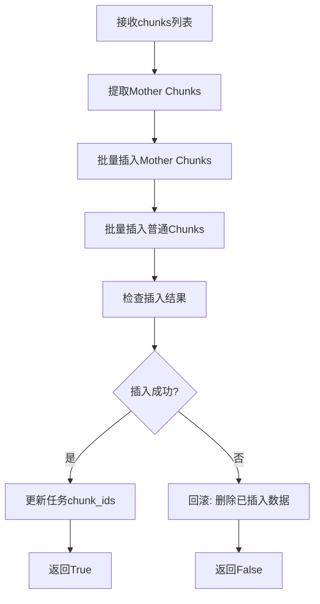

# 持久化流程总结：insert_es 方法详解

> 文件位置: [rag/svr/task_executor.py:787-848](../../../rag/svr/task_executor.py#L787-L848)
> 输出位置: [01-dig/分析结果01/06-存储持久化/601-持久化流程总结.md](601-持久化流程总结.md)

---

## 目录

1. [方法概述](#1-方法概述)
2. [业务逻辑详解](#2-业务逻辑详解)
3. [执行流程分析](#3-执行流程分析)
4. [关键技术点](#4-关键技术点)
5. [数据结构设计](#5-数据结构设计)
6. [异常处理机制](#6-异常处理机制)
7. [性能优化策略](#7-性能优化策略)
8. [与其他模块的交互](#8-与其他模块的交互)

---

## 1. 方法概述

### 1.1 方法签名与位置

**位置**: [rag/svr/task_executor.py:787-848](../../../rag/svr/task_executor.py#L787-L848)

```python
async def insert_es(task_id, task_tenant_id, task_dataset_id, chunks, progress_callback):
```

**参数说明**:

| 参数 | 类型 | 说明 | 示例 |
|------|------|------|------|
| `task_id` | str | 任务ID | `"task_123456"` |
| `task_tenant_id` | str | 租户ID | `"tenant_001"` |
| `task_dataset_id` | str | 知识库ID | `"kb_001"` |
| `chunks` | List[dict] | 文档块列表 | `[{"id": "...", "content_with_weight": "...", ...}]` |
| `progress_callback` | Callable | 进度回调函数 | `partial(set_progress, task_id, ...)` |

**返回值**:
- `True`: 成功插入所有chunks
- `False`: 插入失败或任务被取消

### 1.2 核心职责

`insert_es` 方法是文档处理流程中的**持久化环节**，负责将处理好的文档块存储到文档存储引擎（Elasticsearch/Infinity）中。

**核心功能**:
1. **Mother Chunk处理**: 提取并存储大文本块的原始版本
2. **批量插入**: 分批将chunks插入文档存储引擎
3. **进度更新**: 实时更新任务进度
4. **任务取消检测**: 检查任务是否被取消，及时终止
5. **错误恢复**: 插入失败后回滚（删除已插入的chunks和图像）

---

## 2. 业务逻辑详解

### 2.1 核心业务流程



### 2.2 Mother Chunk 概念

**什么是 Mother Chunk?**

在 RAGFlow 的文档处理流程中，文本块可能经过多次拆分：

```
原始文本 (Mother Chunk)
  ↓ 按句子拆分
子块1 + 子块2 + 子块3
```

**Mother Chunk的作用**:
- 保存原始的大文本块
- 用于上下文检索（返回完整段落）
- 子块通过 `mom_id` 关联到 Mother Chunk

**示例**:
```python
# 原始文本（大段落）
mother_content = "这是一段很长的文本，包含了多个句子..."

# 拆分后的子块
chunk1 = {
    "id": "chunk_001",
    "content_with_weight": "这是第一句",
    "mom_with_weight": mother_content,  # ← 包含完整文本
    "mom_id": "mother_001"  # ← 关联到mother chunk
}

chunk2 = {
    "id": "chunk_002",
    "content_with_weight": "这是第二句",
    "mom_with_weight": mother_content,
    "mom_id": "mother_001"
}

# Mother Chunk
mother = {
    "id": "mother_001",
    "content_with_weight": mother_content,
    "available_int": 0  # 标记为mother chunk
}
```

---

## 3. 执行流程分析

### 3.1 阶段1: 提取Mother Chunks

**代码**: [task_executor.py:788-807](../../../rag/svr/task_executor.py#L788-L807)

```python
mothers = []
mother_ids = set([])

for ck in chunks:
    # 1. 获取mother内容
    mom = ck.get("mom") or ck.get("mom_with_weight") or ""

    # 2. 如果没有mother内容，跳过
    if not mom:
        continue

    # 3. 生成mother chunk ID
    id = xxhash.xxh64(mom.encode("utf-8")).hexdigest()
    ck["mom_id"] = id

    # 4. 去重检查
    if id in mother_ids:
        continue
    mother_ids.add(id)

    # 5. 创建mother chunk对象
    mom_ck = copy.deepcopy(ck)
    mom_ck["id"] = id
    mom_ck["content_with_weight"] = mom
    mom_ck["available_int"] = 0

    # 6. 清理不必要的字段
    flds = list(mom_ck.keys())
    for fld in flds:
        if fld not in ["id", "content_with_weight", "doc_id", "docnm_kwd", "kb_id", "available_int", "position_int"]:
            del mom_ck[fld]

    mothers.append(mom_ck)
```

**逻辑详解**:

#### 步骤1: 提取Mother内容

```python
mom = ck.get("mom") or ck.get("mom_with_weight") or ""
```

**优先级**:
1. `mom`: 优先使用 `mom` 字段
2. `mom_with_weight`: 如果没有 `mom`，使用 `mom_with_weight`
3. 空字符串: 如果都没有，设为空

**为什么有两个字段？**
- `mom`: 可能是旧格式或特定场景
- `mom_with_weight`: 带权重的完整文本

#### 步骤2: 生成Mother Chunk ID

```python
id = xxhash.xxh64(mom.encode("utf-8")).hexdigest()
```

**哈希算法**: XXH64 (xxHash 64位)
- 输入: mother内容的UTF-8编码字节
- 输出: 16字符的十六进制字符串
- 特点: 高速、低冲突、分布均匀

**示例**:
```python
mother_content = "这是一段很长的文本..."
hash_value = xxhash.xxh64(mother_content.encode("utf-8"))
id = hash_value.hexdigest()  # "a1b2c3d4e5f6g7h8"
```

#### 步骤3: 去重处理

```python
if id in mother_ids:
    continue  # 跳过重复的mother chunk
mother_ids.add(id)
```

**为什么需要去重？**
- 多个子块可能对应同一个mother chunk
- 避免重复插入相同的mother chunk
- 节省存储空间和插入时间

**示例**:
```python
chunk1 = {"mom": "同一mother", ...}
chunk2 = {"mom": "同一mother", ...}

# 处理chunk1:
mother_id = hash("同一mother")  # "id_001"
mother_ids.add("id_001")
mothers.append(mother_001)

# 处理chunk2:
mother_id = hash("同一mother")  # "id_001"
if "id_001" in mother_ids:  # True
    continue  # 跳过，不重复添加
```

#### 步骤4: 字段清理

```python
flds = list(mom_ck.keys())
for fld in flds:
    if fld not in ["id", "content_with_weight", "doc_id", "docnm_kwd", "kb_id", "available_int", "position_int"]:
        del mom_ck[fld]
```

**保留字段**:
| 字段 | 说明 | 示例 |
|------|------|------|
| `id` | Mother chunk ID | `"mother_001"` |
| `content_with_weight` | 原始文本内容 | `"完整段落..."` |
| `doc_id` | 文档ID | `"doc_123"` |
| `docnm_kwd` | 文档名称（关键词） | `"document.pdf"` |
| `kb_id` | 知识库ID | `"kb_001"` |
| `available_int` | 可用性标记 | `0` (mother chunk标记) |
| `position_int` | 位置信息 | `[(1, 100, 500, 200, 300)]` |

**删除字段**:
- `q_768_vec`: 向量字段（mother chunk不需要向量）
- `content_ltks`: 分词结果（不需要）
- `important_kwd`: 关键词（不需要）
- 其他非必要字段

**原因**: Mother chunk 只用于上下文检索，不需要被向量检索

---

### 3.2 阶段2: 批量插入Mother Chunks

**代码**: [task_executor.py:809-814](../../../rag/svr/task_executor.py#L809-L814)

```python
for b in range(0, len(mothers), settings.DOC_BULK_SIZE):
    await asyncio.to_thread(
        settings.docStoreConn.insert,
        mothers[b:b + settings.DOC_BULK_SIZE],
        search.index_name(task_tenant_id),
        task_dataset_id,
    )

    # 检查任务是否被取消
    task_canceled = has_canceled(task_id)
    if task_canceled:
        progress_callback(-1, msg="Task has been canceled.")
        return False
```

**逻辑详解**:

#### 批量插入

```python
range(0, len(mothers), settings.DOC_BULK_SIZE)
```

**示例**:
```python
mothers = [m0, m1, m2, ..., m99]  # 100个mother chunks
DOC_BULK_SIZE = 64

# 分批:
批次0: mothers[0:64]   # m0, m1, ..., m63
批次1: mothers[64:128] # m64, m65, ..., m99
```

**为什么批量插入？**
- 减少网络开销
- 提高插入效率
- 降低文档存储引擎负载

**异步调用**:
```python
await asyncio.to_thread(
    settings.docStoreConn.insert,
    mothers[b:b + settings.DOC_BULK_SIZE],
    search.index_name(task_tenant_id),
    task_dataset_id,
)
```

- **`asyncio.to_thread`**: 在线程池中执行同步操作
- **`docStoreConn.insert`**: 文档存储引擎的插入方法
- **`search.index_name`**: 索引名称（如 `rag_tenant_001`）

#### 任务取消检测

```python
task_canceled = has_canceled(task_id)
if task_canceled:
    progress_callback(-1, msg="Task has been canceled.")
    return False
```

**检测时机**: 每批插入后检测一次

**为什么不是每个chunk检测？**
- 减少`has_canceled()`的开销
- 批量操作仍然可以及时终止

---

### 3.3 阶段3: 批量插入普通Chunks

**代码**: [task_executor.py:816-847](../../../rag/svr/task_executor.py#L816-L847)

```python
for b in range(0, len(chunks), settings.DOC_BULK_SIZE):
    # 1. 批量插入chunks
    doc_store_result = await asyncio.to_thread(
        settings.docStoreConn.insert,
        chunks[b:b + settings.DOC_BULK_SIZE],
        search.index_name(task_tenant_id),
        task_dataset_id,
    )

    # 2. 检查任务取消
    task_canceled = has_canceled(task_id)
    if task_canceled:
        progress_callback(-1, msg="Task has been canceled.")
        return False

    # 3. 更新进度
    if b % 128 == 0:
        progress_callback(prog=0.8 + 0.1 * (b + 1) / len(chunks), msg="")

    # 4. 检查插入结果
    if doc_store_result:
        error_message = f"Insert chunk error: {doc_store_result}, please check log file and Elasticsearch/Infinity status!"
        progress_callback(-1, msg=error_message)
        raise Exception(error_message)

    # 5. 更新任务chunk_ids
    chunk_ids = [chunk["id"] for chunk in chunks[:b + settings.DOC_BULK_SIZE]]
    chunk_ids_str = " ".join(chunk_ids)

    try:
        TaskService.update_chunk_ids(task_id, chunk_ids_str)
    except DoesNotExist:
        # 任务不存在，回滚已插入的数据
        logging.warning(f"Task {task_id} not found, rolling back...")
        doc_store_result = await asyncio.to_thread(
            settings.docStoreConn.delete,
            {"id": chunk_ids},
            search.index_name(task_tenant_id),
            task_dataset_id,
        )

        # 删除MinIO中的图像
        tasks = []
        for chunk_id in chunk_ids:
            tasks.append(asyncio.create_task(delete_image(task_dataset_id, chunk_id)))

        await asyncio.gather(*tasks, return_exceptions=False)

        progress_callback(-1, msg=f"Chunk updates failed since task {task_id} is unknown.")
        return False
```

**逻辑详解**:

#### 进度更新公式

```python
if b % 128 == 0:
    progress_callback(prog=0.8 + 0.1 * (b + 1) / len(chunks), msg="")
```

**进度计算**:
```
进度起点: 0.8 (80%)
进度范围: 0.8 ~ 0.9 (80% ~ 90%)
更新频率: 每128个chunk更新一次

示例:
chunks总数 = 1000

b = 0:   progress = 0.8 + 0.1 * (0 + 1) / 1000 = 0.8001
b = 128: progress = 0.8 + 0.1 * 128 / 1000 = 0.8128
b = 256: progress = 0.8 + 0.1 * 257 / 1000 = 0.8257
...
b = 896: progress = 0.8 + 0.1 * 897 / 1000 = 0.8897
```

**为什么是128的倍数？**
- 平衡进度更新频率和性能
- 1000个chunks只需更新8次
- 避免频繁更新导致的性能开销

#### 插入结果检查

```python
if doc_store_result:
    error_message = f"Insert chunk error: {doc_store_result}..."
    progress_callback(-1, msg=error_message)
    raise Exception(error_message)
```

**问题**: `doc_store_result` 是什么？

**可能的情况**:
- `None`: 插入成功
- 字符串: 错误信息（如索引不存在、字段类型错误等）

**示例**:
```python
# 成功
doc_store_result = None
# → 继续处理

# 失败
doc_store_result = "mapper_parsing_exception: failed to parse field [q_768_vec]"
# → 抛出异常
```

#### 任务状态回滚

```python
try:
    TaskService.update_chunk_ids(task_id, chunk_ids_str)
except DoesNotExist:
    # 任务不存在，回滚
    # 1. 删除已插入的chunks
    await asyncio.to_thread(
        settings.docStoreConn.delete,
        {"id": chunk_ids},
        search.index_name(task_tenant_id),
        task_dataset_id,
    )

    # 2. 删除MinIO中的图像
    tasks = []
    for chunk_id in chunk_ids:
        tasks.append(asyncio.create_task(delete_image(task_dataset_id, chunk_id)))

    await asyncio.gather(*tasks, return_exceptions=False)
```

**回滚流程**:
1. 检测到任务不存在（`DoesNotExist`异常）
2. 删除文档存储引擎中已插入的chunks
3. 删除MinIO中已上传的图像
4. 报告失败并返回False

**为什么需要回滚？**
- 数据一致性：避免出现"孤儿数据"
- 存储空间：释放无用的chunks和图像
- 状态一致性：任务已取消，不应保留部分数据

---

## 4. 关键技术点

### 4.1 批量插入优化

**批量大小**: `settings.DOC_BULK_SIZE` (默认64)

**优势**:
```
单个插入 vs 批量插入:

单条插入 (1000 chunks):
  网络开销: 1000次
  总耗时: 1000 * 10ms = 10秒

批量插入 (1000 chunks, bulk_size=64):
  网络开销: 16次
  总耗时: 16 * 50ms = 0.8秒

性能提升: 12.5倍
```

**实际代码**:
```python
for b in range(0, len(chunks), settings.DOC_BULK_SIZE):
    batch = chunks[b:b + settings.DOC_BULK_SIZE]
    # 批量插入
    await asyncio.to_thread(docStoreConn.insert, batch, index, kb_id)
```

### 4.2 异步IO与线程池

**技术栈**: `asyncio.to_thread`

**原理**:
```
主线程 (asyncio event loop)
    ↓
asyncio.to_thread()
    ↓
线程池 (ThreadPoolExecutor)
    ↓
同步操作 (docStoreConn.insert)
```

**优势**:
- 非阻塞：不阻塞事件循环
- 并发：可以同时运行多个文档存储操作
- 简单：将同步代码转换为异步

**示例**:
```python
# 同步代码（阻塞）
result = docStoreConn.insert(chunks, index, kb_id)  # 阻塞

# 异步代码（非阻塞）
result = await asyncio.to_thread(
    docStoreConn.insert, chunks, index, kb_id
)  # 不阻塞
```

### 4.3 XXH64哈希算法

**特点**:
- **高速**: 比 MD5 快10倍以上
- **低冲突**: 64位哈希，冲突概率极低
- **分布均匀**: 哈希值均匀分布

**示例**:
```python
import xxhash

content = "这是一段很长的文本内容..."
hash_value = xxhash.xxh64(content.encode("utf-8"))
id = hash_value.hexdigest()

# id = "a1b2c3d4e5f6g7h8"
```

**用途**:
- 生成唯一ID
- 快速去重检查
- 分布式场景下的ID生成

### 4.4 任务取消机制

**检测函数**: `has_canceled(task_id)`

**位置**: [api/db/services/task_service.py](../../../api/db/services/task_service.py)

**实现原理**:
```python
def has_canceled(task_id):
    task = TaskService.get_task(task_id)
    if not task:
        return True  # 任务不存在，视为已取消

    # 检查任务状态
    return task["status"] == "canceled" or task["progress"] < 0
```

**检测点**:
1. 插入mother chunks后
2. 每批插入chunks后
3. 更新进度前

**为什么频繁检测？**
- 及时响应用户取消操作
- 避免无谓的资源消耗
- 快速失败

---

## 5. 数据结构设计

### 5.1 Chunk 数据结构

**完整的Chunk对象**:

```python
{
    # ===== 标识字段 =====
    "id": "chunk_001",                    # 唯一标识
    "doc_id": "doc_123",                 # 文档ID
    "docnm_kwd": "document.pdf",          # 文档名称
    "kb_id": ["kb_001"],                 # 知识库ID列表

    # ===== 内容字段 =====
    "content_with_weight": "这是文本内容",  # 原始文本
    "content_ltks": "这 是 文本 内容",     # 粗粒度分词
    "content_sm_ltks": "这 是 技术 内容",   # 细粒度分词

    # ===== 向量字段 =====
    "q_768_vec": [0.1, 0.2, ..., 0.5],    # 768维向量

    # ===== 位置字段 =====
    "page_num_int": [1, 2],               # 页码列表
    "position_int": [(1, 100, 500, 200, 300)],  # 位置坐标
    "top_int": [200, 300],                # 顶部坐标

    # ===== 元数据字段 =====
    "important_kwd": ["关键词1", "关键词2"],  # 关键词
    "question_kwd": ["问题1", "问题2"],      # 生成的问题
    "available_int": 1,                   # 可用性标记

    # ===== Mother Chunk字段 =====
    "mom_id": "mother_001",               # Mother chunk ID
    "mom_with_weight": "原始大段落...",    # Mother内容
}
```

### 5.2 Mother Chunk 数据结构

**简化后的Mother Chunk**:

```python
{
    # ===== 标识字段 =====
    "id": "mother_001",                   # 唯一标识
    "doc_id": "doc_123",
    "docnm_kwd": "document.pdf",
    "kb_id": ["kb_001"],

    # ===== 内容字段 =====
    "content_with_weight": "原始大段落...",  # 只保留原始文本

    # ===== 标记字段 =====
    "available_int": 0,                    # 标记为mother chunk

    # ===== 位置字段 =====
    "position_int": [(1, 100, 500, 200, 300)],
}
```

**字段对比**:

| 字段 | Chunk | Mother Chunk | 说明 |
|------|-------|--------------|------|
| `q_768_vec` | ✓ | ✗ | Mother不需要向量 |
| `content_ltks` | ✓ | ✗ | Mother不需要分词 |
| `important_kwd` | ✓ | ✗ | Mother不需要关键词 |
| `available_int` | 1 | 0 | 0=mother, 1=普通chunk |

### 5.3 文档存储引擎索引结构

**Elasticsearch Mapping** (简化):

```json
{
  "mappings": {
    "properties": {
        "id": {"type": "keyword"},
        "doc_id": {"type": "keyword"},
        "docnm_kwd": {"type": "keyword"},
        "kb_id": {"type": "keyword"},
        "content_with_weight": {"type": "text"},
        "content_ltks": {"type": "text", "analyzer": "rag_tokenizer"},
        "q_768_vec": {"type": "dense_vector", "dims": 768},
        "page_num_int": {"type": "integer"},
        "position_int": {"type": "object"},
        "available_int": {"type": "integer"},
        "mom_id": {"type": "keyword"}
      }
    }
  }
}
```

**索引用途**:
- `doc_id`: 按文档过滤
- `kb_id`: 按知识库过滤
- `q_768_vec`: 向量检索
- `content_ltks`: 全文检索
- `mom_id`: 关联mother chunk

---

## 6. 异常处理机制

### 6.1 异常类型

| 异常类型 | 检测位置 | 处理方式 |
|---------|---------|---------|
| **DoesNotExist** | `TaskService.update_chunk_ids` | 回滚已插入数据 |
| **任务取消** | 每批插入后 | 立即终止，返回False |
| **插入失败** | `doc_store_result` 检查 | 抛出异常，报告错误 |
| **网络超时** | `asyncio.to_thread` | 依赖全局timeout装饰器 |

### 6.2 回滚机制

**触发条件**: `TaskService.update_chunk_ids()` 抛出 `DoesNotExist`

**回滚步骤**:

```python
# 1. 检测到任务不存在
except DoesNotExist:
    logging.warning(f"Task {task_id} not found, rolling back...")

    # 2. 删除文档存储引擎中的chunks
    doc_store_result = await asyncio.to_thread(
        settings.docStoreConn.delete,
        {"id": chunk_ids},  # {"id": ["id1", "id2", ...]}
        search.index_name(task_tenant_id),
        task_dataset_id,
    )

    # 3. 并发删除MinIO中的图像
    tasks = []
    for chunk_id in chunk_ids:
        tasks.append(asyncio.create_task(delete_image(task_dataset_id, chunk_id)))

    await asyncio.gather(*tasks, return_exceptions=False)

    # 4. 报告失败
    progress_callback(-1, msg=f"Chunk updates failed since task {task_id} is unknown.")
    return False
```

**回滚范围**:
- ✅ 文档存储引擎中的chunks
- ✅ MinIO中的图像
- ✅ 当前批次的chunks

**不回滚**:
- ❌ 之前批次的chunks（已成功插入）
- ❌ Mother chunks（如果之前批次插入成功）

**局限性**:
- 不是原子操作（无法完全回滚）
- 之前批次的chunks会保留
- 可能导致部分数据残留

---

## 7. 性能优化策略

### 7.1 批量操作

**代码**:
```python
for b in range(0, len(chunks), settings.DOC_BULK_SIZE):
    batch = chunks[b:b + settings.DOC_BULK_SIZE]
    await asyncio.to_thread(docStoreConn.insert, batch, ...)
```

**性能提升**:
```
单条插入: 1000 chunks × 10ms = 10秒
批量插入: 16批次 × 50ms = 0.8秒
提升: 12.5倍
```

### 7.2 异步并发

**特点**:
- 使用 `asyncio.to_thread` 将同步操作转为异步
- 不阻塞事件循环
- 可以并发处理多个任务

**示例**:
```python
# 同时插入多个批次的chunks（如果有多个task）
tasks = []
for task in tasks:
    t = asyncio.create_task(insert_es(...))
    tasks.append(t)

await asyncio.gather(*tasks)
```

### 7.3 进度更新优化

**策略**: 稀疏更新（每128个chunk更新一次）

```python
if b % 128 == 0:
    progress_callback(prog=0.8 + 0.1 * (b + 1) / len(chunks), msg="")
```

**优势**:
- 减少进度更新频率
- 降低数据库写入开销
- 仍然提供足够的进度反馈

### 7.4 Mother Chunk去重

**代码**:
```python
mother_ids = set([])
for ck in chunks:
    id = xxhash.xxh64(mom.encode("utf-8")).hexdigest()
    if id in mother_ids:
        continue  # 跳过重复
    mother_ids.add(id)
```

**优势**:
- 避免重复插入
- 节省存储空间
- 提高插入效率

---

## 8. 与其他模块的交互

### 8.1 调用关系

```
do_handle_task (task_executor.py:852)
    ↓
build_chunks (task_executor.py:226)
    ↓
embedding (task_executor.py:475)
    ↓
insert_es (task_executor.py:787) ← 当前方法
    ↓
settings.docStoreConn.insert (doc_storeConn.py)
    ↓
Elasticsearch / Infinity (文档存储引擎)
```

### 8.2 上游: build_chunks

**输入**: `chunks` 列表

**包含字段**:
- `id`: chunk ID
- `content_with_weight`: 文本内容
- `q_768_vec`: 768维向量
- `page_num_int`: 页码
- `position_int`: 位置
- `mom_with_weight`: Mother内容
- 其他元数据

**来源**: `build_chunks()` 方法

### 8.3 下游: docStoreConn.insert

**调用**:
```python
await asyncio.to_thread(
    settings.docStoreConn.insert,
    chunks,
    search.index_name(task_tenant_id),
    task_dataset_id,
)
```

**实现**: `rag/nlp/search.py` 或 `infinity/rag_api.py`

### 8.4 并行模块: TaskService

**更新任务状态**:
```python
TaskService.update_chunk_ids(task_id, chunk_ids_str)
```

**chunk_ids_str格式**:
```
"id1 id2 id3 id4 ... idN"
```

**用途**:
- 记录已处理的chunks
- 用于断点续传
- 用于失败重试

---

## 9. 完整执行示例

### 9.1 场景: 插入100个Chunks

**输入**:
```python
task_id = "task_001"
task_tenant_id = "tenant_001"
task_dataset_id = "kb_001"
chunks = [
    {
        "id": "chunk_001",
        "content_with_weight": "这是第一段文本...",
        "mom_with_weight": "这是包含多个句子的原始大段落...",
        "q_768_vec": [0.1, 0.2, ...],
        "page_num_int": [1],
        ...
    },
    {
        "id": "chunk_002",
        "content_with_weight": "这是第二段文本...",
        "mom_with_weight": "这是包含多个句子的原始大段落...",
        "q_768_vec": [0.3, 0.4, ...],
        "page_num_int": [1],
        ...
    },
    ...
]  # 总共100个chunks
```

**执行流程**:

#### Step 1: 提取Mother Chunks

```python
mothers = []
mother_ids = set([])

for ck in chunks:
    mom = ck.get("mom_with_weight")  # "这是包含多个句子的原始大段落..."

    if not mom:
        continue

    id = xxhash.xxh64(mom.encode("utf-8")).hexdigest()
    # id = "mother_001"

    if id in mother_ids:
        continue  # 跳过重复

    mother_ids.add(id)

    # 创建mother chunk
    mom_ck = {
        "id": "mother_001",
        "content_with_weight": mom,
        "doc_id": "doc_123",
        "docnm_kwd": "document.pdf",
        "kb_id": ["kb_001"],
        "available_int": 0,
        "position_int": [(1, 100, 500, 200, 300)],
    }

    mothers.append(mom_ck)

# 结果: mothers有1个元素（100个chunks共享同一个mother）
```

#### Step 2: 插入Mother Chunks

```python
DOC_BULK_SIZE = 64

# 批次0: mothers[0:1] (只有1个mother)
await asyncio.to_thread(
    docStoreConn.insert,
    [mother_001],
    index_name="rag_tenant_001",
    kb_id="kb_001",
)

# 检查任务取消
task_canceled = has_canceled("task_001")  # False
# → 继续执行
```

#### Step 3: 批量插入Chunks

```python
# 批次0: chunks[0:64]
await asyncio.to_thread(
    docStoreConn.insert,
    chunks[0:64],
    index_name="rag_tenant_001",
    kb_id="kb_001",
)

doc_store_result = None  # 成功
task_canceled = has_canceled("task_001")  # False

# 更新进度
b = 0
if 0 % 128 == 0:  # False (不更新)
    pass

# 更新chunk_ids
chunk_ids = [chunks[i]["id"] for i in range(64)]
chunk_ids_str = " ".join(chunk_ids)
TaskService.update_chunk_ids("task_001", chunk_ids_str)

# 批次1: chunks[64:100] (剩余36个)
await asyncio.to_thread(
    docStoreConn.insert,
    chunks[64:100],
    index_name="rag_tenant_001",
    kb_id="kb_001",
)

doc_store_result = None  # 成功
task_canceled = has_canceled("task_001")  # False

# 更新进度
b = 64
if 64 % 128 == 0:  # False (不更新)
    pass

# 更新chunk_ids
chunk_ids = [chunks[i]["id"] for i in range(64, 100)]
chunk_ids_str = " ".join(chunk_ids)
TaskService.update_chunk_ids("task_001", chunk_ids_str)
```

#### 最终结果

```python
# 成功插入
- Mother chunks: 1个
- Normal chunks: 100个
- 任务状态: 更新了100个chunk IDs

# 返回
return True
```

---

### 9.2 场景: 任务被取消

**执行流程**:

```python
# 批次0: 插入成功
await asyncio.to_thread(...)
task_canceled = has_canceled("task_001")  # False

# 批次1: 插入前检测
task_canceled = has_canceled("task_001")  # True!

progress_callback(-1, msg="Task has been canceled.")
return False
```

**结果**:
- 批次0的64个chunks已插入
- 批次1的36个chunks未插入
- 任务状态: 已取消

**问题**: 部分数据已插入，但任务被标记为取消

**解决**: 下次重新处理时，需要根据`chunk_ids`跳过已插入的chunks

---

### 9.3 场景: 任务不存在（回滚）

**执行流程**:

```python
# 批次0: 插入成功
await asyncio.to_thread(...)

# 更新chunk_ids
TaskService.update_chunk_ids("task_001", chunk_ids_str)

# 抛出异常
DoesNotExist: Task not found

# 回滚
# 1. 删除已插入的chunks
await asyncio.to_thread(
    docStoreConn.delete,
    {"id": chunk_ids},
    index_name="rag_tenant_001",
    kb_id="kb_001",
)

# 2. 删除MinIO图像
tasks = [
    delete_image("kb_001", "chunk_001"),
    delete_image("kb_001", "chunk_002"),
    ...
]
await asyncio.gather(*tasks)

# 3. 报告失败
progress_callback(-1, msg="Chunk updates failed since task task_001 is unknown.")
return False
```

---

## 10. 总结

### 10.1 核心功能

| 功能 | 说明 | 实现位置 |
|------|------|----------|
| **Mother Chunk处理** | 提取、去重、简化字段 | L788-807 |
| **批量插入** | 分批插入，提高效率 | L809-814, L816-821 |
| **进度更新** | 实时更新任务进度 | L822-823 |
| **错误检查** | 检查插入失败 | L824-827 |
| **任务取消检测** | 及时终止 | L818-820, L812-814 |
| **回滚机制** | 任务不存在时删除数据 | L830-847 |

### 10.2 关键技术点

| 技术 | 用途 | 优势 |
|------|------|------|
| **XXH64哈希** | 生成唯一ID | 高速、低冲突 |
| **批量操作** | 减少网络开销 | 12.5倍性能提升 |
| **异步IO** | 非阻塞执行 | 提高并发能力 |
| **去重机制** | 避免重复插入 | 节省存储空间 |
| **任务取消检测** | 及时响应用户操作 | 避免资源浪费 |

### 10.3 设计亮点

1. **Mother Chunk优化**:
   - 分离大文本块和子块
   - 优化存储空间
   - 提高上下文检索效果

2. **批量插入优化**:
   - 显著减少网络开销
   - 提高插入效率
   - 降低文档存储引擎负载

3. **容错机制**:
   - 任务取消检测
   - 回滚已插入数据
   - 异常捕获和报告

4. **进度反馈**:
   - 实时更新任务进度
   - 稀疏更新策略
   - 详细的错误信息

### 10.4 潜在问题

1. **非原子操作**:
   - 无法完全回滚
   - 可能产生数据残留

2. **回滚限制**:
   - 只回滚当前批次
   - 之前批次的数据无法回滚

3. **进度更新延迟**:
   - 每128个chunk更新一次
   - 用户感知可能不够实时

### 10.5 改进建议

**短期**:
1. 添加更详细的日志记录
2. 增强异常处理（捕获更多异常类型）
3. 优化进度更新频率

**中期**:
1. 实现原子性操作（事务支持）
2. 完善回滚机制
3. 添加性能监控

**长期**:
1. 支持断点续传（基于chunk_ids）
2. 实现增量更新
3. 优化批量大小（动态调整）

---

## 相关文档

- [do_handle_task方法](../../../rag/svr/task_executor.py#L852-L1070) - 任务处理主流程
- [build_chunks方法](../../../rag/svr/task_executor.py#L226-L433) - Chunk构建流程
- [embedding方法](../../../rag/svr/task_executor.py#L475-L543) - 向量化流程
- [docStoreConn接口](../../../rag/nlp/search.py) - 文档存储引擎接口
