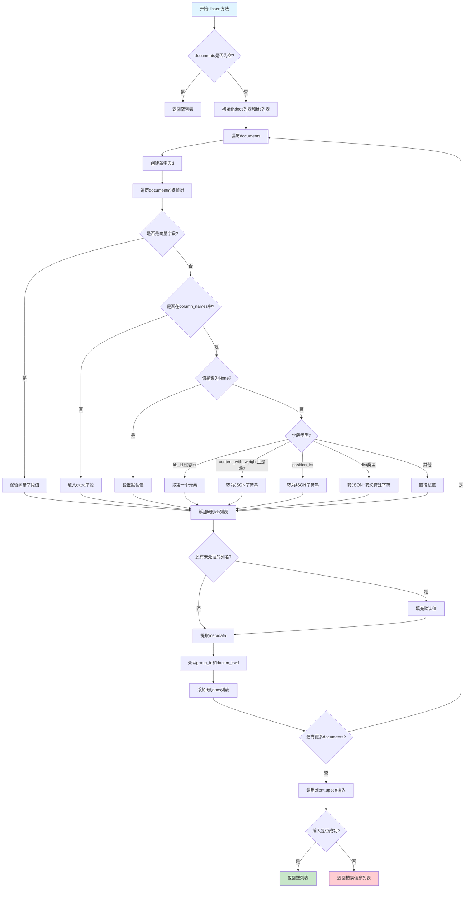
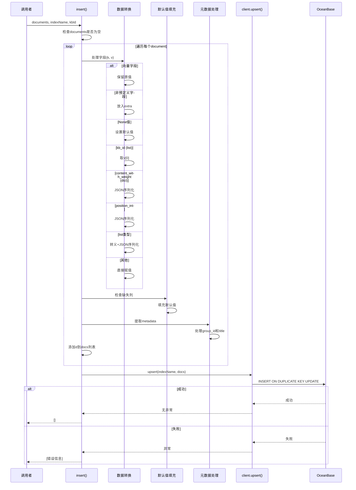

# OceanBase insert() 方法业务逻辑与执行流程分析

> **文件位置**: [rag/utils/ob_conn.py:1325-1398](../../../rag/utils/ob_conn.py#L1325-L1398)
> **类**: `OBConnection`
> **方法**: `insert(documents, indexName, knowledgebaseId=None)`
> **创建时间**: 2026-01-21

---

## 目录

1. [方法概览](#1-方法概览)
2. [业务逻辑](#2-业务逻辑)
3. [执行流程](#3-执行流程)
4. [技术要点](#4-技术要点)
5. [数据转换规则](#5-数据转换规则)
6. [相关代码示例](#6-相关代码示例)
7. [与Elasticsearch的差异](#7-与elasticsearch的差异)

---

## 1. 方法概览

### 1.1 方法签名

```python
def insert(self, documents: list[dict], indexName: str, knowledgebaseId: str = None) -> list[str]
```

### 1.2 参数说明

| 参数 | 类型 | 说明 |
|------|------|------|
| `documents` | `list[dict]` | 待插入的文档列表，每个文档是一个字典 |
| `indexName` | `str` | 表名（在OceanBase中对应表名） |
| `knowledgebaseId` | `str` | 知识库ID（当前未直接使用） |

### 1.3 返回值

- **类型**: `list[str]`
- **说明**: 错误信息列表
  - 成功时返回空列表 `[]`
  - 失败时返回包含错误信息的列表

### 1.4 核心职责

1. **数据清洗与转换**: 将外部文档格式转换为OceanBase表结构
2. **字段映射**: 处理向量字段、数组字段、JSON字段
3. **特殊字段处理**: 处理`kb_id`、`content_with_weight`、`position_int`等特殊字段
4. **元数据扩展**: 提取`metadata`中的`_group_id`和`_title`到主字段
5. **默认值填充**: 为缺失的字段填充默认值
6. **批量upsert**: 调用`upsert`操作实现插入或更新

---

## 2. 业务逻辑

### 2.1 整体逻辑结构



### 2.2 核心业务规则

#### 规则1: 向量字段识别与保留

```python
# 向量字段命名模式: q_<vector_size>_vec
vector_column_pattern = re.compile(r"q_(?P<vector_size>\d+)_vec")

# 示例:
# q_1024_vec - 1024维向量
# q_768_vec  - 768维向量
# q_1536_vec - 1536维向量
```

**处理逻辑**:
- 匹配模式: `q_<数字>_vec`
- 直接保留原始值（不做任何转换）
- 原因: 向量数据需要以原始格式存储，用于向量检索

#### 规则2: 非预定义字段放入extra

```python
if k not in column_names:
    if "extra" not in d:
        d["extra"] = {}
    d["extra"][k] = v
    continue
```

**示例**:
```python
# 输入document
{
    "id": "chunk_1",
    "kb_id": "kb_001",
    "content_ltks": "...",
    "custom_field": "value",  # 不在column_names中
    "another_field": 123
}

# 输出
{
    "id": "chunk_1",
    "kb_id": "kb_001",
    "content_ltks": "...",
    "extra": {
        "custom_field": "value",
        "another_field": 123
    }
}
```

#### 规则3: 特殊字段的类型转换

| 字段名 | 输入类型 | 转换逻辑 | 示例 |
|--------|---------|---------|------|
| `kb_id` | `list` | 取第一个元素 | `["kb_1"]` → `"kb_1"` |
| `content_with_weight` | `dict` | JSON序列化 | `{"k": "v"}` → `'{"k": "v"}'` |
| `position_int` | `list[list]` | JSON序列化 | `[[0, 100], [200, 300]]` → `'[[0,100],[200,300]]'` |
| `important_kwd` | `list[str]` | 转义+JSON序列化 | `["a", "b"]` → `'["a","b"]'` |

#### 规则4: 元数据扩展

```python
metadata = d.get("metadata", {})
if metadata is None:
    metadata = {}
group_id = metadata.get("_group_id")
title = metadata.get("_title")
if d.get("doc_id"):
    if group_id:
        d["group_id"] = group_id
    else:
        d["group_id"] = d["doc_id"]  # 默认使用doc_id
    if title:
        d["docnm_kwd"] = title  # 覆盖文档名称
```

**用途**:
- `_group_id`: 外部检索时使用的分组ID
- `_title`: 自定义文档标题（覆盖默认的docnm_kwd）

#### 规则5: 默认值填充

```python
# SQLAlchemy Issue #9703 修复
for column_name in column_names:
    if column_name not in d:
        d[column_name] = get_default_value(column_name)
```

**默认值规则**:
```python
def get_default_value(column_name: str) -> Any:
    if column_name == "available_int":
        return 1  # 默认可用
    elif column_name == "removed_kwd":
        return "N"  # 默认未删除
    elif column_name == "_order_id":
        return 0  # 默认顺序为0
    else:
        return None
```

---

## 3. 执行流程

### 3.1 完整流程图



### 3.2 关键步骤详解

#### 步骤1: 数据验证

```python
if not documents:
    return []
```

**目的**: 提前返回，避免空列表处理

#### 步骤2: 遍历文档列表

```python
docs: list[dict] = []
ids: list[str] = []
for document in documents:
    d: dict = {}
    # 处理逻辑...
    ids.append(d["id"])
    docs.append(d)
```

**目的**:
- `docs`: 转换后的文档列表
- `ids`: 收集所有文档ID（用于后续可能的操作）

#### 步骤3: 字段级别处理

```python
for k, v in document.items():
    # 向量字段
    if vector_column_pattern.match(k):
        d[k] = v
        continue

    # 非预定义字段
    if k not in column_names:
        if "extra" not in d:
            d["extra"] = {}
        d["extra"][k] = v
        continue

    # None值处理
    if v is None:
        d[k] = get_default_value(k)
        continue

    # 特殊字段处理
    if k == "kb_id" and isinstance(v, list):
        d[k] = v[0]
    elif k == "content_with_weight" and isinstance(v, dict):
        d[k] = json.dumps(v, ensure_ascii=False)
    # ... 其他处理
```

#### 步骤4: 默认值填充

```python
# 修复SQLAlchemy Issue #9703
for column_name in column_names:
    if column_name not in d:
        d[column_name] = get_default_value(column_name)
```

**问题背景**: SQLAlchemy可能不完整地处理某些字段，需要手动填充

#### 步骤5: 元数据扩展

```python
metadata = d.get("metadata", {})
if metadata is None:
    metadata = {}
group_id = metadata.get("_group_id")
title = metadata.get("_title")
if d.get("doc_id"):
    if group_id:
        d["group_id"] = group_id
    else:
        d["group_id"] = d["doc_id"]
    if title:
        d["docnm_kwd"] = title
```

**用途**: 支持外部系统通过metadata传递额外信息

#### 步骤6: 批量upsert

```python
res = []
try:
    self.client.upsert(indexName, docs)
except Exception as e:
    logger.error(f"OBConnection.insert error: {str(e)}")
    res.append(str(e))
return res
```

**Upsert语义**: `INSERT ON DUPLICATE KEY UPDATE`
- 如果主键`id`不存在 → 插入新记录
- 如果主键`id`已存在 → 更新记录

---

## 4. 技术要点

### 4.1 向量字段处理

**模式识别**:
```python
vector_column_pattern = re.compile(r"q_(?P<vector_size>\d+)_vec")
```

**示例**:
```python
# 输入
{
    "id": "chunk_1",
    "q_1024_vec": [0.1, 0.2, ...],  # 1024维向量
    "content_ltks": "..."
}

# 处理: 向量字段直接保留，不转换
d["q_1024_vec"] = [0.1, 0.2, ...]
```

**原因**: 向量数据需要以二进制或数组格式存储，用于向量相似度计算

### 4.2 字符串转义与清洗

**需要转义的字符**:
```python
cleaned_str = value.replace('\\', '\\\\')  # 反斜杠
cleaned_str = cleaned_str.replace('\n', '\\n')  # 换行符
cleaned_str = cleaned_str.replace('\r', '\\r')  # 回车符
cleaned_str = cleaned_str.replace('\t', '\\t')  # 制表符
```

**调用链**:
```python
# pymysql.converters.escape_string
from pymysql.converters import escape_string
cleaned_str = value.replace('\\', '\\\\')
return f"'{escape_string(cleaned_str)}'"
```

**目的**:
1. 防止SQL注入
2. 正确存储特殊字符
3. 避免JSON解析错误

### 4.3 JSON序列化配置

**配置参数**:
```python
json.dumps(v, ensure_ascii=False)
```

**选择`ensure_ascii=False`的原因**:
- 保留中文等非ASCII字符
- 减少存储空间（UTF-8编码）
- 提高可读性

**示例**:
```python
# ensure_ascii=True (默认)
json.dumps("中文")  # '"\\u4e2d\\u6587"'

# ensure_ascii=False
json.dumps("中文", ensure_ascii=False)  # '"中文"'
```

### 4.4 数组字段处理

**OceanBase数组类型**:
```python
Column("important_kwd", ARRAY(String(256)), nullable=True)
Column("position_int", ARRAY(ARRAY(Integer)), nullable=True)
```

**转换逻辑**:
```python
elif isinstance(v, list):
    cleaned_v = []
    for vv in v:
        if isinstance(vv, str):
            cleaned_str = vv.strip()
            cleaned_str = cleaned_str.replace('\\', '\\\\')
            cleaned_str = cleaned_str.replace('\n', '\\n')
            cleaned_str = cleaned_str.replace('\r', '\\r')
            cleaned_str = cleaned_str.replace('\t', '\\t')
            cleaned_v.append(cleaned_str)
        else:
            cleaned_v.append(vv)
    d[k] = json.dumps(cleaned_v, ensure_ascii=False)
```

**示例**:
```python
# 输入
{
    "important_kwd": ["  key1\n", "key2\r", "key\t3"]
}

# 输出
{
    "important_kwd": '["key1\\n", "key2\\r", "key\\t3"]'
}
```

### 4.5 Upsert操作

**OceanBase Upsert语法**:
```sql
INSERT INTO table_name (columns...)
VALUES (values...)
ON DUPLICATE KEY UPDATE
    column1 = VALUES(column1),
    column2 = VALUES(column2),
    ...
```

**pyobvector封装**:
```python
self.client.upsert(indexName, docs)
```

**优点**:
- 幂等性：多次插入相同文档不会重复
- 更新能力：文档内容变化时自动更新
- 简化调用：无需手动判断插入或更新

---

## 5. 数据转换规则

### 5.1 字段类型映射表

| 字段名 | 数据库类型 | Python输入类型 | 转换规则 |
|--------|-----------|---------------|---------|
| `id` | `String(256)` | `str` | 直接赋值 |
| `kb_id` | `String(256)` | `list[str]` | 取第一个元素 |
| `content_with_weight` | `LONGTEXT` | `dict` | JSON序列化 |
| `content_ltks` | `LONGTEXT` | `str` | 直接赋值 |
| `position_int` | `ARRAY(ARRAY(Integer))` | `list[list[int]]` | JSON序列化 |
| `important_kwd` | `ARRAY(String(256))` | `list[str]` | 转义+JSON序列化 |
| `question_kwd` | `ARRAY(String(1024))` | `list[str]` | 转义+JSON序列化 |
| `tag_feas` | `JSON` | `dict` | JSON序列化 |
| `metadata` | `JSON` | `dict` | JSON序列化 |
| `extra` | `JSON` | `dict` | JSON序列化 |
| `available_int` | `Integer` | `int` | 直接赋值，默认1 |
| `removed_kwd` | `String(256)` | `str` | 直接赋值，默认'N' |
| `q_<size>_vec` | `VECTOR(size)` | `list[float]` | 直接保留 |

### 5.2 特殊字段处理示例

#### 示例1: kb_id字段

```python
# 输入
{
    "id": "chunk_1",
    "kb_id": ["kb_001", "kb_002"]  # 可能属于多个知识库
}

# 处理
d["kb_id"] = v[0]  # 取第一个

# 输出
{
    "id": "chunk_1",
    "kb_id": "kb_001"
}
```

**设计原因**: OceanBase表中每个chunk只能属于一个知识库（通过`kb_id`字段）

#### 示例2: content_with_weight字段

```python
# 输入（富文本格式）
{
    "content_with_weight": {
        "title": "文档标题",
        "content": "文档内容",
        "weight": 1.5
    }
}

# 处理
d["content_with_weight"] = json.dumps(v, ensure_ascii=False)

# 输出
{
    "content_with_weight": '{"title": "文档标题", "content": "文档内容", "weight": 1.5}'
}
```

**存储格式**: JSON字符串，支持复杂结构

#### 示例3: position_int字段

```python
# 输入（PDF位置信息）
{
    "position_int": [
        [0, 100, 200, 300],   # 第一个位置: x0, y0, x1, y1
        [400, 500, 600, 700]  # 第二个位置
    ]
}

# 处理
d["position_int"] = json.dumps([list(vv) for vv in v], ensure_ascii=False)

# 输出
{
    "position_int": '[[0,100,200,300],[400,500,600,700]]'
}
```

**用途**: 保留PDF中的位置信息，用于图片裁剪和原文定位

#### 示例4: 数组字段转义

```python
# 输入
{
    "important_kwd": [
        "  keyword1  ",
        "key\nword2",
        "key\tword3"
    ]
}

# 处理
cleaned_v = []
for vv in v:
    if isinstance(vv, str):
        cleaned_str = vv.strip()
        cleaned_str = cleaned_str.replace('\\', '\\\\')
        cleaned_str = cleaned_str.replace('\n', '\\n')
        cleaned_str = cleaned_str.replace('\r', '\\r')
        cleaned_str = cleaned_str.replace('\t', '\\t')
        cleaned_v.append(cleaned_str)
d["important_kwd"] = json.dumps(cleaned_v, ensure_ascii=False)

# 输出
{
    "important_kwd": '["keyword1","key\\nword2","key\\tword3"]'
}
```

---

## 6. 相关代码示例

### 6.1 完整插入示例

```python
# 准备数据
documents = [
    {
        "id": "chunk_001",
        "kb_id": ["kb_123"],
        "doc_id": "doc_456",
        "docnm_kwd": "示例文档.pdf",
        "content_ltks": "this is a test document",
        "content_sm_ltks": "test doc",
        "important_kwd": ["keyword1", "关键词2"],
        "q_1024_vec": [0.1, 0.2, ...],  # 1024维向量
        "available_int": 1,
        "metadata": {
            "_group_id": "group_789",
            "_title": "自定义标题",
            "custom_field": "value"
        }
    }
]

# 调用insert
ob_conn = OBConnection()
errors = ob_conn.insert(
    documents=documents,
    indexName="rag_table_001",
    knowledgebaseId="kb_123"
)

# 检查结果
if not errors:
    print("插入成功")
else:
    print(f"插入失败: {errors}")
```

### 6.2 实际存储的数据结构

```sql
-- OceanBase表结构
CREATE TABLE rag_table_001 (
    id VARCHAR(256) PRIMARY KEY,
    kb_id VARCHAR(256) NOT NULL,
    doc_id VARCHAR(256),
    docnm_kwd VARCHAR(256),
    content_ltks LONGTEXT,
    content_sm_ltks LONGTEXT,
    important_kwd ARRAY(VARCHAR(256)),
    q_1024_vec VECTOR(1024),
    available_int INT DEFAULT 1,
    group_id VARCHAR(256),
    metadata JSON,
    extra JSON,
    ...
) CHARSET=utf8mb4;

-- 实际存储的记录
INSERT INTO rag_table_001 VALUES (
    'chunk_001',
    'kb_123',
    'doc_456',
    '自定义标题',
    'this is a test document',
    'test doc',
    '["keyword1", "关键词2"]',
    VECTOR([0.1, 0.2, ...]),
    1,
    'group_789',
    '{"_group_id": "group_789", "_title": "自定义标题", "custom_field": "value"}',
    '{"custom_field": "value"}'
);
```

### 6.3 错误处理示例

```python
# 场景1: 空文档列表
errors = ob_conn.insert([], "table_name")
print(errors)  # []

# 场景2: 插入失败（表不存在）
try:
    errors = ob_conn.insert(
        documents=[{"id": "chunk_1"}],
        indexName="non_existent_table"
    )
    print(errors)  # ["Table 'non_existent_table' doesn't exist"]
except Exception as e:
    print(f"异常: {e}")
```

---

## 7. 与Elasticsearch的差异

### 7.1 数据模型对比

| 特性 | OceanBase | Elasticsearch |
|------|-----------|---------------|
| **数据结构** | 关系型表（Schema强约束） | 文档型（Schema灵活） |
| **主键** | 必须有`id`字段 | `_id`字段 |
| **向量存储** | `VECTOR`类型（原生支持） | `dense_vector`类型 |
| **数组类型** | `ARRAY(type)` | 原生支持 |
| **JSON类型** | `JSON`类型 | `object`类型 |
| **全文检索** | `FULLTEXT`索引 | 倒排索引 |
| **向量检索** | HNSW索引 | HNSW索引 |
| **Upsert** | `INSERT ON DUPLICATE KEY UPDATE` | `_doc`操作 |

### 7.2 字段处理差异

#### Elasticsearch es_conn.py

```python
def insert(self, documents, indexName, knowledgebaseId=None):
    # 不需要预定义字段
    # 直接插入，动态映射
    for doc in documents:
        # 自动处理向量字段
        # 自动处理数组字段
        pass
```

#### OceanBase ob_conn.py

```python
def insert(self, documents, indexName, knowledgebaseId=None):
    # 严格的字段映射
    for doc in documents:
        d = {}
        for k, v in doc.items():
            if k not in column_names:
                d["extra"][k] = v  # 非预定义字段放入extra
            else:
                d[k] = transform(v)  # 类型转换
```

### 7.3 性能特点

| 操作 | OceanBase | Elasticsearch |
|------|-----------|---------------|
| **批量插入** | `upsert`（批量事务） | `bulk` API |
| **原子性** | ACID保证 | 最终一致性 |
| **事务支持** | 完整事务支持 | 仅单文档事务 |
| **并发写入** | 行级锁 | 乐观并发控制 |

### 7.4 使用场景

**OceanBase优势**:
- 需要强一致性
- 需要事务支持
- 复杂条件查询（SQL）
- 结构化数据为主

**Elasticsearch优势**:
- 文档检索为主
- 全文检索需求强
- Schema灵活
- 分布式扩展

---

## 8. 总结

### 8.1 核心要点

1. **数据转换严格**: 必须符合预定义的表结构
2. **向量字段保留**: 不做任何转换，直接存储
3. **特殊字段处理**: `kb_id`、`content_with_weight`、`position_int`等有特殊转换逻辑
4. **数组字段清洗**: 转义特殊字符+JSON序列化
5. **元数据扩展**: 支持`_group_id`和`_title`覆盖主字段
6. **默认值填充**: 修复SQLAlchemy的潜在问题
7. **Upsert语义**: 插入或更新，保证幂等性

### 8.2 设计优点

- ✅ **类型安全**: 强类型约束，避免脏数据
- ✅ **灵活性**: 通过`extra`字段支持自定义字段
- ✅ **幂等性**: Upsert操作可重复执行
- ✅ **可扩展**: 支持向量检索和全文检索
- ✅ **事务支持**: ACID保证

### 8.3 注意事项

- ⚠️ **字段限制**: 非预定义字段会放入`extra`，无法直接查询
- ⚠️ **kb_id单值**: 只取第一个元素，多知识库场景需特殊处理
- ⚠️ **转义成本**: 数组字段需要逐个转义，性能开销较大
- ⚠️ **JSON序列化**: 所有复杂类型都转为JSON字符串，查询时需要解析

### 8.4 调用关系

```
task_executor.py:insert_es()
    └─> settings.docStoreConn.insert()
        └─> OBConnection.insert() (本方法)
            └─> self.client.upsert()
                └─> OceanBase: INSERT ON DUPLICATE KEY UPDATE
```

---

## 9. 相关文档

- [601-持久化流程总结.md](601-持久化流程总结.md) - Elasticsearch/Infinity持久化流程
- [rag/utils/ob_conn.py](../../../rag/utils/ob_conn.py) - OceanBase连接实现
- [rag/nlp/search.py](../../../rag/nlp/search.py) - 检索层抽象
