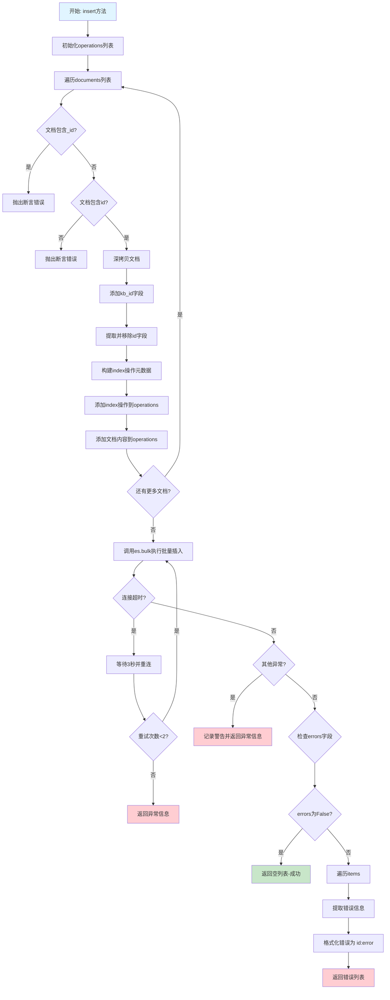
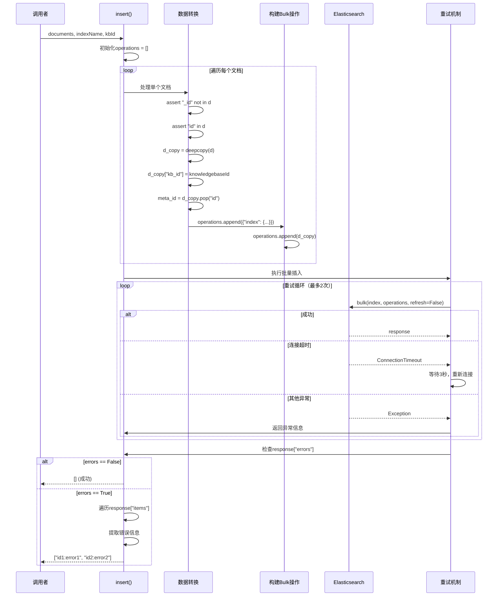

# Elasticsearch insert() 方法业务逻辑与执行流程分析

> **文件位置**: [rag/utils/es_conn.py:291-327](../../../rag/utils/es_conn.py#L291-L327)
> **类**: `ESConnection`
> **方法**: `insert(documents, indexName, knowledgebaseId=None)`
> **创建时间**: 2026-01-21

---

## 目录

1. [方法概览](#1-方法概览)
2. [业务逻辑](#2-业务逻辑)
3. [执行流程](#3-执行流程)
4. [技术要点](#4-技术要点)
5. [Bulk API详解](#5-bulk-api详解)
6. [错误处理与重试](#6-错误处理与重试)
7. [与OceanBase的对比](#7-与oceanbase的对比)

---

## 1. 方法概览

### 1.1 方法签名

```python
def insert(self, documents: list[dict], indexName: str, knowledgebaseId: str = None) -> list[str]
```

### 1.2 参数说明

| 参数 | 类型 | 说明 |
|------|------|------|
| `documents` | `list[dict]` | 待插入的文档列表，每个文档必须包含`id`字段 |
| `indexName` | `str` | Elasticsearch索引名称 |
| `knowledgebaseId` | `str` | 知识库ID，会自动添加到每个文档的`kb_id`字段 |

### 1.3 返回值

- **类型**: `list[str]`
- **说明**: 错误信息列表
  - 成功时返回空列表 `[]`
  - 失败时返回格式为 `["doc_id:error_message", ...]` 的错误列表

### 1.4 核心职责

1. **构建Bulk操作**: 将文档列表转换为Elasticsearch Bulk API格式
2. **ID映射**: 将文档的`id`字段映射为Elasticsearch的`_id`元字段
3. **知识库ID注入**: 自动将`knowledgebaseId`注入到每个文档的`kb_id`字段
4. **批量插入**: 使用Elasticsearch Bulk API实现高性能批量写入
5. **错误收集**: 收集并返回所有插入失败的文档错误信息
6. **自动重试**: 连接超时时自动重试（最多2次）

---

## 2. 业务逻辑

### 2.1 整体逻辑结构



### 2.2 核心业务规则

#### 规则1: 字段断言检查

```python
assert "_id" not in d
assert "id" in d
```

**目的**:
- 防止用户直接使用`_id`字段（Elasticsearch保留字段）
- 确保每个文档都有`id`字段（用于生成`_id`）

**示例**:
```python
# ❌ 错误：包含_id字段
{"_id": "chunk_1", "content": "..."}  # AssertionError

# ❌ 错误：缺少id字段
{"content": "..."}  # AssertionError

# ✅ 正确
{"id": "chunk_1", "content": "..."}  # OK
```

#### 规则2: ID字段映射

```python
meta_id = d_copy.pop("id", "")
operations.append({"index": {"_index": indexName, "_id": meta_id}})
```

**映射关系**:
```
document["id"]  →  Elasticsearch["_id"]
```

**Elasticsearch元字段结构**:
```json
{
  "index": {
    "_index": "rag_table_001",
    "_id": "chunk_123"
  }
}
```

**为何使用`pop`**:
- `id`是业务字段，在Elasticsearch中对应`_id`元字段
- 使用`pop`移除业务字段`id`，避免重复存储

#### 规则3: 知识库ID自动注入

```python
d_copy["kb_id"] = knowledgebaseId
```

**注入逻辑**:
- 不管原始文档是否包含`kb_id`，都会被覆盖
- 确保文档与知识库的正确关联
- 支持多租户隔离

**示例**:
```python
# 输入
{
    "id": "chunk_1",
    "kb_id": "old_kb_id",  # 会被覆盖
    "content": "..."
}

# 处理后（存储到ES）
{
    "_id": "chunk_1",
    "_source": {
        "kb_id": "new_kb_id",  # knowledgebaseId参数
        "content": "..."
    }
}
```

#### 规则4: Bulk API操作格式

```python
operations = []
for d in documents:
    # 操作行
    operations.append({"index": {"_index": indexName, "_id": meta_id}})
    # 数据行
    operations.append(d_copy)
```

**最终格式**:
```json
[
  {"index": {"_index": "rag_table", "_id": "chunk_1"}},
  {"kb_id": "kb_123", "content": "content 1"},

  {"index": {"_index": "rag_table", "_id": "chunk_2"}},
  {"kb_id": "kb_123", "content": "content 2"},

  ...
]
```

**Bulk API格式说明**:
- 每个文档由**两行**组成：操作行 + 数据行
- 操作行：指定操作类型（index/create/update/delete）和元数据
- 数据行：文档的实际内容

---

## 3. 执行流程

### 3.1 完整流程图



### 3.2 关键步骤详解

#### 步骤1: 数据转换

```python
operations = []
for d in documents:
    assert "_id" not in d
    assert "id" in d
    d_copy = copy.deepcopy(d)
    d_copy["kb_id"] = knowledgebaseId
    meta_id = d_copy.pop("id", "")
    operations.append({"index": {"_index": indexName, "_id": meta_id}})
    operations.append(d_copy)
```

**转换示例**:
```python
# 输入documents
[
    {
        "id": "chunk_001",
        "doc_id": "doc_123",
        "content_ltks": "this is a test"
    }
]

# 转换后operations
[
    {"index": {"_index": "rag_table", "_id": "chunk_001"}},
    {
        "doc_id": "doc_123",
        "content_ltks": "this is a test",
        "kb_id": "kb_456"  # 自动注入
    }
]
```

#### 步骤2: 执行Bulk插入

```python
r = self.es.bulk(
    index=(indexName),
    operations=operations,
    refresh=False,      # 不立即刷新，提高性能
    timeout="60s"
)
```

**参数说明**:
- `refresh=False`: 不立即刷新索引，提高写入性能
- `timeout="60s": 60秒超时
- `operations`: 批量操作列表

#### 步骤3: 错误检查

```python
if re.search(r"False", str(r["errors"]), re.IGNORECASE):
    return res  # 无错误，返回空列表
```

**Elasticsearch Bulk响应格式**:
```json
{
  "took": 15,
  "errors": false,  // false表示没有错误
  "items": [
    {
      "index": {
        "_index": "rag_table",
        "_id": "chunk_001",
        "_version": 1,
        "result": "created",
        "status": 201
      }
    }
  ]
}
```

#### 步骤4: 错误收集

```python
for item in r["items"]:
    for action in ["create", "delete", "index", "update"]:
        if action in item and "error" in item[action]:
            res.append(str(item[action]["_id"]) + ":" + str(item[action]["error"]))
return res
```

**错误响应示例**:
```json
{
  "took": 10,
  "errors": true,
  "items": [
    {
      "index": {
        "_id": "chunk_001",
        "error": {
          "type": "version_conflict_engine_exception",
          "reason": "[chunk_001]: version conflict"
        }
      }
    }
  ]
}
```

**错误格式化**:
```
chunk_001:version_conflict_engine_exception: [chunk_001]: version conflict
```

---

## 4. 技术要点

### 4.1 Elasticsearch Bulk API

**官方文档**: https://www.elastic.co/guide/en/elasticsearch/reference/current/docs-bulk.html

**请求格式**:
```json
POST /_bulk
{ "index" : { "_index" : "test", "_id" : "1" } }
{ "field1" : "value1" }
{ "delete" : { "_index" : "test", "_id" : "2" } }
{ "create" : { "_index" : "test", "_id" : "3" } }
{ "field1" : "value3" }
{ "update" : {"_id" : "1", "_index" : "test"} }
{ "doc" : {"field2" : "value2"} }
```

**操作类型**:
| 操作 | 说明 | ID不存在时 | ID存在时 |
|------|------|-----------|---------|
| `index` | 索引文档 | 创建 | 覆盖 |
| `create` | 创建文档 | 创建 | 错误 |
| `update` | 更新文档 | 错误 | 更新 |
| `delete` | 删除文档 | 错误 | 删除 |

**RAGFlow使用`index`操作**:
- 幂等性：重复插入相同ID不会报错
- 自动覆盖：文档内容变化时自动更新

### 4.2 深拷贝的作用

```python
d_copy = copy.deepcopy(d)
```

**为何使用深拷贝**:

1. **防止修改原始数据**:
```python
# 原始documents可能被其他地方使用
documents = [{"id": "1", "kb_id": "old"}]

# 如果直接修改
d = documents[0]
d["kb_id"] = "new"  # 会影响documents[0]

# 使用深拷贝
d_copy = copy.deepcopy(documents[0])
d_copy["kb_id"] = "new"  # 不影响documents[0]
```

2. **避免共享引用**:
```python
# 浅拷贝的问题
original = {"id": "1", "nested": {"key": "value"}}
shallow = original.copy()
shallow["nested"]["key"] = "modified"  # 也会修改original

# 深拷贝的解决方案
deep = copy.deepcopy(original)
deep["nested"]["key"] = "modified"  # 不影响original
```

### 4.3 元字段与业务字段

**Elasticsearch元字段**:
| 元字段 | 说明 | 示例 |
|--------|------|------|
| `_id` | 文档唯一标识 | `"chunk_123"` |
| `_index` | 索引名称 | `"rag_table"` |
| `_source` | 原始JSON文档 | `{"field": "value"}` |
| `_version` | 文档版本号 | `1` |
| `_score` | 相关性得分 | `0.85` |

**ID映射规则**:
```python
# 业务字段 → 元字段
document["id"] → _id (元字段，不可在_source中访问)

# 访问方式
es.get(index="table", id="chunk_123")     # 使用_id
source = res["_source"]                    # 获取_source部分
source["id"]                               # ❌ 不存在（已被pop）
source["kb_id"]                           # ✅ 存在
```

### 4.4 知识库ID注入的必要性

**多租户隔离**:
```python
# 场景：多个知识库共享一个Elasticsearch索引
indexName = "rag_table_tenant_001"

# 文档1属于知识库A
doc1 = {"id": "chunk_1", "content": "...", "kb_id": "kb_A"}

# 文档2属于知识库B
doc2 = {"id": "chunk_2", "content": "...", "kb_id": "kb_B"}

# 查询时通过kb_id过滤
query = Q("bool", must=[
    Q("term", kb_id="kb_A")  # 只检索知识库A的文档
])
```

**数据隔离策略**:
```
┌─────────────────────────────────────┐
│  rag_table_tenant_001 (索引)       │
├─────────────────────────────────────┤
│ doc1: {kb_id: "kb_A", ...}        │
│ doc2: {kb_id: "kb_B", ...}        │
│ doc3: {kb_id: "kb_A", ...}        │
└─────────────────────────────────────┘
         ↓                      ↓
    查询kb_A的文档          查询kb_B的文档
```

---

## 5. Bulk API详解

### 5.1 Bulk操作结构

```python
operations = [
    # 文档1
    {"index": {"_index": "rag_table", "_id": "chunk_1"}},
    {"kb_id": "kb_123", "content": "content 1"},

    # 文档2
    {"index": {"_index": "rag_table", "_id": "chunk_2"}},
    {"kb_id": "kb_123", "content": "content 2"},

    # 文档3
    {"index": {"_index": "rag_table", "_id": "chunk_3"}},
    {"kb_id": "kb_123", "content": "content 3"},
]
```

**HTTP请求格式**:
```http
POST /_bulk
Content-Type: application/x-ndjson

{"index": {"_index": "rag_table", "_id": "chunk_1"}}
{"kb_id": "kb_123", "content": "content 1"}
{"index": {"_index": "rag_table", "_id": "chunk_2"}}
{"kb_id": "kb_123", "content": "content 2"}
{"index": {"_index": "rag_table", "_id": "chunk_3"}}
{"kb_id": "kb_123", "content": "content 3"}
```

**注意事项**:
- 每行必须是有效的JSON
- 每行必须以换行符（`\n`）结尾
- 最后一行也要有换行符
- Content-Type: `application/x-ndjson` (Newline-Delimited JSON)

### 5.2 Bulk响应解析

```python
r = self.es.bulk(index=indexName, operations=operations, refresh=False)
```

**响应结构**:
```json
{
  "took": 30,
  "errors": false,
  "items": [
    {
      "index": {
        "_index": "rag_table",
        "_id": "chunk_1",
        "_version": 1,
        "result": "created",
        "_shards": {
          "total": 2,
          "successful": 1,
          "failed": 0
        },
        "status": 201,
        "_seq_no": 0,
        "_primary_term": 1
      }
    },
    {
      "index": {
        "_index": "rag_table",
        "_id": "chunk_2",
        "_version": 1,
        "result": "created",
        "_shards": {
          "total": 2,
          "successful": 1,
          "failed": 0
        },
        "status": 201,
        "_seq_no": 1,
        "_primary_term": 1
      }
    }
  ]
}
```

**响应字段说明**:
- `took`: 执行时间（毫秒）
- `errors`: 是否有错误（布尔值）
- `items`: 每个操作的执行结果
  - `result`: 操作结果（created/updated/deleted）
  - `status`: HTTP状态码
  - `error`: 错误信息（如果失败）

### 5.3 错误响应示例

```json
{
  "took": 20,
  "errors": true,
  "items": [
    {
      "index": {
        "_index": "rag_table",
        "_id": "chunk_1",
        "error": {
          "type": "version_conflict_engine_exception",
          "reason": "[chunk_1]: version conflict, current version [2] is different from the one provided [1]"
        },
        "status": 409
      }
    },
    {
      "index": {
        "_index": "rag_table",
        "_id": "chunk_2",
        "_version": 2,
        "result": "updated",
        "status": 200
      }
    }
  ]
}
```

**错误类型**:
| 错误类型 | HTTP状态码 | 说明 |
|---------|-----------|------|
| `version_conflict_engine_exception` | 409 | 版本冲突 |
| `document_missing_exception` | 404 | 文档不存在（update操作） |
| `mapper_parsing_exception` | 400 | 字段类型错误 |
| `illegal_argument_exception` | 400 | 参数错误 |

---

## 6. 错误处理与重试

### 6.1 重试机制

```python
res = []
for _ in range(ATTEMPT_TIME):  # ATTEMPT_TIME = 2
    try:
        res = []
        r = self.es.bulk(...)
        if re.search(r"False", str(r["errors"]), re.IGNORECASE):
            return res
        # ... 错误收集
        return res
    except ConnectionTimeout:
        logger.exception("ES request timeout")
        time.sleep(3)
        self._connect()  # 重新连接
        continue
    except Exception as e:
        res.append(str(e))
        logger.warning("ESConnection.insert got exception: " + str(e))
return res
```

**重试策略**:
| 异常类型 | 处理方式 | 重试次数 |
|---------|---------|---------|
| `ConnectionTimeout` | 等待3秒并重连 | 最多2次 |
| 其他异常 | 记录警告，不重试 | - |

**重连逻辑**:
```python
def _connect(self):
    self.es = Elasticsearch(
        settings.ES["hosts"].split(","),
        basic_auth=(settings.ES["username"], settings.ES["password"]),
        verify_certs=settings.ES.get("verify_certs", False),
        timeout=600
    )
    if self.es:
        self.info = self.es.info()
        return True
    return False
```

### 6.2 错误收集逻辑

```python
for item in r["items"]:
    for action in ["create", "delete", "index", "update"]:
        if action in item and "error" in item[action]:
            res.append(str(item[action]["_id"]) + ":" + str(item[action]["error"]))
return res
```

**错误信息格式**:
```
{document_id}:{error_message}
```

**示例**:
```python
# 成功：返回空列表
[]

# 失败：返回错误列表
[
    "chunk_1:version_conflict_engine_exception: [chunk_1]: version conflict",
    "chunk_2:mapper_parsing_exception: failed to parse field [q_1024_vec]"
]
```

### 6.3 错误处理最佳实践

**调用方示例**:
```python
# rag/svr/task_executor.py:820
doc_store_result = await asyncio.to_thread(
    settings.docStoreConn.insert,
    chunks[b:b + settings.DOC_BULK_SIZE],
    search.index_name(task_tenant_id),
    task_dataset_id,
)

# 检查结果
if doc_store_result:
    error_message = f"Insert chunk error: {doc_store_result}"
    progress_callback(-1, msg=error_message)
    raise Exception(error_message)
```

**错误处理流程**:
```python
# 1. 调用insert
errors = es_conn.insert(documents, indexName, kbId)

# 2. 检查是否有错误
if errors:
    # 3. 处理错误
    for error in errors:
        doc_id, error_msg = error.split(":", 1)
        logger.error(f"Failed to insert {doc_id}: {error_msg}")
        # 可以选择：重试、记录日志、通知用户等
```

---

## 7. 与OceanBase的对比

### 7.1 数据模型对比

| 特性 | Elasticsearch | OceanBase |
|------|---------------|-----------|
| **数据结构** | 文档型（Schema灵活） | 关系型表（Schema强约束） |
| **主键** | `_id`元字段 | `id`字段（主键） |
| **字段映射** | `id` → `_id` | `id`保持不变 |
| **数组类型** | 原生支持，自动识别 | 需要定义`ARRAY`类型 |
| **JSON类型** | 原生`object`类型 | 需要`JSON`类型 |
| **未知字段** | 动态映射，自动添加 | 放入`extra`字段 |

### 7.2 插入操作对比

#### Elasticsearch es_conn.py

```python
def insert(self, documents, indexName, knowledgebaseId):
    operations = []
    for d in documents:
        d_copy = copy.deepcopy(d)
        d_copy["kb_id"] = knowledgebaseId
        meta_id = d_copy.pop("id")
        operations.append({"index": {"_index": indexName, "_id": meta_id}})
        operations.append(d_copy)

    r = self.es.bulk(index=indexName, operations=operations, refresh=False)
    # 错误收集...
```

**特点**:
- 使用Bulk API
- 两行格式（操作行 + 数据行）
- `id` → `_id` 映射
- 不需要预定义字段

#### OceanBase ob_conn.py

```python
def insert(self, documents, indexName, knowledgebaseId):
    docs = []
    for document in documents:
        d = {}
        for k, v in document.items():
            if k not in column_names:
                d["extra"][k] = v
            else:
                d[k] = transform(v)  # 类型转换
        docs.append(d)

    self.client.upsert(indexName, docs)
```

**特点**:
- 使用Upsert操作
- 单个文档列表
- 严格的字段映射
- 需要类型转换

### 7.3 性能对比

| 操作 | Elasticsearch | OceanBase |
|------|---------------|-----------|
| **批量插入** | Bulk API（两行格式） | `INSERT ON DUPLICATE KEY UPDATE` |
| **并发写入** | 乐观并发控制 | 行级锁（悲观锁） |
| **原子性** | 单文档原子性 | 完整ACID事务 |
| **刷新策略** | `refresh=False`（延迟刷新） | 立即持久化 |
| **吞吐量** | 更高（文档型） | 较低（关系型） |

### 7.4 使用场景

**Elasticsearch优势**:
- ✅ 文档检索为主
- ✅ 全文检索需求强
- ✅ Schema灵活，字段动态添加
- ✅ 高并发写入场景
- ✅ 分布式扩展性强

**OceanBase优势**:
- ✅ 需要强一致性
- ✅ 需要事务支持
- ✅ 复杂条件查询（SQL）
- ✅ 结构化数据为主
- ✅ 向量原生支持

### 7.5 代码复杂度对比

#### Elasticsearch

```python
# 简单直接
operations = []
for d in documents:
    operations.append({"index": {"_index": indexName, "_id": d.pop("id")}})
    operations.append(d)
self.es.bulk(operations=operations)
```

#### OceanBase

```python
# 复杂转换
docs = []
for document in documents:
    d = {}
    for k, v in document.items():
        if vector_column_pattern.match(k):
            d[k] = v
        elif k not in column_names:
            d["extra"][k] = v
        elif k == "kb_id" and isinstance(v, list):
            d[k] = v[0]
        elif k == "content_with_weight" and isinstance(v, dict):
            d[k] = json.dumps(v, ensure_ascii=False)
        # ... 更多类型判断
    docs.append(d)
self.client.upsert(indexName, docs)
```

---

## 8. 总结

### 8.1 核心要点

1. **Bulk API格式**: 两行格式（操作行 + 数据行）
2. **ID映射**: `id`字段 → `_id`元字段
3. **知识库ID注入**: 自动覆盖`kb_id`字段
4. **深拷贝**: 防止修改原始数据
5. **幂等性**: 使用`index`操作，支持重复插入
6. **错误收集**: 返回`["id:error"]`格式
7. **自动重试**: 连接超时自动重试（最多2次）

### 8.2 设计优点

- ✅ **高性能**: Bulk API批量操作
- ✅ **灵活性**: 动态映射，无需预定义字段
- ✅ **幂等性**: `index`操作可重复执行
- ✅ **多租户**: 自动注入`kb_id`实现隔离
- ✅ **错误处理**: 详细收集每个失败文档的错误
- ✅ **重试机制**: 自动重试连接超时

### 8.3 注意事项

- ⚠️ **字段冲突**: 不能包含`_id`字段
- ⚠️ **ID必需**: 必须包含`id`字段
- ⚠️ **刷新延迟**: `refresh=False`，数据可能不立即可见
- ⚠️ **错误处理**: 部分失败不影响其他文档
- ⚠️ **版本冲突**: 并发更新可能导致版本冲突

### 8.4 调用关系

```
task_executor.py:insert_es()
    └─> settings.docStoreConn.insert()
        └─> ESConnection.insert() (本方法)
            └─> es.bulk()
                └─> Elasticsearch Bulk API
```

### 8.5 与601文档的关联

**[601-持久化流程总结.md](601-持久化流程总结.md)** 提到的批量插入优化：

```python
# task_executor.py:818-820
for b in range(0, len(chunks), settings.DOC_BULK_SIZE):
    doc_store_result = await asyncio.to_thread(
        settings.docStoreConn.insert,
        chunks[b:b + settings.DOC_BULK_SIZE],
        search.index_name(task_tenant_id),
        task_dataset_id,
    )
```

**批量大小**:
- `DOC_BULK_SIZE = 64`（默认）
- 每批最多64个文档
- 平衡内存占用与性能

---

## 9. 相关文档

- [601-持久化流程总结.md](601-持久化流程总结.md) - Elasticsearch/Infinity持久化流程
- [610-OceanBase插入流程分析.md](610-OceanBase插入流程分析.md) - OceanBase插入实现
- [conf/mapping.json](../../../conf/mapping.json) - Elasticsearch映射配置
- [Elasticsearch Bulk API](https://www.elastic.co/guide/en/elasticsearch/reference/current/docs-bulk.html)
