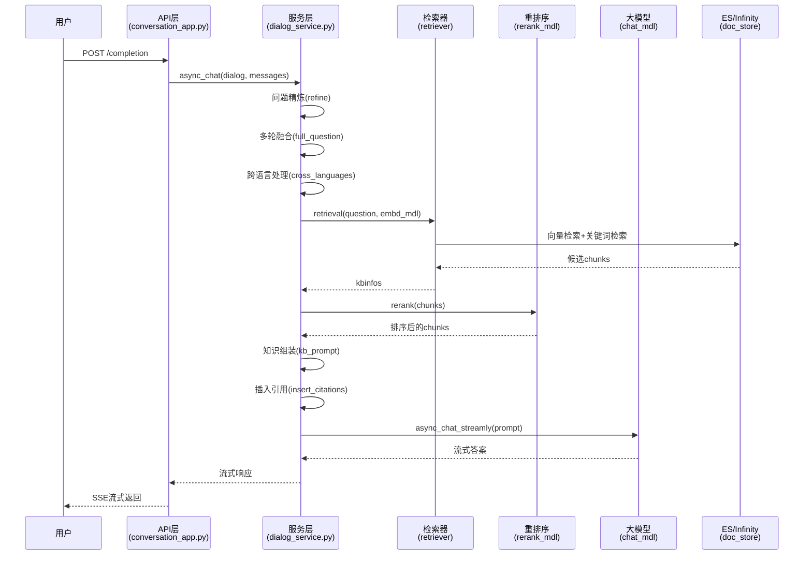

# 查询执行流程分析任务分解

> **研究目标**: 系统分析用户提交查询之后的完整执行流程，从API接收到答案返回的端到端过程
> **创建时间**: 2026-01-20
> **分析范围**: 从用户查询提交到答案生成的完整链路

---

## 目录

1. [整体流程概览](#1-整体流程概览)
2. [任务分解](#2-任务分解)
3. [分析顺序建议](#3-分析顺序建议)
4. [核心文件清单](#4-核心文件清单)

---

## 1. 整体流程概览

### 1.1 查询执行主链路



### 1.2 核心处理阶段

| 阶段 | 关键方法 | 说明 |
|------|---------|------|
| **请求接收** | `completion()` | API层接收用户查询 |
| **对话管理** | `async_chat()` | 对话服务主入口 |
| **问题预处理** | `full_question()` | 多轮对话融合 |
| **问题优化** | `keyword_extraction()` | 关键词提取 |
| **知识检索** | `retrieval()` | 混合检索（向量+关键词） |
| **重排序** | `rerank_mdl` | 精细化排序 |
| **上下文组装** | `kb_prompt()` | 检索结果格式化 |
| **答案生成** | `async_chat_streamly()` | LLM流式生成 |
| **引用标注** | `insert_citations()` | 自动插入引用标记 |

---

## 2. 任务分解

### 任务1: API层请求接收与路由

**文件**: [api/apps/conversation_app.py:168-251](../../../api/apps/conversation_app.py#L168-L251)

**方法**: `completion()`

**分析要点**:
- 请求参数解析与验证（conversation_id, messages）
- 会话状态加载（conversation, dialog）
- 消息格式化处理
- 流式/非流式响应路由
- 错误处理机制

**核心代码**:
```python
@manager.route("/completion", methods=["POST"])
@login_required
@validate_request("conversation_id", "messages")
async def completion():
    req = await get_request_json()
    # 1. 参数解析
    # 2. 加载会话
    # 3. 调用async_chat
    # 4. 流式响应
```

**输出文档**: `702-API层请求接收与路由.md`

---

### 任务2: 对话服务主流程

**文件**: [api/db/services/dialog_service.py:281-564](../../../api/db/services/dialog_service.py#L281-L564)

**方法**: `async_chat(dialog, messages, stream=True, **kwargs)`

**分析要点**:
- 对话模型加载（chat_mdl, embd_mdl, rerank_mdl, tts_mdl）
- SQL检索模式判断（`use_sql`）
- 问题精炼流程（`refine_multiturn`, `full_question`）
- 跨语言处理（`cross_languages`）
- 元数据过滤（`meta_data_filter`）
- 知识图谱检索（`use_kg`）
- 深度研究模式（`reasoning` with DeepResearcher）
- 提示词组装（prompt construction）
- LLM调用与流式输出
- 时间统计与性能监控

**核心流程**:
```python
async def async_chat(dialog, messages, stream=True, **kwargs):
    # 1. 模型加载
    kbs, embd_mdl, rerank_mdl, chat_mdl, tts_mdl = get_models(dialog)

    # 2. SQL模式检查
    if field_map:
        ans = await use_sql(...)
        if ans: return

    # 3. 问题精炼
    if refine_multiturn:
        questions = [await full_question(...)]

    # 4. 检索
    kbinfos = retriever.retrieval(...)

    # 5. 知识图谱检索
    if use_kg:
        ck = settings.kg_retriever.retrieval(...)

    # 6. 知识组装
    knowledges = kb_prompt(kbinfos, max_tokens)

    # 7. LLM生成
    async for ans in chat_mdl.async_chat_streamly(...):
        yield ans
```

**输出文档**: `703-对话服务主流程详解.md`

---

### 任务3: 问题精炼与多轮对话融合

**文件**: `rag/prompts/generator.py`

**方法**: `full_question()`, `message_fit_in()`

**分析要点**:
- 多轮对话上下文提取（最近3轮用户问题）
- 问题融合策略
- Token数量控制（`message_fit_in`）
- 提示词模板使用

**输入输出**:
```python
# 输入
messages = [
    {"role": "user", "content": "什么是RAG？"},
    {"role": "assistant", "content": "RAG是..."},
    {"role": "user", "content": "它有什么优点？"}
]

# 输出
refined_question = "RAG技术有哪些优点？"
```

**输出文档**: `704-问题精炼与多轮对话融合.md`

---

### 任务4: 知识检索流程

**文件**: [rag/nlp/search.py](../../../rag/nlp/search.py)

**方法**: `retrieval()`, `retrieval_by_toc()`, `retrieval_by_children()`

**分析要点**:
- 混合检索策略（向量+关键词+标量特征）
- 相似度计算（vector_similarity_weight）
- Top-K与Top-N控制
- TOC增强检索（目录结构增强）
- 子chunk检索（retrieval_by_children）
- 检索结果聚合（doc_aggs）

**检索公式**:
```python
final_score = vector_similarity_weight * vector_score +
              (1 - vector_similarity_weight) * keyword_score +
              rank_feature_score
```

**关键参数**:
- `similarity_threshold`: 相似度阈值（默认0.2）
- `vector_similarity_weight`: 向量权重（默认0.3）
- `top_n`: 每个知识库检索数量
- `top_k`: 最终保留数量

**输出文档**: `705-知识检索流程详解.md`

---

### 任务5: 重排序机制

**方法**: `rerank_mdl.rerank(chunks, question)`

**分析要点**:
- Rerank模型调用（如BGE-Reranker, Cohere Rerank）
- 批处理优化
- 评分机制
- 与初始检索的融合策略

**调用位置**:
```python
kbinfos = retriever.retrieval(
    ...,
    rerank_mdl=rerank_mdl,
    rank_feature=label_question(" ".join(questions), kbs),
)
```

**输出文档**: `706-重排序机制分析.md`

---

### 任务6: 知识组装与上下文构建

**文件**: `rag/prompts/generator.py`

**方法**: `kb_prompt()`, `chunks_format()`, `citation_prompt()`

**分析要点**:
- Chunk格式化策略（模板: `##{i}$$ {content}`）
- 知识库提示词模板
- Token数量限制（max_tokens控制）
- 引用标记格式（`##{i}$$`）
- 文档聚合信息（doc_aggs）

**组装逻辑**:
```python
knowledges = kb_prompt(kbinfos, max_tokens)
# 格式:
"""
------
##0$$ 第一段检索内容...
------
##1$$ 第二段检索内容...
"""
```

**输出文档**: `707-知识组装与上下文构建.md`

---

### 任务7: 引用插入与自动标注

**文件**: [api/db/services/dialog_service.py:456-532](../../../api/db/services/dialog_service.py#L456-L532)

**方法**: `insert_citations()`, `decorate_answer()`

**分析要点**:
- 引用检测模式（`[ID:1]`, `##1$$`）
- 自动插入引用机制
- 向量相似度匹配
- 引用修复（`repair_bad_citation_formats`）
- 文档来源聚合

**核心逻辑**:
```python
# 自动插入引用
answer, idx = retriever.insert_citations(
    answer,
    [ck["content_ltks"] for ck in kbinfos["chunks"]],
    [ck["vector"] for ck in kbinfos["chunks"]],
    embd_mdl,
    tkweight=1 - dialog.vector_similarity_weight,
    vtweight=dialog.vector_similarity_weight,
)
```

**输出文档**: `708-引用插入与自动标注机制.md`

---

### 任务8: LLM答案生成与流式输出

**文件**: [rag/llm/chat_model.py](../../../rag/llm/chat_model.py)

**方法**: `async_chat_streamly()`, `async_chat()`

**分析要点**:
- 提示词组装（system + user + knowledge）
- 流式生成机制（SSE）
- Token数量控制（max_tokens动态调整）
- 思维链处理（CoT，提取`` ``内容）
- 错误处理与重试

**提示词结构**:
```python
prompt = """
{system_prompt}

{knowledge}

------
{user_question}
------
"""
```

**流式输出**:
```python
async for ans in chat_mdl.async_chat_streamly(prompt, msg[1:], gen_conf):
    yield {"answer": ans, "reference": {}, "audio_binary": tts(...)}
```

**输出文档**: `709-LLM答案生成与流式输出机制.md`

---

### 任务9: SQL检索模式

**文件**: [api/db/services/dialog_service.py:567-690](../../../api/db/services/dialog_service.py#L567-L690)

**方法**: `use_sql()`

**分析要点**:
- 结构化数据检索场景
- LLM生成SQL（Text2SQL）
- SQL执行与结果格式化
- Markdown表格生成
- 引用标记插入

**适用场景**:
- 简历解析（已填写字段）
- 结构化文档查询
- 元数据过滤查询

**输出文档**: `710-SQL检索模式分析.md`

---

### 任务10: 深度研究模式（Agentic Reasoning）

**文件**: [api/db/services/dialog_service.py:373-395](../../../api/db/services/dialog_service.py#L373-L395)

**方法**: `DeepResearcher.thinking()`

**分析要点**:
- Agentic RAG实现
- 多步推理机制
- 迭代检索策略
- 思维链生成
- 知识累积与精炼

**调用条件**:
```python
if prompt_config.get("reasoning", False):
    reasoner = DeepResearcher(...)
    async for think in reasoner.thinking(kbinfos, ...):
        if isinstance(think, str):
            thought = think
        else:
            yield think  # 流式输出
```

**输出文档**: `711-深度研究模式（Agentic Reasoning）.md`

---

### 任务11: TOC增强检索

**文件**: `rag/nlp/search.py`

**方法**: `retrieval_by_toc()`

**分析要点**:
- 目录结构识别
- 层级检索策略
- 上下文扩展
- 相关性评分

**调用位置**:
```python
if prompt_config.get("toc_enhance"):
    cks = retriever.retrieval_by_toc(
        " ".join(questions),
        kbinfos["chunks"],
        tenant_ids,
        chat_mdl,
        dialog.top_n
    )
```

**输出文档**: `712-TOC增强检索机制.md`

---

### 任务12: 知识图谱检索

**文件**: `graphrag/`

**方法**: `settings.kg_retriever.retrieval()`

**分析要点**:
- 图谱构建流程
- 实体检索策略
- 关系路径查找
- 图谱上下文组装

**调用条件**:
```python
if prompt_config.get("use_kg"):
    ck = settings.kg_retriever.retrieval(
        " ".join(questions),
        tenant_ids,
        dialog.kb_ids,
        embd_mdl,
        LLMBundle(dialog.tenant_id, LLMType.CHAT)
    )
```

**输出文档**: `713-知识图谱检索流程.md`

---

### 任务13: 性能监控与时间统计

**文件**: [api/db/services/dialog_service.py:500-532](../../../api/db/services/dialog_service.py#L500-L532)

**方法**: `decorate_answer()`

**分析要点**:
- 时间分片统计
  - Check LLM
  - Check Langfuse tracer
  - Bind models
  - Query refinement (LLM)
  - Retrieval
  - Generate answer
- Token使用统计
- 性能瓶颈识别
- Langfuse集成

**输出示例**:
```python
## Time elapsed:
  - Total: 1234.5ms
  - Check LLM: 10.2ms
  - Check Langfuse tracer: 5.1ms
  - Bind models: 100.3ms
  - Query refinement(LLM): 450.6ms
  - Retrieval: 300.2ms
  - Generate answer: 368.1ms

## Token usage:
  - Generated tokens(approximately): 512
  - Token speed: 23/s
```

**输出文档**: `714-性能监控与时间统计机制.md`

---

### 任务14: 错误处理与降级策略

**分析要点**:
- 各层级错误处理
  - API层错误响应
  - 服务层异常捕获
  - LLM调用失败重试
  - 检索失败降级
- 空响应处理（empty_response）
- 引用格式修复
- TTS集成错误处理

**示例**:
```python
except Exception as e:
    yield "data:" + json.dumps({
        "code": 500,
        "message": str(e),
        "data": {"answer": "**ERROR**: " + str(e), "reference": []}
    }, ensure_ascii=False) + "\n\n"
```

**输出文档**: `715-错误处理与降级策略.md`

---

## 3. 分析顺序建议

### 阶段1: 主链路理解（任务1-2）

**目标**: 理解端到端流程

1. ✅ 任务1: API层请求接收与路由
2. ✅ 任务2: 对话服务主流程

### 阶段2: 核心检索机制（任务3-6）

**目标**: 理解知识检索与排序

3. ✅ 任务3: 问题精炼与多轮对话融合
4. ✅ 任务4: 知识检索流程
5. ✅ 任务5: 重排序机制
6. ✅ 任务6: 知识组装与上下文构建

### 阶段3: 高级特性（任务7-13）

**目标**: 理解增强功能

7. ✅ 任务7: 引用插入与自动标注
8. ✅ 任务8: LLM答案生成与流式输出
9. ✅ 任务9: SQL检索模式
10. ✅ 任务10: 深度研究模式（Agentic Reasoning）
11. ✅ 任务11: TOC增强检索
12. ✅ 任务12: 知识图谱检索

### 阶段4: 可观测性与稳定性（任务13-14）

**目标**: 理解监控与容错

13. ✅ 任务13: 性能监控与时间统计
14. ✅ 任务14: 错误处理与降级策略

---

## 4. 核心文件清单

### 4.1 API层

| 文件 | 路径 | 说明 |
|------|------|------|
| conversation_app.py | api/apps/conversation_app.py | 对话API路由 |
| dialog_app.py | api/apps/dialog_app.py | 助手配置API |

### 4.2 服务层

| 文件 | 路径 | 说明 |
|------|------|------|
| dialog_service.py | api/db/services/dialog_service.py | 对话服务核心逻辑 |
| conversation_service.py | api/db/services/conversation_service.py | 会话管理 |
| llm_service.py | api/db/services/llm_service.py | LLM封装 |

### 4.3 检索层

| 文件 | 路径 | 说明 |
|------|------|------|
| search.py | rag/nlp/search.py | 检索实现 |
| retrieval.py | agent/tools/retrieval.py | Agent检索工具 |

### 4.4 LLM层

| 文件 | 路径 | 说明 |
|------|------|------|
| chat_model.py | rag/llm/chat_model.py | 对话模型封装 |
| embedding_model.py | rag/llm/embedding_model.py | 向量化模型 |
| rerank_model.py | rag/llm/rerank_model.py | 重排序模型 |

### 4.5 提示词

| 文件 | 路径 | 说明 |
|------|------|------|
| generator.py | rag/prompts/generator.py | 提示词生成器 |
| template.py | rag/prompts/template.py | 提示词模板 |

### 4.6 高级特性

| 文件 | 路径 | 说明 |
|------|------|------|
| DeepResearcher | agentic_reasoning | 深度研究模式 |
| MindMapExtractor | graphrag/general/mind_map_extractor.py | 思维导图生成 |
| kg_retriever | graphrag/ | 知识图谱检索 |

---

## 5. 关键数据结构

### 5.1 请求结构

```python
{
    "conversation_id": "conv_123",
    "messages": [
        {"role": "user", "content": "问题内容", "id": "msg_1"},
        {"role": "assistant", "content": "答案内容", "id": "msg_1"},
        {"role": "user", "content": "追问内容", "id": "msg_2"}
    ],
    "stream": True,
    "llm_id": "model_name",
    "temperature": 0.7
}
```

### 5.2 kbinfos结构

```python
{
    "total": 10,  # 检索到的总chunk数
    "chunks": [
        {
            "chunk_id": "chunk_1",
            "content_ltks": "分词后的内容",
            "content_sm_ltks": "精细分词内容",
            "vector": [0.1, 0.2, ...],  # 向量表示
            "doc_id": "doc_1",
            "docnm_kwd": "文档名称",
            "important_kwd": ["关键词"],
            "image_id": "img_1",
            "similarity": 0.85,
            "score": 0.92
        }
    ],
    "doc_aggs": [
        {
            "doc_id": "doc_1",
            "doc_name": "文档1",
            "count": 3  # 该文档被引用次数
        }
    ]
}
```

### 5.3 响应结构

```python
{
    "code": 0,
    "message": "",
    "data": {
        "answer": "答案内容",
        "reference": {
            "chunks": [...],
            "doc_aggs": [...]
        },
        "prompt": "完整提示词",
        "audio_binary": b"...",  # TTS音频
        "created_at": 1234567890.0
    }
}
```

---

## 6. 关键配置参数

### 6.1 Dialog配置

| 参数 | 类型 | 说明 | 默认值 |
|------|------|------|--------|
| `kb_ids` | list | 关联知识库ID列表 | [] |
| `llm_id` | str | LLM模型ID | - |
| `similarity_threshold` | float | 相似度阈值 | 0.2 |
| `vector_similarity_weight` | float | 向量权重 | 0.3 |
| `top_n` | int | 每个知识库检索数量 | 10 |
| `top_k` | int | 最终保留数量 | 5 |
| `rerank_id` | str | 重排序模型ID | - |
| `prompt_config` | dict | 提示词配置 | {} |

### 6.2 Prompt配置

| 参数 | 类型 | 说明 |
|------|------|------|
| `system` | str | 系统提示词 |
| `parameters` | list | 参数列表 |
| `quote` | bool | 是否启用引用 |
| `refine_multiturn` | bool | 多轮对话精炼 |
| `cross_languages` | str | 跨语言处理 |
| `keyword` | bool | 关键词提取 |
| `reasoning` | bool | 深度研究模式 |
| `toc_enhance` | bool | TOC增强 |
| `use_kg` | bool | 知识图谱 |
| `empty_response` | str | 空响应 |
| `tts` | bool | 语音合成 |

---

## 7. 研究价值与预期产出

### 7.1 技术理解

通过系统分析，您将深入理解:

1. **RAG系统架构**: 检索增强生成的完整实现
2. **混合检索策略**: 向量检索与关键词检索的融合
3. **多轮对话管理**: 上下文维护与问题精炼
4. **流式输出机制**: SSE服务端推送实现
5. **引用自动标注**: 基于向量相似度的引用插入
6. **Agentic RAG**: 深度研究模式的实现
7. **知识图谱增强**: 图谱检索与向量检索的融合

### 7.2 文档产出

预计生成 **14篇** 详细分析文档，总计约 **5-7万字**，涵盖:

- API层设计与路由
- 服务层核心逻辑
- 检索算法实现
- LLM集成与流式输出
- 高级特性分析
- 性能监控与优化

### 7.3 实践价值

- **架构设计**: 学习生产级RAG系统的架构设计
- **性能优化**: 理解各环节性能瓶颈与优化策略
- **功能扩展**: 为自定义功能开发提供参考
- **问题诊断**: 快速定位和解决线上问题

---

## 8. 分析方法建议

### 8.1 静态分析

1. **代码走读**: 按调用链路逐步分析
2. **数据流追踪**: 关注数据结构的流转与变换
3. **配置依赖**: 理解参数对各环节的影响

### 8.2 动态分析

1. **日志分析**: 通过日志验证执行流程
2. **性能分析**: 监控各环节耗时
3. **断点调试**: 关键逻辑断点调试

### 8.3 对比分析

1. **模式对比**: SQL检索 vs 向量检索
2. **策略对比**: 不同rerank模型的效果
3. **配置对比**: 不同参数对结果的影响

---

## 9. 下一步行动

**建议起点**: 从 **任务1 (API层请求接收)** 开始，按顺序逐个分析。

**分析模板**:
```markdown
# [任务标题]

## 1. 方法概览
- 文件位置: [文件路径]
- 方法签名: `def method_name()`
- 调用位置: [调用链路]

## 2. 业务逻辑
- 核心职责
- 输入参数
- 输出结果
- 处理流程图

## 3. 技术要点
- 关键算法
- 数据结构
- 性能优化
- 边界处理

## 4. 代码示例
关键代码片段与注释

## 5. 相关配置
配置参数说明

## 6. 执行示例
实际执行流程演示

## 7. 总结
核心要点总结
```

---

**开始分析吧！🚀**

建议从 `/Users/zhaob/workspace/zhaob/zwk03/py-wk/ragflow/api/apps/conversation_app.py` 的 `completion()` 方法开始。
