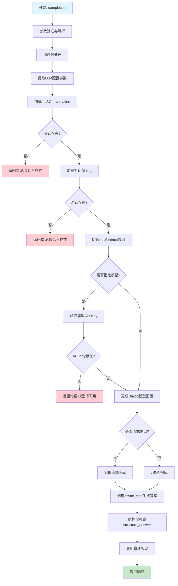
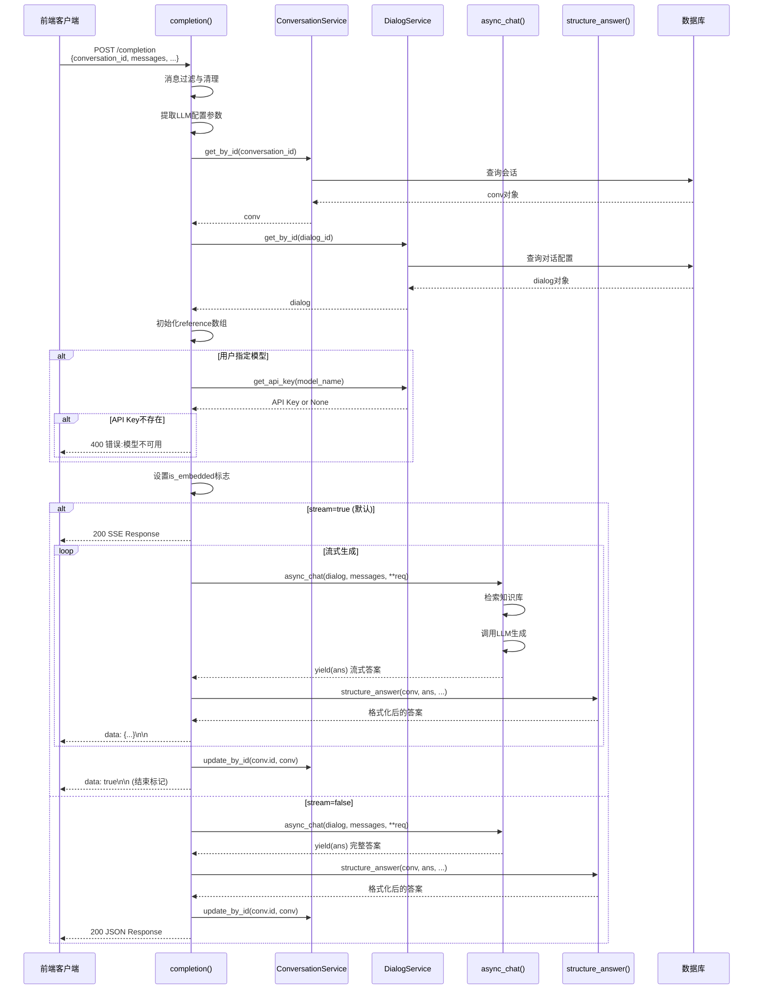
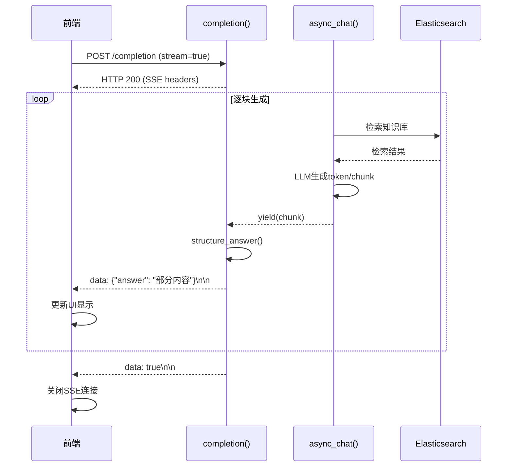

# API层 completion() 方法业务逻辑与执行流程分析

> **文件位置**: [api/apps/conversation_app.py:168-251](../../../api/apps/conversation_app.py#L168-L251)
> **路由**: `POST /completion`
> **创建时间**: 2026-01-21

---

## 目录

1. [方法概览](#1-方法概览)
2. [业务逻辑](#2-业务逻辑)
3. [执行流程](#3-执行流程)
4. [技术要点](#4-技术要点)
5. [流式响应机制](#5-流式响应机制)
6. [相关方法分析](#6-相关方法分析)

---

## 1. 方法概览

### 1.1 方法签名

```python
@manager.route("/completion", methods=["POST"])
@login_required
@validate_request("conversation_id", "messages")
async def completion()
```

### 1.2 路由配置

| 配置项 | 值 | 说明 |
|--------|-----|------|
| **路由路径** | `/completion` | 对话完成接口 |
| **HTTP方法** | `POST` | POST请求 |
| **认证要求** | `@login_required` | 需要用户登录 |
| **参数验证** | `conversation_id`, `messages` | 必填参数 |

### 1.3 核心职责

1. **消息预处理**: 过滤和清理用户提交的消息列表
2. **会话加载**: 加载对话(Dialog)和会话(Conversation)配置
3. **模型配置**: 提取和验证LLM模型参数
4. **流式/非流式**: 支持SSE流式输出和普通JSON响应
5. **答案结构化**: 格式化AI返回的答案和引用
6. **会话更新**: 保存对话历史到数据库

### 1.4 请求参数

```python
{
    "conversation_id": "conv_123",      # 必填：会话ID
    "messages": [                       # 必填：消息列表
        {"role": "user", "content": "问题", "id": "msg_1"},
        {"role": "assistant", "content": "答案", "id": "msg_1"},
        {"role": "user", "content": "追问", "id": "msg_2"}
    ],
    "llm_id": "model_name",             # 可选：指定LLM模型
    "temperature": 0.7,                 # 可选：温度参数
    "top_p": 0.9,                        # 可选：top_p采样
    "max_tokens": 2000,                 # 可选：最大token数
    "stream": true                       # 可选：是否流式输出（默认true）
}
```

### 1.5 响应格式

#### 流式响应（SSE）

```http
HTTP/1.1 200 OK
Content-Type: text/event-stream; charset=utf-8
Cache-control: no-cache
Connection: keep-alive
X-Accel-Buffering: no

data: {"code": 0, "message": "", "data": {"answer": "部分答案", "reference": {}}}

data: {"code": 0, "message": "", "data": {"answer": "继续生成", "reference": {}}}

data: {"code": 0, "message": "", "data": {"answer": "完整答案", "reference": {...}}}

data: {"code": 0, "message": "", "data": true}
```

#### 非流式响应（JSON）

```json
{
    "code": 0,
    "message": "",
    "data": {
        "answer": "完整答案",
        "reference": {
            "chunks": [...],
            "doc_aggs": [...]
        }
    }
}
```

---

## 2. 业务逻辑

### 2.1 整体逻辑结构



### 2.2 核心业务规则

#### 规则1: 消息过滤与清理

```python
msg = []
for m in req["messages"]:
    if m["role"] == "system":
        continue  # 过滤system消息
    if m["role"] == "assistant" and not msg:
        continue  # 过滤开头的assistant消息
    msg.append(m)
```

**过滤逻辑**:

| 原始消息 | 条件 | 处理结果 |
|---------|------|---------|
| `{"role": "system", "content": "..."}` | role==system | ❌ 过滤掉 |
| `{"role": "assistant", "content": "..."}` | 开头且无历史 | ❌ 过滤掉 |
| `{"role": "user", "content": "..."}` | user消息 | ✅ 保留 |
| `{"role": "assistant", ...}` | 有历史上下文 | ✅ 保留 |

**示例**:
```python
# 输入
messages = [
    {"role": "system", "content": "你是一个助手"},      # 过滤
    {"role": "assistant", "content": "你好"},           # 过滤（开头）
    {"role": "user", "content": "我是用户"},            # 保留
    {"role": "assistant", "content": "很高兴认识你"},   # 保留
    {"role": "user", "content": "帮我查询"}             # 保留
]

# 输出
msg = [
    {"role": "user", "content": "我是用户"},
    {"role": "assistant", "content": "很高兴认识你"},
    {"role": "user", "content": "帮我查询"}
]
```

#### 规则2: LLM配置提取

```python
chat_model_config = {}
for model_config in [
    "temperature",
    "top_p",
    "frequency_penalty",
    "presence_penalty",
    "max_tokens",
]:
    config = req.get(model_config)
    if config:
        chat_model_config[model_config] = config
```

**支持的配置参数**:

| 参数 | 类型 | 说明 | 默认值 |
|------|------|------|--------|
| `temperature` | float | 控制随机性（0-2） | 模型默认 |
| `top_p` | float | 核采样参数（0-1） | 模型默认 |
| `frequency_penalty` | float | 频率惩罚（-2到2） | 0 |
| `presence_penalty` | float | 存在惩罚（-2到2） | 0 |
| `max_tokens` | int | 最大生成token数 | 模型默认 |

**示例**:
```python
# 输入
{
    "temperature": 0.7,
    "top_p": 0.9,
    "max_tokens": 2000,
    "other_param": "ignored"  # 不在列表中，忽略
}

# 输出
chat_model_config = {
    "temperature": 0.7,
    "top_p": 0.9,
    "max_tokens": 2000
}
```

#### 规则3: 会话状态管理

```python
# 加载会话
e, conv = ConversationService.get_by_id(req["conversation_id"])
conv.message = deepcopy(req["messages"])

# 初始化reference
if not conv.reference:
    conv.reference = []
conv.reference = [r for r in conv.reference if r]  # 过滤None值
conv.reference.append({"chunks": [], "doc_aggs": []})  # 为新回答预留位置
```

**reference结构**:
```python
conv.reference = [
    {"chunks": [...], "doc_aggs": [...]},  # 第1轮回答的引用
    {"chunks": [...], "doc_aggs": [...]},  # 第2轮回答的引用
    {"chunks": [], "doc_aggs": []},         # 当前回答的引用（待填充）
]
```

#### 规则4: 模型切换验证

```python
if chat_model_id:
    if not TenantLLMService.get_api_key(tenant_id=dia.tenant_id, model_name=chat_model_id):
        return get_data_error_result(message=f"Cannot use specified model {chat_model_id}.")
    dia.llm_id = chat_model_id
    dia.llm_setting = chat_model_config

is_embedded = bool(chat_model_id)
```

**验证逻辑**:
1. 检查租户是否拥有该模型的API Key
2. 如果没有，返回错误
3. 如果有，临时更新Dialog的模型配置
4. `is_embedded`: 标记是否使用了用户指定的模型（影响会话保存）

---

## 3. 执行流程

### 3.1 完整流程图



### 3.2 关键步骤详解

#### 步骤1: 参数验证与解析

```python
req = await get_request_json()
# req包含:
# {
#     "conversation_id": "conv_123",
#     "messages": [...],
#     "llm_id": "...",
#     "temperature": 0.7,
#     ...
# }
```

**装饰器验证**:
```python
@login_required              # 验证用户登录
@validate_request("conversation_id", "messages")  # 验证必填参数
```

#### 步骤2: 消息预处理

```python
msg = []
for m in req["messages"]:
    if m["role"] == "system":
        continue
    if m["role"] == "assistant" and not msg:
        continue
    msg.append(m)
message_id = msg[-1].get("id")  # 提取最后一条消息的ID
```

**message_id的作用**:
- 标识当前用户问题
- 用于在`structure_answer`中关联答案
- 前端通过此ID匹配问题和答案

#### 步骤3: 加载会话和对话配置

```python
# 加载会话（Conversation）
e, conv = ConversationService.get_by_id(req["conversation_id"])
if not e:
    return get_data_error_result(message="Conversation not found!")
conv.message = deepcopy(req["messages"])

# 加载对话配置（Dialog）
e, dia = DialogService.get_by_id(conv.dialog_id)
if not e:
    return get_data_error_result(message="Dialog not found!")
```

**Conversation vs Dialog**:

| 对象 | 作用 | 示例字段 |
|------|------|---------|
| **Conversation** | 会话实例 | id, dialog_id, message, reference |
| **Dialog** | 对话模板/配置 | llm_id, prompt_config, kb_ids, similarity_threshold |

**关系**:
```
Dialog (对话模板)
    ↓ 实例化
Conversation (会话1)
Conversation (会话2)
...
```

#### 步骤4: 初始化reference数组

```python
if not conv.reference:
    conv.reference = []
conv.reference = [r for r in conv.reference if r]  # 过滤None值
conv.reference.append({"chunks": [], "doc_aggs": []})  # 预留位置
```

**reference数组演变**:
```python
# 第1轮对话
conv.reference = [
    {"chunks": [chunk1, chunk2], "doc_aggs": [doc1]}  # 第1轮的检索结果
]

# 第2轮对话（追加）
conv.reference = [
    {"chunks": [chunk1, chunk2], "doc_aggs": [doc1]},   # 第1轮
    {"chunks": [chunk3, chunk4], "doc_aggs": [doc2]}    # 第2轮
]

# 第3轮对话（追加）
conv.reference = [
    {"chunks": [chunk1, chunk2], "doc_aggs": [doc1]},   # 第1轮
    {"chunks": [chunk3, chunk4], "doc_aggs": [doc2]},   # 第2轮
    {"chunks": [], "doc_aggs": []}                      # 第3轮（当前，待填充）
]
```

#### 步骤5: 模型配置验证与切换

```python
if chat_model_id:
    # 验证API Key
    if not TenantLLMService.get_api_key(tenant_id=dia.tenant_id, model_name=chat_model_id):
        return get_data_error_result(message=f"Cannot use specified model {chat_model_id}.")
    # 临时更新Dialog配置
    dia.llm_id = chat_model_id
    dia.llm_setting = chat_model_config

is_embedded = bool(chat_model_id)
```

**is_embedded的作用**:
- `True`: 用户指定了模型，不保存到数据库（临时使用）
- `False`: 使用Dialog默认模型，需要保存到数据库

```python
# 流式/非流式都需要更新会话
if not is_embedded:
    ConversationService.update_by_id(conv.id, conv.to_dict())
```

#### 步骤6: 流式响应生成

```python
async def stream():
    nonlocal dia, msg, req, conv
    try:
        async for ans in async_chat(dia, msg, True, **req):
            ans = structure_answer(conv, ans, message_id, conv.id)
            yield "data:" + json.dumps({"code": 0, "message": "", "data": ans}, ensure_ascii=False) + "\n\n"
        if not is_embedded:
            ConversationService.update_by_id(conv.id, conv.to_dict())
    except Exception as e:
        logging.exception(e)
        yield "data:" + json.dumps({"code": 500, "message": str(e), "data": {"answer": "**ERROR**: " + str(e), "reference": []}}, ensure_ascii=False) + "\n\n"
    yield "data:" + json.dumps({"code": 0, "message": "", "data": True}, ensure_ascii=False) + "\n\n"
```

**SSE格式**:
```
data: {"code": 0, "message": "", "data": {...}}\n\n
data: {"code": 0, "message": "", "data": {...}}\n\n
data: {"code": 0, "message": "", "data": true}\n\n  # 结束标记
```

#### 步骤7: 非流式响应生成

```python
else:
    answer = None
    async for ans in async_chat(dia, msg, **req):
        answer = structure_answer(conv, ans, message_id, conv.id)
        if not is_embedded:
            ConversationService.update_by_id(conv.id, conv.to_dict())
        break
    return get_json_result(data=answer)
```

**非流式特点**:
- 只取第一个答案（`break`）
- 等待完整生成后返回
- 适合需要完整响应的场景

---

## 4. 技术要点

### 4.1 SSE (Server-Sent Events) 流式响应

**什么是SSE**:
- 基于 HTTP 的服务器推送技术
- 单向通信（服务器 → 客户端）
- 自动重连机制
- 文本格式（`data: ...\n\n`）

**响应头设置**:

```python
resp = Response(stream(), mimetype="text/event-stream")
resp.headers.add_header("Cache-control", "no-cache")
resp.headers.add_header("Connection", "keep-alive")
resp.headers.add_header("X-Accel-Buffering", "no")
resp.headers.add_header("Content-Type", "text/event-stream; charset=utf-8")
```

**响应头说明**:

| 响应头 | 值 | 说明 |
|--------|-----|------|
| `Content-Type` | `text/event-stream; charset=utf-8` | SSE格式 |
| `Cache-control` | `no-cache` | 禁用缓存 |
| `Connection` | `keep-alive` | 保持连接 |
| `X-Accel-Buffering` | `no` | 禁用Nginx缓冲 |

**前端接收示例**:

```javascript
const eventSource = new EventSource('/completion');

eventSource.onmessage = function(event) {
    const data = JSON.parse(event.data);

    if (data.data === true) {
        console.log('Stream ended');
        eventSource.close();
        return;
    }

    if (data.code === 0) {
        console.log('Answer:', data.data.answer);
        console.log('Reference:', data.data.reference);
    } else if (data.code === 500) {
        console.error('Error:', data.message);
    }
};

eventSource.onerror = function(error) {
    console.error('SSE Error:', error);
    eventSource.close();
};
```

### 4.2 异步生成器（Async Generator）

```python
async def stream():
    async for ans in async_chat(dia, msg, True, **req):
        ans = structure_answer(conv, ans, message_id, conv.id)
        yield "data:" + json.dumps(...) + "\n\n"
```

**特点**:
- `async def`: 异步函数
- `async for`: 异步迭代
- `yield`: 生成器输出
- 惰性求值（按需生成）

**执行流程**:
```
async_chat() 生成答案
    ↓
structure_answer() 格式化
    ↓
yield 输出SSE数据
    ↓
前端接收并显示
    ↓
循环下一个token/chunk
```

### 4.3 消息过滤策略

**为什么过滤system消息**:
```python
if m["role"] == "system":
    continue
```

**原因**:
1. Dialog配置中已包含`system`提示词
2. 避免重复设置
3. 防止用户注入恶意system prompt

**为什么过滤开头的assistant消息**:
```python
if m["role"] == "assistant" and not msg:
    continue
```

**原因**:
- 新对话不应以assistant消息开头
- 防止无上下文的assistant响应

### 4.4 深拷贝的作用

```python
conv.message = deepcopy(req["messages"])
```

**为什么使用deepcopy**:
1. **防止引用污染**:
```python
# 如果是浅拷贝
conv.message = req["messages"]  # 引用同一对象
req["messages"][0]["content"] = "modified"  # 会影响conv.message
```

2. **隔离修改**:
```python
# 使用deepcopy
conv.message = deepcopy(req["messages"])  # 独立副本
req["messages"][0]["content"] = "modified"  # 不影响conv.message
```

3. **保存历史快照**:
- 每次请求保存当前消息状态
- 用于会话恢复和上下文重建

### 4.5 模型配置优先级

**配置优先级**（从高到低）:

1. **用户指定**（`chat_model_id` + `chat_model_config`）:
   - 临时使用
   - 不保存到Dialog
   - 需要验证API Key

2. **Dialog默认配置**（`dia.llm_id` + `dia.llm_setting`）:
   - Dialog模板配置
   - 保存到数据库
   - 所有会话共享

**代码逻辑**:
```python
if chat_model_id:
    # 临时覆盖
    dia.llm_id = chat_model_id
    dia.llm_setting = chat_model_config
    is_embedded = True  # 不保存

# async_chat使用dia的配置
async for ans in async_chat(dia, msg, **req):
    ...

# 只有使用默认配置时才保存
if not is_embedded:
    ConversationService.update_by_id(conv.id, conv.to_dict())
```

---

## 5. 流式响应机制

### 5.1 完整SSE流程



### 5.2 数据格式转换

#### async_chat返回的答案格式

```python
{
    "answer": "这是完整的答案内容",
    "reference": {
        "chunks": [
            {
                "chunk_id": "chunk_1",
                "content_ltks": "...",
                "doc_id": "doc_1",
                "docnm_kwd": "文档1.pdf",
                "similarity": 0.85,
                ...
            }
        ],
        "doc_aggs": [
            {
                "doc_id": "doc_1",
                "doc_name": "文档1.pdf",
                "count": 3
            }
        ]
    },
    "prompt": "完整的提示词...",
    "audio_binary": b"...",  # TTS音频
    "created_at": 1234567890.0
}
```

#### structure_answer格式化后

```python
{
    "answer": "这是完整的答案内容",
    "reference": {
        "chunks": [
            {
                "chunk_id": "chunk_1",
                "content_ltks": "...",
                "doc_id": "doc_1",
                "docnm_kwd": "文档1.pdf",
                "similarity": 0.85,
                ...
            }
        ],
        "doc_aggs": [
            {
                "doc_id": "doc_1",
                "doc_name": "文档1.pdf",
                "count": 3
            }
        ]
    }
}
```

#### SSE发送格式

```json
data: {"code": 0, "message": "", "data": {"answer": "这是完整的答案内容", "reference": {...}}}

```

### 5.3 错误处理机制

```python
try:
    async for ans in async_chat(dia, msg, True, **req):
        ans = structure_answer(conv, ans, message_id, conv.id)
        yield "data:" + json.dumps({"code": 0, "message": "", "data": ans}, ensure_ascii=False) + "\n\n"
except Exception as e:
    logging.exception(e)
    yield "data:" + json.dumps({"code": 500, "message": str(e), "data": {"answer": "**ERROR**: " + str(e), "reference": []}}, ensure_ascii=False) + "\n\n"
yield "data:" + json.dumps({"code": 0, "message": "", "data": True}, ensure_ascii=False) + "\n\n"
```

**错误处理流程**:

1. **正常流程**:
   - 生成答案 → 格式化 → 发送SSE
   - 最后发送结束标记 `{"data": true}`

2. **异常流程**:
   - 捕获异常 → 记录日志 → 发送错误SSE
   - 仍然发送结束标记 `{"data": true}`

**前端错误处理**:

```javascript
eventSource.onmessage = function(event) {
    const data = JSON.parse(event.data);

    if (data.code === 500) {
        // 显示错误
        showError(data.message);
        // 仍然关闭连接（因为会收到data: true）
    }
};
```

---

## 6. 相关方法分析

### 6.1 async_chat() 方法

**位置**: [api/db/services/dialog_service.py:281-564](../../../api/db/services/dialog_service.py#L281-L564)

**调用**:
```python
async for ans in async_chat(dia, msg, True, **req):
```

**职责**:
1. 加载模型（LLM、Embedding、Rerank）
2. 问题精炼（多轮融合、跨语言）
3. 知识检索（向量检索 + 全文检索）
4. 答案生成（LLM调用）
5. 引用标注

**返回格式**:
```python
{
    "answer": "答案内容",
    "reference": {
        "chunks": [...],
        "doc_aggs": [...]
    },
    "prompt": "提示词",
    "audio_binary": b"...",
    "created_at": timestamp
}
```

### 6.2 structure_answer() 方法

**位置**: [api/db/services/conversation_service.py:67](../../../api/db/services/conversation_service.py#L67)

**调用**:
```python
ans = structure_answer(conv, ans, message_id, conv.id)
```

**职责**:
1. 将答案关联到消息ID
2. 更新会话的reference数组
3. 格式化输出

**关键逻辑**:
```python
def structure_answer(conv, ans, message_id, session_id):
    if not conv.reference:
        conv.reference = []

    # 找到当前回答的reference槽位
    reference = conv.reference[-1] if conv.reference else {"chunks": [], "doc_aggs": []}

    # 更新reference
    if ans.get("reference"):
        reference["chunks"] = ans["reference"].get("chunks", [])
        reference["doc_aggs"] = ans["reference"].get("doc_aggs", [])

    return {
        "answer": ans.get("answer", ""),
        "reference": reference
    }
```

### 6.3 ConversationService.update_by_id()

**调用时机**:
```python
if not is_embedded:
    ConversationService.update_by_id(conv.id, conv.to_dict())
```

**更新内容**:
- `conv.message`: 完整的消息历史
- `conv.reference`: 累积的检索结果

**为何不更新is_embedded的情况**:
- 用户临时指定模型
- 不希望保存临时配置到数据库
- 下次使用Dialog默认配置

---

## 7. 总结

### 7.1 核心要点

1. **消息过滤**: 去除system消息和开头的assistant消息
2. **双对象管理**: Conversation（会话）+ Dialog（配置）
3. **模型切换**: 支持临时指定模型，需验证API Key
4. **流式输出**: 基于SSE的异步生成器
5. **答案结构化**: 通过`structure_answer`格式化输出
6. **会话保存**: 更新消息历史和reference数组

### 7.2 设计优点

- ✅ **灵活性**: 支持流式/非流式两种模式
- ✅ **可扩展**: 支持临时模型切换
- ✅ **健壮性**: 完善的错误处理机制
- ✅ **用户体验**: SSE流式输出，实时响应
- ✅ **会话管理**: 自动保存历史和引用

### 7.3 注意事项

- ⚠️ **SSE连接**: 需要前端正确处理EventSource
- ⚠️ **模型验证**: 临时模型必须有API Key
- ⚠️ **会话保存**: 只有使用默认模型时才保存配置
- ⚠️ **消息过滤**: system消息会被丢弃
- ⚠️ **内存管理**: 长对话的reference数组会增长

### 7.4 调用关系

```
前端 → completion() → async_chat() → 检索+LLM
                              ↓
                         structure_answer()
                              ↓
                         ConversationService.update_by_id()
```

### 7.5 与701文档的关联

**[701-查询流程任务分解.md](701-查询流程任务分解.md)** 中的任务1：

> **任务1: API层请求接收与路由**
> - 文件: `api/apps/conversation_app.py`
> - 方法: `completion()`
> - 职责: 接收用户查询，调用对话服务

本文档是任务1的完整实现分析。

---

## 8. 相关文档

- [701-查询流程任务分解.md](701-查询流程任务分解.md) - 查询流程概览
- [703-对话服务主流程详解.md](703-对话服务主流程详解.md) - async_chat分析（待创建）
- [api/db/services/dialog_service.py](../../../api/db/services/dialog_service.py) - 对话服务
- [api/db/services/conversation_service.py](../../../api/db/services/conversation_service.py) - 会话服务
