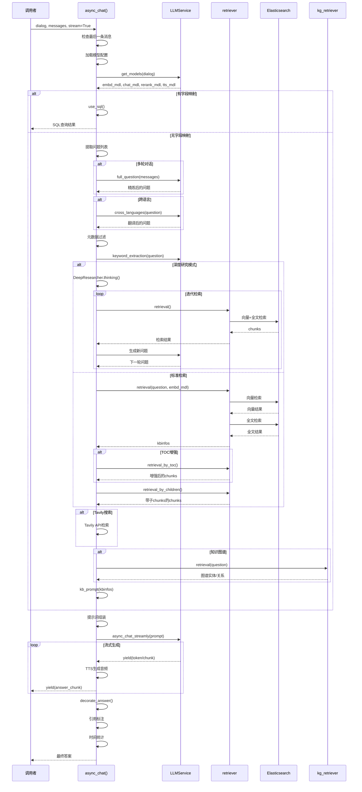

# 对话服务主流程 async_chat() 方法详解

> **文件位置**: [api/db/services/dialog_service.py:281-564](../../../api/db/services/dialog_service.py#L281-L564)
> **方法**: `async_chat(dialog, messages, stream=True, **kwargs)`
> **创建时间**: 2026-01-21

---

## 目录

1. [方法概览](#1-方法概览)
2. [业务逻辑](#2-业务逻辑)
3. [执行流程](#3-执行流程)
4. [核心处理阶段](#4-核心处理阶段)
5. [技术要点](#5-技术要点)
6. [性能监控](#6-性能监控)
7. [相关方法](#7-相关方法)

---

## 1. 方法概览

### 1.1 方法签名

```python
async def async_chat(dialog, messages, stream=True, **kwargs):
    assert messages[-1]["role"] == "user"
    # ... 核心逻辑
```

### 1.2 参数说明

| 参数 | 类型 | 说明 |
|------|------|------|
| `dialog` | `Dialog` | 对话配置对象（包含LLM配置、知识库ID等） |
| `messages` | `list[dict]` | 消息历史（多轮对话） |
| `stream` | `bool` | 是否流式输出（默认True） |
| `**kwargs` | `dict` | 额外参数（如`doc_ids`、`quote`等） |

### 1.3 核心职责

1. **模型加载**: 加载LLM、Embedding、Rerank、TTS模型
2. **模式判断**: SQL检索模式 vs 向量检索模式
3. **问题精炼**: 多轮对话融合、跨语言处理、关键词提取
4. **知识检索**: 向量检索、全文检索、TOC增强、图谱检索
5. **答案生成**: LLM调用与流式输出
6. **引用标注**: 自动插入引用标记
7. **性能监控**: 时间分片统计与日志记录

### 1.4 返回格式

```python
{
    "answer": "这是完整的答案内容",
    "reference": {
        "chunks": [...],  # 检索到的chunk列表
        "doc_aggs": [...]  # 文档聚合信息
    },
    "prompt": "完整的提示词...",
    "created_at": 1234567890.0
}
```

---

## 2. 业务逻辑

### 2.1 整体逻辑结构

```mermaid
flowchart TD
    A[开始: async_chat] --> B{检查最后一条消息}
    B -->|非user| C[断言错误]
    B -->|是user| D{有知识库或Tavily?}

    D -->|否| E[async_chat_solo<br/>无RAG纯对话]
    D -->|是| F[初始化时间戳]

    F --> G[获取LLM模型配置]
    G --> H[初始化Langfuse Tracer]
    H --> I[加载模型<br/>embd_mdl, chat_mdl, rerank_mdl, tts_mdl]
    I --> J[提取问题列表<br/>最近3轮]

    J --> K{有字段映射?}
    K -->|是| L[use_sql<br/>Text2SQL检索]
    K -->|否| M[验证提示词参数]

    L -->|有结果| N[返回SQL结果]
    L -->|无结果| M

    M --> O{多轮对话精炼?}
    O -->|是| P[full_question<br/>融合多轮问题]
    O -->|否| Q[使用最后一条问题]

    P --> R{跨语言处理?}
    Q --> R
    R -->|是| S[cross_languages<br/>翻译问题]
    R -->|否| T[元数据过滤]

    S --> T
    T --> U{关键词提取?}
    U -->|是| V[keyword_extraction<br/>添加关键词]
    U -->|否| W[知识检索阶段]

    V --> W

    W --> X{深度研究模式?}
    X -->|是| Y[DeepResearcher.thinking<br/>多步推理]
    X -->|否| Z[向量检索<br/>retrieval.retrieval]

    Y --> AA[TOC增强<br/>retrieval_by_toc]
    Z --> AA
    AA --> AB[子chunk检索<br/>retrieval_by_children]

    AB --> AC{Tavily搜索?}
    AC -->|是| AD[Tavily API检索]
    AC -->|否| AE{知识图谱?}

    AD --> AE
    AE -->|是| AF[kg_retriever.retrieval<br/>图谱检索]
    AE -->|否| AG[知识组装<br/>kb_prompt]

    AF --> AG

    AG --> AH{有知识?}
    AH -->|否| AI[返回empty_response]
    AH -->|是| AJ[提示词组装<br/>format kwargs]

    AJ --> AK[LLM生成答案]
    AK --> AL{流式输出?}
    AL -->|是| AM[async_chat_streamly<br/>分块yield]
    AL -->|否| AN[async_chat<br/>一次性返回]

    AM --> AO[decorate_answer<br/>引用标注+时间统计]
    AN --> AO
    AO --> AP[返回结果]

    style A fill:#e1f5ff
    style C fill:#ffcdd2
    style E fill:#c8e6c9
    style N fill:#c8e6c9
    style AI fill:#ffcdd2
    style AP fill:#c8e6c9
```



### 2.2 核心业务规则

#### 规则1: 无知识库纯对话模式

```python
if not dialog.kb_ids and not dialog.prompt_config.get("tavily_api_key"):
    async for ans in async_chat_solo(dialog, messages, stream):
        yield ans
    return
```

**触发条件**:
- 没有关联知识库（`kb_ids`为空）
- 没有配置Tavily API

**处理逻辑**:
- 调用`async_chat_solo`（纯LLM对话，无检索）
- 直接返回，不执行后续流程

**适用场景**:
- 通用聊天助手
- 无需知识库的问答

#### 规则2: SQL检索模式优先

```python
field_map = KnowledgebaseService.get_field_map(dialog.kb_ids)
if field_map:
    logging.debug("Use SQL to retrieval:{}".format(questions[-1]))
    ans = await use_sql(questions[-1], field_map, ...)
    if ans:
        yield ans
        return
```

**触发条件**:
- 知识库有字段映射（`field_map`不为空）
- 通常用于结构化数据（如简历解析）

**处理逻辑**:
- 使用LLM生成SQL（Text2SQL）
- 执行SQL查询
- 返回Markdown表格结果

**适用场景**:
- 简历查询
- 结构化文档检索
- 元数据过滤

#### 规则3: 多轮对话问题精炼

```python
if len(questions) > 1 and prompt_config.get("refine_multiturn"):
    questions = [await full_question(dialog.tenant_id, dialog.llm_id, messages)]
else:
    questions = questions[-1:]
```

**示例**:
```python
# 输入messages
[
    {"role": "user", "content": "什么是RAG？"},
    {"role": "assistant", "content": "RAG是检索增强生成..."},
    {"role": "user", "content": "它有什么优势？"}
]

# 原始问题（最近3轮）
questions = ["什么是RAG？", "它有什么优势？"]

# 精炼后
questions = ["RAG技术有哪些优势？"]  # 融合了上下文
```

#### 规则4: 检索模式选择

```python
if prompt_config.get("reasoning", False):
    # 深度研究模式（Agentic RAG）
    reasoner = DeepResearcher(...)
    async for think in reasoner.thinking(...):
        ...
else:
    # 标准检索模式
    kbinfos = retriever.retrieval(...)
    if prompt_config.get("toc_enhance"):
        kbinfos["chunks"] = retriever.retrieval_by_toc(...)
    kbinfos["chunks"] = retriever.retrieval_by_children(kbinfos["chunks"])
```

**模式对比**:

| 模式 | 特点 | 调用条件 |
|------|------|---------|
| **reasoning** | 多步推理、迭代检索 | `prompt_config.reasoning == True` |
| **toc_enhance** | 目录结构增强 | `prompt_config.toc_enhance == True` |
| **标准检索** | 向量+全文混合 | 默认模式 |

---

## 3. 执行流程

### 3.1 完整时序图



### 3.2 时间分片统计

```python
chat_start_ts = timer()  # 记录开始时间

check_llm_ts = timer()  # LLM配置检查完成
check_langfuse_tracer_ts = timer()  # Langfuse初始化完成
bind_models_ts = timer()  # 模型绑定完成
refine_question_ts = timer()  # 问题精炼完成
retrieval_ts = timer()  # 检索完成
finish_chat_ts = timer()  # LLM生成完成
```

**时间统计示例**:
```python
## Time elapsed:
  - Total: 1234.5ms
  - Check LLM: 10.2ms
  - Check Langfuse tracer: 5.1ms
  - Bind models: 100.3ms
  - Query refinement(LLM): 450.6ms
  - Retrieval: 300.2ms
  - Generate answer: 368.1ms
```

---

## 4. 核心处理阶段

### 4.1 阶段1: 模型加载与初始化

```python
# 1. 获取LLM模型配置
if TenantLLMService.llm_id2llm_type(dialog.llm_id) == "image2text":
    llm_model_config = TenantLLMService.get_model_config(dialog.tenant_id, LLMType.IMAGE2TEXT, dialog.llm_id)
else:
    llm_model_config = TenantLLMService.get_model_config(dialog.tenant_id, LLMType.CHAT, dialog.llm_id)

# 2. 获取最大token数
max_tokens = llm_model_config.get("max_tokens", 8192)

# 3. 初始化Langfuse Tracer
langfuse_keys = TenantLangfuseService.filter_by_tenant(tenant_id=dialog.tenant_id)
if langfuse_keys:
    langfuse = Langfuse(public_key=langfuse_keys.public_key, secret_key=langfuse_keys.secret_key)
    if langfuse.auth_check():
        langfuse_tracer = langfuse
        trace_id = langfuse_tracer.create_trace_id()

# 4. 加载所有模型
kbs, embd_mdl, rerank_mdl, chat_mdl, tts_mdl = get_models(dialog)
```

**加载的模型**:
| 模型 | 用途 | 方法 |
|------|------|------|
| `embd_mdl` | 文本向量化 | LLMBundle(LLMType.EMBEDDING) |
| `chat_mdl` | 答案生成 | LLMBundle(LLMType.CHAT) |
| `rerank_mdl` | 精排序 | LLMBundle(LLMType.RERANK) |
| `tts_mdl` | 语音合成 | LLMBundle(LLMType.TTS) |

### 4.2 阶段2: 问题提取与预处理

```python
# 1. 提取最近3轮用户问题
questions = [m["content"] for m in messages if m["role"] == "user"][-3:]

# 2. 提取附件
attachments = kwargs["doc_ids"].split(",") if "doc_ids" in kwargs else []
if "doc_ids" in messages[-1]:
    attachments = messages[-1]["doc_ids"]
if "files" in messages[-1]:
    attachments_ = "\n\n".join(FileService.get_files(messages[-1]["files"]))

# 3. 提取Prompt配置
prompt_config = dialog.prompt_config
field_map = KnowledgebaseService.get_field_map(dialog.kb_ids)

# 4. SQL检索模式判断
if field_map:
    ans = await use_sql(questions[-1], field_map, ...)
    if ans:
        yield ans
        return

# 5. 验证提示词参数
for p in prompt_config["parameters"]:
    if p["key"] == "knowledge":
        continue
    if p["key"] not in kwargs and not p["optional"]:
        raise KeyError("Miss parameter: " + p["key"])
```

**Prompt参数示例**:
```python
prompt_config["parameters"] = [
    {"key": "knowledge", "optional": False},
    {"key": "language", "optional": False},
    {"key": "timezone", "optional": True}
]
```

### 4.3 阶段3: 问题精炼

```python
# 1. 多轮对话融合
if len(questions) > 1 and prompt_config.get("refine_multiturn"):
    questions = [await full_question(dialog.tenant_id, dialog.llm_id, messages)]
else:
    questions = questions[-1:]

# 2. 跨语言处理
if prompt_config.get("cross_languages"):
    questions = [await cross_languages(dialog.tenant_id, dialog.llm_id, questions[0], prompt_config["cross_languages"])]

# 3. 元数据过滤
if dialog.meta_data_filter:
    metas = DocumentService.get_meta_by_kbs(dialog.kb_ids)
    attachments = await apply_meta_data_filter(
        dialog.meta_data_filter,
        metas,
        questions[-1],
        chat_mdl,
        attachments,
    )

# 4. 关键词提取
if prompt_config.get("keyword", False):
    questions[-1] += await keyword_extraction(chat_mdl, questions[-1])
```

**精炼流程**:
```
原始问题（多轮）
    ↓
full_question() → 融合上下文
    ↓
cross_languages() → 翻译（如需要）
    ↓
keyword_extraction() → 添加关键词
    ↓
最终问题
```

### 4.4 阶段4: 知识检索

```python
thought = ""
kbinfos = {"total": 0, "chunks": [], "doc_aggs": []}
knowledges = []

if attachments is not None and "knowledge" in [p["key"] for p in prompt_config["parameters"]]:
    tenant_ids = list(set([kb.tenant_id for kb in kbs]))

    # 深度研究模式
    if prompt_config.get("reasoning", False):
        reasoner = DeepResearcher(
            chat_mdl,
            prompt_config,
            partial(retriever.retrieval, ...),
        )
        async for think in reasoner.thinking(kbinfos, attachments_ + " ".join(questions)):
            if isinstance(think, str):
                thought = think
                knowledges = [t for t in think.split("\n") if t]
            elif stream:
                yield think

    # 标准检索模式
    else:
        # 1. 向量+全文混合检索
        if embd_mdl:
            kbinfos = retriever.retrieval(
                " ".join(questions),
                embd_mdl,
                tenant_ids,
                dialog.kb_ids,
                1,  # page
                dialog.top_n,
                dialog.similarity_threshold,
                dialog.vector_similarity_weight,
                doc_ids=attachments,
                top=dialog.top_k,
                aggs=False,
                rerank_mdl=rerank_mdl,
                rank_feature=label_question(" ".join(questions), kbs),
            )

        # 2. TOC增强检索
        if prompt_config.get("toc_enhance"):
            cks = retriever.retrieval_by_toc(" ".join(questions), kbinfos["chunks"], tenant_ids, chat_mdl, dialog.top_n)
            if cks:
                kbinfos["chunks"] = cks

        # 3. 子chunk检索
        kbinfos["chunks"] = retriever.retrieval_by_children(kbinfos["chunks"], tenant_ids)

    # Tavily搜索
    if prompt_config.get("tavily_api_key"):
        tav = Tavily(prompt_config["tavily_api_key"])
        tav_res = tav.retrieve_chunks(" ".join(questions))
        kbinfos["chunks"].extend(tav_res["chunks"])
        kbinfos["doc_aggs"].extend(tav_res["doc_aggs"])

    # 知识图谱检索
    if prompt_config.get("use_kg"):
        ck = settings.kg_retriever.retrieval(" ".join(questions), tenant_ids, dialog.kb_ids, embd_mdl, LLMBundle(dialog.tenant_id, LLMType.CHAT))
        if ck["content_with_weight"]:
            kbinfos["chunks"].insert(0, ck)

    # 知识组装
    knowledges = kb_prompt(kbinfos, max_tokens)
```

**检索方法调用顺序**:

| 序号 | 方法 | 目的 | 调用条件 |
|------|------|------|---------|
| 1 | `retrieval()` | 向量+全文混合检索 | 有embd_mdl |
| 2 | `retrieval_by_toc()` | TOC增强检索 | toc_enhance=True |
| 3 | `retrieval_by_children()` | 子chunk检索 | 总是调用 |
| 4 | `Tavily.retrieve_chunks()` | 网络搜索 | 有tavily_api_key |
| 5 | `kg_retriever.retrieval()` | 知识图谱检索 | use_kg=True |
| 6 | `kb_prompt()` | 知识组装 | 总是调用 |

### 4.5 阶段5: 提示词组装

```python
# 1. 组装知识内容
kwargs["knowledge"] = "\n------\n" + "\n\n------\n\n".join(knowledges)

# 2. 组装系统提示词
msg = [{"role": "system", "content": prompt_config["system"].format(**kwargs)+attachments_}]

# 3. 组装引用提示词
prompt4citation = ""
if knowledges and (prompt_config.get("quote", True) and kwargs.get("quote", True)):
    prompt4citation = citation_prompt()

# 4. 组装历史消息
msg.extend([{"role": m["role"], "content": re.sub(r"##\d+\$\$", "", m["content"])} for m in messages if m["role"] != "system"])

# 5. Token数量控制
used_token_count, msg = message_fit_in(msg, int(max_tokens * 0.95))
assert len(msg) >= 2

# 6. 提取最终提示词
prompt = msg[0]["content"]

# 7. 动态调整max_tokens
if "max_tokens" in gen_conf:
    gen_conf["max_tokens"] = min(gen_conf["max_tokens"], max_tokens - used_token_count)
```

**提示词结构**:
```python
system_prompt = """
{system_prompt_template}

{knowledge}

{attachments}
"""

messages = [
    {"role": "system", "content": system_prompt},
    {"role": "user", "content": "第1轮问题"},
    {"role": "assistant", "content": "第1轮答案"},
    {"role": "user", "content": "当前问题"}
]
```

### 4.6 阶段6: LLM答案生成

```python
# 初始化Langfuse生成追踪
if langfuse_tracer:
    langfuse_generation = langfuse_tracer.start_generation(
        trace_context=trace_context,
        name="chat",
        model=llm_model_config["llm_name"],
        input={"prompt": prompt, "prompt4citation": prompt4citation, "messages": msg}
    )

# 流式输出
if stream:
    last_ans = ""
    answer = ""
    async for ans in chat_mdl.async_chat_streamly(prompt + prompt4citation, msg[1:], gen_conf):
        # 处理思维链
        if thought:
            ans = re.sub(r"^.*?<thought>", "", ans, flags=re.DOTALL)
        answer = ans

        # 提取增量
        delta_ans = ans[len(last_ans):]
        if num_tokens_from_string(delta_ans) < 16:
            continue  # 累积到16个token再发送
        last_ans = answer

        # TTS生成音频
        yield {"answer": thought + answer, "reference": {}, "audio_binary": tts(tts_mdl, delta_ans)}

    # 发送剩余部分
    delta_ans = answer[len(last_ans):]
    if delta_ans:
        yield {"answer": thought + answer, "reference": {}, "audio_binary": tts(tts_mdl, delta_ans)}

    # 装饰答案（引用标注+时间统计）
    yield decorate_answer(thought + answer)

# 非流式输出
else:
    answer = await chat_mdl.async_chat(prompt + prompt4citation, msg[1:], gen_conf)
    res = decorate_answer(answer)
    res["audio_binary"] = tts(tts_mdl, answer)
    yield res
```

---

## 5. 技术要点

### 5.1 异步生成器模式

```python
async def async_chat(dialog, messages, stream=True, **kwargs):
    # 处理逻辑...

    if stream:
        async for ans in chat_mdl.async_chat_streamly(...):
            yield {"answer": ans, "reference": {}}
        yield decorate_answer(ans)
    else:
        ans = await chat_mdl.async_chat(...)
        yield decorate_answer(ans)
```

**特点**:
- `async def`: 异步函数
- `yield`: 生成器输出
- 按需生成，惰性求值

**调用链**:
```
async_chat() 生成器
    ↓
async for ans in chat_mdl.async_chat_streamly()
    ↓
yield {"answer": ans, ...}
    ↓
调用方接收并处理
```

### 5.2 多轮对话上下文处理

```python
# 提取最近3轮用户问题
questions = [m["content"] for m in messages if m["role"] == "user"][-3:]

# 示例
messages = [
    {"role": "user", "content": "Q1"},
    {"role": "assistant", "content": "A1"},
    {"role": "user", "content": "Q2"},
    {"role": "assistant", "content": "A2"},
    {"role": "user", "content": "Q3"}
]

questions = ["Q1", "Q2", "Q3"]  # 取最近3轮
```

**精炼**:
```python
if len(questions) > 1 and prompt_config.get("refine_multiturn"):
    questions = [await full_question(dialog.tenant_id, dialog.llm_id, messages)]
    # ["Q1, Q2, Q3的精炼版本"]
else:
    questions = questions[-1:]  # 只取最后一条
    # ["Q3"]
```

### 5.3 检索策略组合

```python
# 1. 基础检索
kbinfos = retriever.retrieval(
    " ".join(questions),
    embd_mdl,
    tenant_ids,
    dialog.kb_ids,
    page=1,
    page_size=dialog.top_n,
    similarity_threshold=dialog.similarity_threshold,
    vector_similarity_weight=dialog.vector_similarity_weight,
    doc_ids=attachments,
    top=dialog.top_k,
    rerank_mdl=rerank_mdl,
    rank_feature=label_question(" ".join(questions), kbs),
)

# 2. TOC增强
if prompt_config.get("toc_enhance"):
    kbinfos["chunks"] = retriever.retrieval_by_toc(
        " ".join(questions),
        kbinfos["chunks"],
        tenant_ids,
        chat_mdl,
        dialog.top_n
    )

# 3. 子chunk检索
kbinfos["chunks"] = retriever.retrieval_by_children(kbinfos["chunks"], tenant_ids)
```

**检索流程**:
```
原始问题
    ↓
retrieval() → 基础检索chunks
    ↓
retrieval_by_toc() → TOC增强（可选）
    ↓
retrieval_by_children() → 带子chunks
    ↓
最终chunks
```

### 5.4 引用标注机制

```python
def decorate_answer(answer):
    # 1. 提取思维链
    ans = answer.split("<thought>")
    think = ""
    if len(ans) == 2:
        think = ans[0] + "<thought>"
        answer = ans[1]

    # 2. 自动插入引用
    if knowledges and (prompt_config.get("quote", True) and kwargs.get("quote", True)):
        idx = set([])
        if embd_mdl and not re.search(r"\[ID:([0-9]+)\]", answer):
            # 自动插入
            answer, idx = retriever.insert_citations(
                answer,
                [ck["content_ltks"] for ck in kbinfos["chunks"]],
                [ck["vector"] for ck in kbinfos["chunks"]],
                embd_mdl,
                tkweight=1 - dialog.vector_similarity_weight,
                vtweight=dialog.vector_similarity_weight,
            )
        else:
            # 提取手动引用
            for match in re.finditer(r"\[ID:([0-9]+)\]", answer):
                i = int(match.group(1))
                if i < len(kbinfos["chunks"]):
                    idx.add(i)

        # 3. 修复引用格式
        answer, idx = repair_bad_citation_formats(answer, kbinfos, idx)

        # 4. 聚合文档来源
        idx = set([kbinfos["chunks"][int(i)]["doc_id"] for i in idx])
        recall_docs = [d for d in kbinfos["doc_aggs"] if d["doc_id"] in idx]
        kbinfos["doc_aggs"] = recall_docs
```

**引用格式**:
- `[ID:1]` - 手动引用
- `##1$$` - 自动插入的引用标记
- 自动插入基于向量相似度匹配

### 5.5 Token数量控制

```python
# 1. 获取模型最大token数
max_tokens = llm_model_config.get("max_tokens", 8192)

# 2. 消息适配（保留95%给生成）
used_token_count, msg = message_fit_in(msg, int(max_tokens * 0.95))

# 3. 动态调整生成token数
if "max_tokens" in gen_conf:
    gen_conf["max_tokens"] = min(gen_conf["max_tokens"], max_tokens - used_token_count)
```

**分配策略**:
```
总token数: max_tokens (e.g., 8192)
    ↓
提示词: 5% (约410 tokens)
    ↓
答案生成: 95% (约7782 tokens)
```

---

## 6. 性能监控

### 6.1 时间分片统计

```python
# 记录各阶段时间戳
chat_start_ts = timer()
check_llm_ts = timer()
check_langfuse_tracer_ts = timer()
bind_models_ts = timer()
refine_question_ts = timer()
retrieval_ts = timer()
finish_chat_ts = timer()

# 计算时间差
total_time_cost = (finish_chat_ts - chat_start_ts) * 1000
check_llm_time_cost = (check_llm_ts - chat_start_ts) * 1000
check_langfuse_tracer_cost = (check_langfuse_tracer_ts - check_llm_ts) * 1000
bind_embedding_time_cost = (bind_models_ts - check_langfuse_tracer_ts) * 1000
refine_question_time_cost = (refine_question_ts - bind_models_ts) * 1000
retrieval_time_cost = (retrieval_ts - refine_question_ts) * 1000
generate_result_time_cost = (finish_chat_ts - retrieval_ts) * 1000
```

### 6.2 统计输出示例

```python
## Time elapsed:
  - Total: 1234.5ms
  - Check LLM: 10.2ms
  - Check Langfuse tracer: 5.1ms
  - Bind models: 100.3ms
  - Query refinement(LLM): 450.6ms
  - Retrieval: 300.2ms
  - Generate answer: 368.1ms

## Token usage:
  - Generated tokens(approximately): 512
  - Token speed: 23/s
```

### 6.3 Langfuse集成

```python
# 1. 初始化Tracer
langfuse_tracer = langfuse.start_generation(
    trace_context=trace_context,
    name="chat",
    model=llm_model_config["llm_name"],
    input={"prompt": prompt, "prompt4citation": prompt4citation, "messages": msg}
)

# 2. 结束追踪
langfuse_generation.update(output=langfuse_output)
langfuse_generation.end()
```

---

## 7. 相关方法

### 7.1 get_models()

**位置**: [dialog_service.py:219-241](../../../api/db/services/dialog_service.py#L219-L241)

**功能**: 加载所有需要的模型

```python
def get_models(dialog):
    embd_mdl, chat_mdl, rerank_mdl, tts_mdl = None, None, None, None
    kbs = KnowledgebaseService.get_by_ids(dialog.kb_ids)

    # 加载Embedding模型
    embedding_list = list(set([kb.embd_id for kb in kbs]))
    if embedding_list:
        embd_mdl = LLMBundle(dialog.tenant_id, LLMType.EMBEDDING, embedding_list[0])

    # 加载Chat模型
    chat_mdl = LLMBundle(dialog.tenant_id, LLMType.CHAT, dialog.llm_id)

    # 加载Rerank模型
    if dialog.rerank_id:
        rerank_mdl = LLMBundle(dialog.tenant_id, LLMType.RERANK, dialog.rerank_id)

    # 加载TTS模型
    if dialog.prompt_config.get("tts"):
        tts_mdl = LLMBundle(dialog.tenant_id, LLMType.TTS)

    return kbs, embd_mdl, rerank_mdl, chat_mdl, tts_mdl
```

### 7.2 retrieval()

**位置**: [rag/nlp/search.py](../../../rag/nlp/search.py)

**功能**: 向量+全文混合检索

**调用**:
```python
kbinfos = retriever.retrieval(
    " ".join(questions),
    embd_mdl,
    tenant_ids,
    dialog.kb_ids,
    1,
    dialog.top_n,
    dialog.similarity_threshold,
    dialog.vector_similarity_weight,
    doc_ids=attachments,
    top=dialog.top_k,
    rerank_mdl=rerank_mdl,
    rank_feature=label_question(" ".join(questions), kbs),
)
```

### 7.3 kb_prompt()

**位置**: `rag/prompts/generator.py`

**功能**: 知识组装与格式化

**调用**:
```python
knowledges = kb_prompt(kbinfos, max_tokens)
```

---

## 8. 总结

### 8.1 核心要点

1. **模型加载**: 一次性加载LLM、Embedding、Rerank、TTS模型
2. **模式判断**: SQL检索 vs 标准检索 vs 深度研究模式
3. **问题精炼**: 多轮融合、跨语言、关键词提取
4. **多源检索**: 向量、全文、TOC、图谱、网络搜索
5. **知识组装**: 格式化检索结果为上下文
6. **答案生成**: LLM调用与流式输出
7. **引用标注**: 自动插入引用标记
8. **性能监控**: 详细的时间分片统计

### 8.2 设计优点

- ✅ **模块化**: 各阶段职责清晰，易于扩展
- ✅ **灵活性**: 支持多种检索模式组合
- ✅ **可观测**: 完善的时间统计和日志
- ✅ **健壮性**: 空响应处理、错误降级
- ✅ **性能优化**: 并发加载模型、批量检索

### 8.3 关键流程

```
问题输入
    ↓
问题精炼（多轮/跨语言/关键词）
    ↓
多源检索（向量/全文/TOC/图谱）
    ↓
知识组装
    ↓
LLM生成（流式/非流式）
    ↓
引用标注
    ↓
时间统计
    ↓
答案输出
```

### 8.4 相关文档

- [701-查询流程任务分解.md](701-查询流程任务分解.md) - 任务分解
- [702-API层completion方法分析.md](702-API层completion方法分析.md) - API入口
- [704-问题精炼与多轮对话融合.md](704-问题精炼与多轮对话融合.md) - 待创建
- [705-知识检索流程详解.md](705-知识检索流程详解.md) - 待创建
