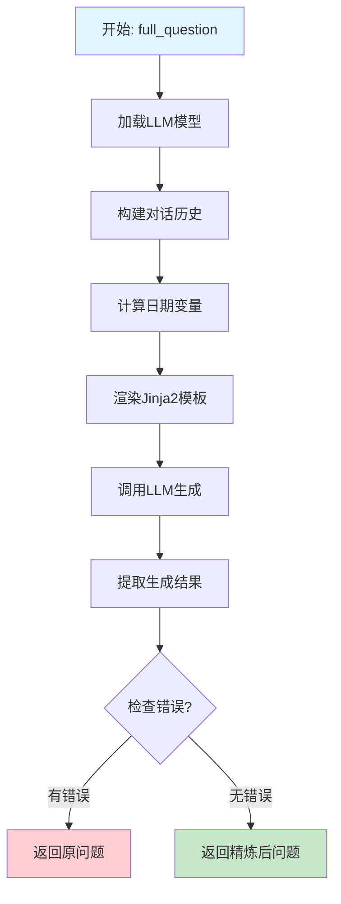

# 问题精炼与多轮对话融合详解

> **文件位置**: [rag/prompts/generator.py:203-234](../../../rag/prompts/generator.py#L203-L234)
> **方法**: `full_question()`, `message_fit_in()`, `cross_languages()`
> **调用位置**: [api/db/services/dialog_service.py:344](../../../api/db/services/dialog_service.py#L344)
> **创建时间**: 2026-01-21

---

## 目录

1. [方法概览](#1-方法概览)
2. [业务逻辑](#2-业务逻辑)
3. [核心方法详解](#3-核心方法详解)
4. [提示词模板](#4-提示词模板)
5. [执行示例](#5-执行示例)
6. [技术要点](#6-技术要点)

---

## 1. 方法概览

### 1.1 相关方法列表

| 方法 | 位置 | 说明 |
|------|------|------|
| `full_question()` | [rag/prompts/generator.py:203](../../../rag/prompts/generator.py#L203-L234) | 多轮对话问题融合 |
| `message_fit_in()` | [rag/prompts/generator.py:61](../../../rag/prompts/generator.py#L61-L95) | Token数量控制 |
| `cross_languages()` | [rag/prompts/generator.py:237](../../../rag/prompts/generator.py#L237-L254) | 跨语言处理 |
| `keyword_extraction()` | (未展示) | 关键词提取 |

### 1.2 核心职责

1. **上下文融合**: 将多轮对话融合为一个完整的问题
2. **相对时间转换**: 将"昨天"、"明天"转换为具体日期
3. **语言一致性**: 保持问题语言与原始问题一致
4. **Token控制**: 裁剪消息历史以适应模型限制
5. **跨语言支持**: 翻译多语言问题

### 1.3 调用上下文

```python
# dialog_service.py:344
if len(questions) > 1 and prompt_config.get("refine_multiturn"):
    questions = [await full_question(dialog.tenant_id, dialog.llm_id, messages)]
else:
    questions = questions[-1:]
```

**触发条件**:
- 多轮对话（`len(questions) > 1`）
- 启用多轮精炼（`prompt_config.refine_multiturn == True`）

---

## 2. 业务逻辑

### 2.1 整体逻辑结构



### 2.2 核心业务规则

#### 规则1: 多轮对话提取

```python
conv = []
for m in messages:
    if m["role"] not in ["user", "assistant"]:
        continue
    conv.append("{}: {}".format(m["role"].upper(), m["content"]))
conversation = "\n".join(conv)
```

**过滤逻辑**:
- 只保留 `user` 和 `assistant` 消息
- 忽略 `system` 消息
- 格式化为 `ROLE: content` 格式

**示例**:
```python
# 输入
messages = [
    {"role": "system", "content": "你是一个助手"},
    {"role": "user", "content": "什么是RAG？"},
    {"role": "assistant", "content": "RAG是检索增强生成..."},
    {"role": "user", "content": "它有什么优势？"}
]

# 输出
conversation = """USER: 什么是RAG？
ASSISTANT: RAG是检索增强生成...
USER: 它有什么优势？"""
```

#### 规则2: 相对日期转换

```python
today = datetime.date.today().isoformat()
yesterday = (datetime.date.today() - datetime.timedelta(days=1)).isoformat()
tomorrow = (datetime.date.today() + datetime.timedelta(days=1)).isoformat()
```

**转换示例**:
```
输入: "yesterday"
输出: "2025-01-20"  # 假设今天是2025-01-21

输入: "tomorrow"
输出: "2025-01-22"
```

**作用**:
- 将相对日期转换为绝对日期
- 便于知识库精确检索
- 避免歧义

#### 规则3: 语言一致性

```python
# 从原始问题中检测语言
# 生成的问题必须使用相同语言

- Text generated MUST be in {{ language }}.

- Text generated MUST be in the same language as the original user's question.

```

**示例**:
```
原始问题: "What's the weather tomorrow?"
生成问题: "What's the weather on 2025-01-22?"  # 保持英文

原始问题: "明天天气怎么样？"
生成问题: "2025-01-22的天气怎么样？"  # 保持中文
```

#### 规则4: 完整问题检测

**模板要求**:
```
- If the user's latest question is already complete, don't do anything — just return the original question.
- DON'T generate anything except a refined question.
```

**逻辑**:
- LLM判断最后一条问题是否完整
- 如果完整，直接返回原始问题
- 如果不完整（如"And his mother?"），生成完整问题

---

## 3. 核心方法详解

### 3.1 full_question() - 多轮对话融合

```python
async def full_question(tenant_id=None, llm_id=None, messages=[], language=None, chat_mdl=None):
    # 1. 加载LLM模型
    if not chat_mdl:
        if TenantLLMService.llm_id2llm_type(llm_id) == "image2text":
            chat_mdl = LLMBundle(tenant_id, LLMType.IMAGE2TEXT, llm_id)
        else:
            chat_mdl = LLMBundle(tenant_id, LLMType.CHAT, llm_id)

    # 2. 构建对话历史
    conv = []
    for m in messages:
        if m["role"] not in ["user", "assistant"]:
            continue
        conv.append("{}: {}".format(m["role"].upper(), m["content"]))
    conversation = "\n".join(conv)

    # 3. 计算日期变量
    today = datetime.date.today().isoformat()
    yesterday = (datetime.date.today() - datetime.timedelta(days=1)).isoformat()
    tomorrow = (datetime.date.today() + datetime.timedelta(days=1)).isoformat()

    # 4. 渲染Jinja2模板
    template = PROMPT_JINJA_ENV.from_string(FULL_QUESTION_PROMPT_TEMPLATE)
    rendered_prompt = template.render(
        today=today,
        yesterday=yesterday,
        tomorrow=tomorrow,
        conversation=conversation,
        language=language,
    )

    # 5. 调用LLM生成
    ans = await chat_mdl.async_chat(
        rendered_prompt,
        [{"role": "user", "content": "Output: "}]
    )

    # 6. 提取生成结果
    ans = re.sub(r"^.*?<thought>", "", ans, flags=re.DOTALL)

    # 7. 错误处理
    return ans if ans.find("**ERROR**") < 0 else messages[-1]["content"]
```

### 3.2 message_fit_in() - Token数量控制

```python
def message_fit_in(msg, max_length=4000):
    """
    确保消息历史不超过max_length限制

    逻辑:
    1. 计算当前token总数
    2. 如果小于限制，直接返回
    3. 优先保留system消息
    4. 如果还不够，截断最后一条消息
    """

    def count():
        tks_cnts = []
        for m in msg:
            tks_cnts.append({
                "role": m["role"],
                "count": num_tokens_from_string(m["content"])
            })
        total = sum(m["count"] for m in tks_cnts)
        return total

    c = count()
    if c < max_length:
        return c, msg

    # 只保留system消息和最后一条消息
    msg_ = [m for m in msg if m["role"] == "system"]
    if len(msg) > 1:
        msg_.append(msg[-1])
    msg = msg_
    c = count()
    if c < max_length:
        return c, msg

    # 截断较长的消息
    ll = num_tokens_from_string(msg_[0]["content"])
    ll2 = num_tokens_from_string(msg_[-1]["content"])
    if ll / (ll + ll2) > 0.8:
        # 截断system消息
        m = msg_[0]["content"]
        m = encoder.decode(encoder.encode(m))[: max_length - ll2]
        msg[0]["content"] = m
        return max_length, msg
    else:
        # 截断用户消息
        m = msg_[-1]["content"]
        m = encoder.decode(encoder.encode(m))[: max_length - ll]
        msg[-1]["content"] = m
        return max_length, msg
```

**截断策略**:

| Token占比 | 截断对象 | 原因 |
|----------|---------|------|
| system > 80% | system消息 | system相对固定，截断影响小 |
| system ≤ 80% | user消息 | 保留更多上下文 |

### 3.3 cross_languages() - 跨语言处理

```python
async def cross_languages(tenant_id, llm_id, query, languages=[]):
    # 1. 加载LLM模型
    chat_mdl = LLMBundle(tenant_id, LLMType.CHAT, llm_id)

    # 2. 渲染提示词
    rendered_sys_prompt = PROMPT_JINJA_ENV.from_string(
        CROSS_LANGUAGES_SYS_PROMPT_TEMPLATE
    ).render()
    rendered_user_prompt = PROMPT_JINJA_ENV.from_string(
        CROSS_LANGUAGES_USER_PROMPT_TEMPLATE
    ).render(query=query, languages=languages)

    # 3. 调用LLM翻译
    ans = await chat_mdl.async_chat(
        rendered_sys_prompt,
        [{"role": "user", "content": rendered_user_prompt}],
        {"temperature": 0.2}  # 低温度，保证翻译准确性
    )

    # 4. 提取翻译结果
    ans = re.sub(r"^.*?<thought>", "", ans, flags=re.DOTALL)

    # 5. 错误处理
    if ans.find("**ERROR**") >= 0:
        return query  # 翻译失败，返回原问题

    # 6. 解析翻译结果
    return "\n".join([
        a for a in re.sub(
            r"(^Output:|\n+)", "", ans, flags=re.DOTALL
        ).split("===")
        if a.strip()
    ])
```

**翻译策略**:
- 低温度（0.2）保证翻译准确性
- 翻译失败时返回原问题
- 支持多目标语言

---

## 4. 提示词模板

### 4.1 full_question_prompt.md 模板

```markdown
## Role
A helpful assistant.

## Task & Steps
1. Generate a full user question that would follow the conversation.
2. If the user's question involves relative dates, convert them into absolute dates based on today ({{ today }}).
   - "yesterday" = {{ yesterday }}, "tomorrow" = {{ tomorrow }}

## Requirements & Restrictions
- If the user's latest question is already complete, don't do anything — just return the original question.
- DON'T generate anything except a refined question.

- Text generated MUST be in {{ language }}.

- Text generated MUST be in the same language as the original user's question.


---

## Examples

### Example 1
**Conversation:**
USER: What is the name of Donald Trump's father?
ASSISTANT: Fred Trump.
USER: And his mother?

**Output:** What's the name of Donald Trump's mother?

---

### Example 2
**Conversation:**
USER: What is the name of Donald Trump's father?
ASSISTANT: Fred Trump.
USER: And his mother?
ASSISTANT: Mary Trump.
USER: What's her full name?

**Output:** What's the full name of Donald Trump's mother Mary Trump?

---

### Example 3
**Conversation:**
USER: What's the weather today in London?
ASSISTANT: Cloudy.
USER: What's about tomorrow in Rochester?

**Output:** What's the weather in Rochester on {{ tomorrow }}?

---

## Real Data

**Conversation:**

{{ conversation }}

Output:
```

**关键要素**:
1. **角色定义**: "A helpful assistant"
2. **任务**: 生成完整的用户问题
3. **日期转换**: 处理相对日期
4. **语言一致性**: 保持原始语言
5. **完整性检查**: 已经完整就不生成
6. **示例驱动**: 提供多个示例

### 4.2 cross_languages 模板

**系统提示词** (`cross_languages_sys_prompt.md`):
- 定义翻译任务
- 指定目标语言
- 要求准确翻译

**用户提示词** (`cross_languages_user_prompt.md`):
```jinja2
Query: {{ query }}
Languages: {{ languages }}

Please translate the above query into the target languages, and output each translated query on a separate line, starting with "=== {{ language_name }} ===" followed by the translated query.
```

**输出格式**:
```
=== English ===
What's the weather like tomorrow?

=== 中文 ===
明天天气怎么样？

=== 日本語 ===
明日の天気はどうですか？
```

---

## 5. 执行示例

### 5.1 示例1: 简单追问

**输入**:
```python
messages = [
    {"role": "user", "content": "什么是RAG？"},
    {"role": "assistant", "content": "RAG是检索增强生成..."},
    {"role": "user", "content": "它有什么优势？"}
]
```

**执行流程**:

**步骤1**: 构建对话历史
```python
conversation = """USER: 什么是RAG？
ASSISTANT: RAG是检索增强生成...
USER: 它有什么优势？"""
```

**步骤2**: 渲染模板
```python
template.render(
    today="2025-01-21",
    yesterday="2025-01-20",
    tomorrow="2025-01-22",
   conversation=conversation
)
```

**步骤3**: LLM生成
```
System: [提示词模板]
User: Output: [对话历史]

LLM Output:
RAG技术有哪些优势？
```

**步骤4**: 提取结果
```python
questions = ["RAG技术有哪些优势？"]
```

### 5.2 示例2: 相对日期转换

**输入**:
```python
messages = [
    {"role": "user", "content": "今天天气怎么样？"},
    {"role": "assistant", "content": "晴天，温度25度。"},
    {"role": "user", "content": "明天呢？"}
]
today = "2025-01-21"
```

**执行**:

**步骤1**: 提取对话
```
USER: 今天天气怎么样？
ASSISTANT: 晴天，温度25度。
USER: 明天呢？
```

**步骤2**: LLM生成
```
System: [提示词 + today=2025-01-21, tomorrow=2025-01-22]
User: Output: [对话历史]

LLM Output:
2025-01-22的天气怎么样？
```

**结果**:
- "明天" → "2025-01-22" ✅
- 问题更加明确，便于知识库检索

### 5.3 示例3: message_fit_in Token控制

**输入**:
```python
msg = [
    {"role": "system", "content": "你是一个助手，..." * 100},  # 3000 tokens
    {"role": "user", "content": "第1个问题"},  # 10 tokens
    {"role": "assistant", "content": "第1个答案"},  # 20 tokens
    {"role": "user", "content": "第2个问题"}  # 10 tokens
]
max_tokens = 4000
```

**处理流程**:

**第1步**: 计算总数
```
Total = 3000 + 10 + 20 + 10 = 3040 < 4000
→ 无需处理，直接返回
```

**场景2**: 超过限制

**输入**:
```python
msg = [
    {"role": "system", "content": "长文本..." * 800},  # 5000 tokens
    {"role": "user", "content": "问题"}  # 10 tokens
]
max_tokens = 4000
```

**处理**:

```
Total = 5010 > 4000

# 策略1: 只保留system + 最后一条
msg_ = [
    {"role": "system", "content": "...5000 tokens..."},
    {"role": "user", "content": "问题"}
]

# 策略2: 截断system
ll = 5000
ll2 = 10
ll / (ll + ll2) = 5000 / 5010 = 0.998 > 0.8

# 截断system到 3990 tokens
msg[0]["content"] = encoder.decode(encoder.encode(m))[: 4000 - 10]

# 结果
msg = [
    {"role": "system", "content": "...3990 tokens..."},
    {"role": "user", "content": "问题"}
]
Total = 4000 tokens ✅
```

### 5.4 示例4: 跨语言处理

**输入**:
```python
query = "What's RAG?"
languages = ["中文", "日本語"]
```

**执行**:

**步骤1**: 渲染用户提示词
```jinja2
Query: What's RAG?
Languages: ['中文', '日本語']
```

**步骤2**: LLM翻译
```
=== 中文 ===
RAG是什么？

=== 日本語 ===
RAGとは何ですか？
```

**步骤3**: 提取结果
```python
return [
    "RAG是什么？",
    "RAGとは何ですか？"
]
```

**使用场景**:
- 支持多语言知识库
- 用户用一种语言提问，检索多种语言的文档

---

## 6. 技术要点

### 6.1 Jinja2模板引擎

**配置**:
```python
from jinja2 import Environment

PROMPT_JINJA_ENV = Environment(
    loader=load_prompt,
    # 其他配置...
)
```

**模板渲染**:
```python
template = PROMPT_JINJA_ENV.from_string(FULL_QUESTION_PROMPT_TEMPLATE)
rendered_prompt = template.render(
    today=today,
    yesterday=yesterday,
    tomorrow=tomorrow,
    conversation=conversation,
    language=language,
)
```

**优势**:
- 动态变量注入
- 条件渲染（``）
- 循环支持
- 模板复用

### 6.2 思维链提取

```python
ans = re.sub(r"^.*?<thought>", "", ans, flags=re.DOTALL)
```

**作用**:
- 移除LLM生成的思维链标记
- 只保留最终答案
- 避免污染提示词

**示例**:
```
输入:
<thought>Let me analyze...
RAG是检索增强生成技术。

输出:
RAG是检索增强生成技术。
```

### 6.3 错误处理机制

```python
return ans if ans.find("**ERROR**") < 0 else messages[-1]["content"]
```

**错误类型**:
- `**ERROR**` - LLM API错误
- `invalid key` - API Key无效
- `invalid api` - API调用失败

**降级策略**:
- 翻译失败 → 返回原问题
- 精炼失败 → 返回最后一条问题
- 保证系统可用性

### 6.4 日期计算

```python
today = datetime.date.today().isoformat()
yesterday = (datetime.date.today() - datetime.timedelta(days=1)).isoformat()
tomorrow = (datetime.date.today() + datetime.timedelta(days=1)).isoformat()
```

**示例**:
```python
# 假设今天是 2025-01-21
today = "2025-01-21"
yesterday = "2025-01-20"
tomorrow = "2025-01-22"
```

**ISO格式**:
- 格式: `YYYY-MM-DD`
- 时区: 使用系统时区
- 标准: ISO 8601

---

## 7. 调用关系

### 7.1 调用链路

```
async_chat()
    ↓
full_question()
    ├── LLMBundle.load() - 加载模型
    ├── 构建对话历史
    ├── 计算日期变量
    ├── 渲染Jinja2模板
    ├── async_chat() - LLM生成
    ├── 提取结果
    └── 返回精炼后的问题
    ↓
cross_languages()
    ├── 翻译问题
    └── 返回多语言问题
    ↓
keyword_extraction()
    └── 添加关键词
    ↓
retrieval.retrieval()
```

### 7.2 参数传递

```python
# 1. 提取问题列表
questions = [m["content"] for m in messages if m["role"] == "user"][-3:]

# 2. 多轮融合
if len(questions) > 1 and prompt_config.get("refine_multiturn"):
    questions = [await full_question(dialog.tenant_id, dialog.llm_id, messages)]

# 3. 跨语言
if prompt_config.get("cross_languages"):
    questions = [await cross_languages(...)]

# 4. 关键词提取
if prompt_config.get("keyword", False):
    questions[-1] += await keyword_extraction(chat_mdl, questions[-1])
```

---

## 8. 总结

### 8.1 核心要点

1. **上下文融合**: 将多轮对话融合为一个完整问题
2. **日期转换**: 相对日期（昨天/明天）→ 绝对日期
3. **语言一致性**: 保持问题语言与原始问题一致
4. **Token控制**: 截断过长的消息历史
5. **跨语言支持**: 翻译问题为多语言
6. **错误降级**: 失败时返回原问题

### 8.2 设计优点

- ✅ **智能融合**: 理解对话上下文，生成完整问题
- **✅ 日期精确**: 相对日期转绝对日期，提高检索准确度
- ✅ **语言一致**: 保持用户体验的语言
- ✅ **Token优化**: 智能截断，保留重要上下文
- ✅ **多语言**: 支持国际化场景

### 8.3 应用场景

| 场景 | 原始问题 | 精炼后问题 |
|------|---------|-----------|
| 简单追问 | "它有哪些优势？" | "RAG技术有哪些优势？" |
| 相对日期 | "明天天气怎么样？" | "2025-01-22的天气怎么样？" |
| 代词引用 | "他的母亲是谁？" | "Donald Trump的母亲是谁？" |
| 多轮追问 | "它是什么？它怎么工作？" | "RAG是什么？RAG如何工作？" |

### 8.4 性能考虑

**LLM调用开销**:
- 每次精炼需要1次LLM调用
- 建议缓存精炼结果
- 可异步执行，不阻塞主流程

**Token优化**:
- 截断策略保护system消息
- 优先保留最近对话
- 避免丢失关键上下文

---

## 9. 相关文档

- [701-查询流程任务分解.md](701-查询流程任务分解.md) - 任务分解
- [702-API层completion方法分析.md](702-API层completion方法分析.md) - API入口
- [703-对话服务主流程详解.md](703-对话服务主流程详解.md) - 调用方
- [rag/prompts/full_question_prompt.md](../../../rag/prompts/full_question_prompt.md) - 提示词模板
- [rag/prompts/generator.py](../../../rag/prompts/generator.py) - 实现
