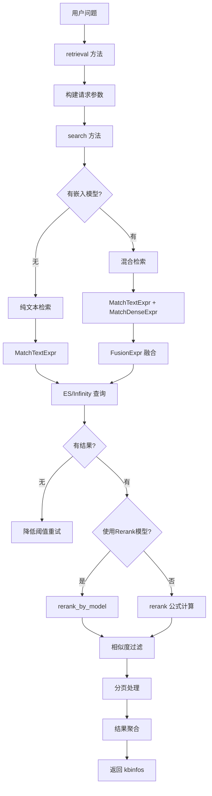
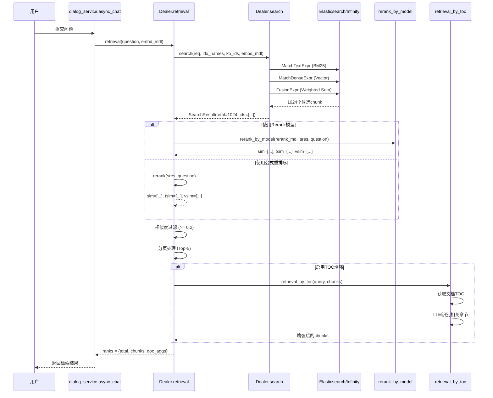

# 知识检索流程详解

> **文件位置**: [rag/nlp/search.py](../../../rag/nlp/search.py)
> **核心方法**: `retrieval()`, `search()`, `retrieval_by_toc()`, `retrieval_by_children()`
> **分析时间**: 2026-01-23

---

## 目录

1. [整体架构](#1-整体架构)
2. [核心检索方法](#2-核心检索方法)
3. [混合检索策略](#3-混合检索策略)
4. [相似度计算](#4-相似度计算)
5. [重排序机制](#5-重排序机制)
6. [TOC增强检索](#6-toc增强检索)
7. [子Chunk聚合](#7-子chunk聚合)
8. [检索结果处理](#8-检索结果处理)
9. [关键配置参数](#9-关键配置参数)
10. [执行流程示例](#10-执行流程示例)

---

## 1. 整体架构

### 1.1 类结构

```python
class Dealer:
    """检索核心类"""

    def __init__(self, dataStore: DocStoreConnection):
        self.qryr = query.FulltextQueryer()  # 全文查询器
        self.dataStore = dataStore            # 文档存储连接

    @dataclass
    class SearchResult:
        """检索结果数据类"""
        total: int                           # 总结果数
        ids: list[str]                       # Chunk ID列表
        query_vector: list[float] | None     # 查询向量
        field: dict | None                   # 字段数据
        highlight: dict | None               # 高亮结果
        aggregation: list | dict | None      # 聚合结果
        keywords: list[str] | None           # 提取的关键词
        group_docs: list[list] | None        # 分组文档
```

### 1.2 检索流程图



---

## 2. 核心检索方法

### 2.1 retrieval() 主检索方法

**文件位置**: [rag/nlp/search.py:360-506](../../../rag/nlp/search.py#L360-L506)

**方法签名**:
```python
def retrieval(
    self,
    question: str,                      # 检索问题
    embd_mdl,                           # 嵌入模型
    tenant_ids: str | list[str],        # 租户ID
    kb_ids: list[str],                  # 知识库ID列表
    page: int,                          # 页码
    page_size: int,                     # 每页大小
    similarity_threshold: float = 0.2,  # 相似度阈值
    vector_similarity_weight: float = 0.3,  # 向量权重
    top: int = 1024,                    # 初始检索数量
    doc_ids: list = None,               # 文档ID过滤
    aggs: bool = True,                  # 是否聚合
    rerank_mdl = None,                  # Rerank模型
    highlight: bool = False,            # 是否高亮
    rank_feature: dict | None = None,   # 排序特征
) -> dict:
```

**执行流程**:

```python
# 1. 构建搜索请求
RERANK_LIMIT = math.ceil(64 / page_size) * page_size  # 确保是page_size的倍数
req = {
    "kb_ids": kb_ids,
    "doc_ids": doc_ids,
    "page": math.ceil(page_size * page / RERANK_LIMIT),
    "size": RERANK_LIMIT,
    "question": question,
    "vector": True,
    "topk": top,
    "similarity": similarity_threshold,
    "available_int": 1,  # 只检索可用chunk
}

# 2. 调用search方法进行初始检索
sres = self.search(req, idx_names, kb_ids, embd_mdl, highlight, rank_feature)

# 3. 重排序
if rerank_mdl and sres.total > 0:
    # 使用模型重排序
    sim, tsim, vsim = self.rerank_by_model(
        rerank_mdl, sres, question,
        1 - vector_similarity_weight,  # tkweight
        vector_similarity_weight,      # vtweight
        rank_feature=rank_feature,
    )
else:
    # 使用公式重排序
    sim, tsim, vsim = self.rerank(
        sres, question,
        1 - vector_similarity_weight,
        vector_similarity_weight,
        rank_feature=rank_feature,
    )

# 4. 相似度过滤和排序
sim_np = np.array(sim, dtype=np.float64)
sorted_idx = np.argsort(sim_np * -1)  # 降序排列
valid_idx = [i for i in sorted_idx if sim_np[i] >= similarity_threshold]

# 5. 分页处理
max_pages = max(RERANK_LIMIT // max(page_size, 1), 1)
page_index = (page - 1) % max_pages
begin = page_index * page_size
end = begin + page_size
page_idx = valid_idx[begin:end]

# 6. 构建返回结果
ranks = {"total": len(valid_idx), "chunks": [], "doc_aggs": {}}
for i in page_idx:
    chunk = sres.field[sres.ids[i]]
    ranks["chunks"].append({
        "chunk_id": sres.ids[i],
        "content_ltks": chunk["content_ltks"],
        "content_with_weight": chunk["content_with_weight"],
        "doc_id": chunk["doc_id"],
        "docnm_kwd": chunk["docnm_kwd"],
        "similarity": float(sim_np[i]),
        "vector_similarity": float(vsim[i]),
        "term_similarity": float(tsim[i]),
        ...
    })

# 7. 文档聚合
if aggs:
    ranks["doc_aggs"] = [聚合后的文档统计]
```

### 2.2 search() 底层搜索方法

**文件位置**: [rag/nlp/search.py:74-170](../../../rag/nlp/search.py#L74-L170)

**核心逻辑**:

```python
def search(self, req, idx_names, kb_ids, embd_mdl=None, highlight=False, rank_feature=None):
    # 1. 构建过滤条件
    filters = self.get_filters(req)  # kb_ids, doc_ids等

    # 2. 获取字段列表
    src = req.get("fields", [
        "docnm_kwd", "content_ltks", "kb_id", "img_id",
        "title_tks", "important_kwd", "position_int",
        "doc_id", "page_num_int", ...
    ])

    # 3. 问题分析
    qst = req.get("question", "")
    if qst:
        matchText, keywords = self.qryr.question(qst, min_match=0.3)

    # 4. 嵌入模型处理
    if emb_mdl is not None:
        # 向量检索
        matchDense = self.get_vector(qst, embd_mdl, topk, similarity)

        # 混合检索融合
        fusionExpr = FusionExpr("weighted_sum", topk, {"weights": "0.05,0.95"})
        matchExprs = [matchText, matchDense, fusionExpr]

        # 执行检索
        res = self.dataStore.search(
            src, highlightFields, filters, matchExprs,
            orderBy, offset, limit, idx_names, kb_ids,
            rank_feature=rank_feature
        )

        # 5. 空结果降级处理
        if total == 0:
            # 尝试降低阈值
            matchText, _ = self.qryr.question(qst, min_match=0.1)
            matchDense.extra_options["similarity"] = 0.17
            res = self.dataStore.search(...)
```

---

## 3. 混合检索策略

### 3.1 融合公式

RAGFlow使用 **加权求和融合 (Weighted Sum Fusion)** 策略:

```python
# 在search方法中
fusionExpr = FusionExpr("weighted_sum", topk, {"weights": "0.05,0.95"})
#                                                  文本检索   向量检索
```

**融合公式**:
```
final_score = 0.05 * text_score + 0.95 * vector_score
```

### 3.2 检索模式对比

| 模式 | 适用场景 | 权重配置 |
|------|---------|----------|
| **纯文本检索** | 无嵌入模型 | BM25分数 |
| **混合检索** | 有嵌入模型 | 5%文本 + 95%向量 |
| **向量检索** | 语义匹配为主 | 100%向量 |

### 3.3 文本检索: BM25变体

**字段权重配置** ([query.py:30-38](../../../rag/nlp/query.py#L30-L38)):

```python
self.query_fields = [
    "title_tks^10",           # 标题权重10
    "title_sm_tks^5",         # 精细分词标题权重5
    "important_kwd^30",       # 重要关键词权重30
    "important_tks^20",       # 重要分词权重20
    "question_tks^20",        # 问题分词权重20
    "content_ltks^2",         # 内容分词权重2
    "content_sm_ltks",        # 精细分词内容权重1
]
```

### 3.4 向量检索: 余弦相似度

```python
def get_vector(self, txt, emb_mdl, topk=10, similarity=0.1):
    qv, _ = emb_mdl.encode_queries(txt)
    embedding_data = [get_float(v) for v in qv]
    vector_column_name = f"q_{len(embedding_data)}_vec"
    return MatchDenseExpr(
        vector_column_name,
        embedding_data,
        'float',
        'cosine',        # 余弦相似度
        topk,
        {"similarity": similarity}
    )
```

---

## 4. 相似度计算

### 4.1 hybrid_similarity() 混合相似度

**文件位置**: [rag/nlp/query.py:220-228](../../../rag/nlp/query.py#L220-L228)

```python
def hybrid_similarity(self, avec, bvecs, atks, btkss, tkweight=0.3, vtweight=0.7):
    """
    计算混合相似度

    Args:
        avec: 查询向量
        bvecs: 候选chunk向量列表
        atks: 查询分词
        btkss: 候选chunk分词列表
        tkweight: 文本权重 (默认0.3)
        vtweight: 向量权重 (默认0.7)
    """
    from sklearn.metrics.pairwise import cosine_similarity

    # 1. 向量相似度 (余弦相似度)
    sims = cosine_similarity([avec], bvecs)  # 返回 [0-1]

    # 2. 分词相似度
    tksim = self.token_similarity(atks, btkss)  # 返回 [0-1]

    # 3. 向量全为0时的降级处理
    if np.sum(sims[0]) == 0:
        return np.array(tksim), tksim, sims[0]

    # 4. 加权融合
    return (
        np.array(sims[0]) * vtweight + np.array(tksim) * tkweight,
        tksim,
        sims[0]
    )
```

**公式**:
```
hybrid_similarity = vector_similarity * vtweight + token_similarity * tkweight
```

### 4.2 token_similarity() 分词相似度

**文件位置**: [rag/nlp/query.py:230-242](../../../rag/nlp/query.py#L230-L242)

```python
def token_similarity(self, atks, btkss):
    """
    基于TF-IDF的分词相似度

    Args:
        atks: 查询分词列表
        btkss: 候选chunk分词列表
    """
    def to_dict(tks):
        d = defaultdict(int)
        wts = self.tw.weights(tks, preprocess=False)  # TF-IDF权重
        for t, c in wts:
            d[t] += c
        return d

    atks = to_dict(atks)
    btkss = [to_dict(tks) for tks in btkss]
    return [self.similarity(atks, btks) for btks in btkss]
```

### 4.3 similarity() 核心相似度算法

**文件位置**: [rag/nlp/query.py:244-256](../../../rag/nlp/query.py#L244-L256)

```python
def similarity(self, qtwt, dtwt):
    """
    计算查询与文档的相似度 (基于TF-IDF)

    Args:
        qtwt: 查询词权重字典 {token: weight}
        dtwt: 文档词权重字典 {token: weight}

    Returns:
        float: 相似度分数 [0-1]
    """
    s = 1e-9  # 分子: 匹配词权重和
    q = 1e-9  # 分母: 查询总权重

    for k, v in qtwt.items():
        if k in dtwt:
            s += v  # 只计算查询中的词
        q += v

    return s / q  # 归一化
```

**公式**:
```
similarity = sum(matching_token_weights) / sum(query_token_weights)
```

---

## 5. 重排序机制

### 5.1 rerank() 公式重排序

**文件位置**: [rag/nlp/search.py:292-329](../../../rag/nlp/search.py#L292-L329)

```python
def rerank(self, sres, query, tkweight=0.3, vtweight=0.7,
           cfield="content_ltks", rank_feature=None):
    """使用混合相似度公式进行重排序"""

    # 1. 提取向量
    vector_column = f"q_{len(sres.query_vector)}_vec"
    ins_embd = [sres.field[id].get(vector_column, zero_vector) for id in sres.ids]

    # 2. 构建增强分词 (加入title/important/question的权重)
    ins_tw = []
    for id in sres.ids:
        content_ltks = sres.field[id][cfield].split()
        title_tks = sres.field[id].get("title_tks", "").split()
        question_tks = sres.field[id].get("question_tks", "").split()
        important_kwd = sres.field[id].get("important_kwd", [])

        # 权重叠加: title*2 + important*5 + question*6
        tks = content_ltks + title_tks * 2 + important_kwd * 5 + question_tks * 6
        ins_tw.append(tks)

    # 3. 计算Rank Feature分数 (标签匹配+PageRank)
    rank_fea = self._rank_feature_scores(rank_feature, sres)

    # 4. 混合相似度计算
    sim, tksim, vtsim = self.qryr.hybrid_similarity(
        sres.query_vector, ins_embd,
        keywords, ins_tw,
        tkweight, vtweight
    )

    # 5. 最终分数 = 混合相似度 + Rank特征
    return sim + rank_fea, tksim, vtsim
```

### 5.2 rerank_by_model() 模型重排序

**文件位置**: [rag/nlp/search.py:331-352](../../../rag/nlp/search.py#L331-L352)

```python
def rerank_by_model(self, rerank_mdl, sres, query, tkweight=0.3,
                    vtweight=0.7, cfield="content_ltks", rank_feature=None):
    """使用Rerank模型进行重排序 (如BGE-Reranker, Cohere Rerank)"""

    # 1. 构建文本输入
    ins_tw = []
    for id in sres.ids:
        content_ltks = sres.field[id][cfield].split()
        title_tks = [t for t in sres.field[id].get("title_tks", "").split() if t]
        important_kwd = sres.field[id].get("important_kwd", [])
        tks = content_ltks + title_tks + important_kwd
        ins_tw.append(tks)

    # 2. 分词相似度
    tksim = self.qryr.token_similarity(keywords, ins_tw)

    # 3. Rerank模型相似度
    vtsim, _ = rerank_mdl.similarity(
        query,
        [remove_redundant_spaces(" ".join(tks)) for tks in ins_tw]
    )

    # 4. Rank特征分数
    rank_fea = self._rank_feature_scores(rank_feature, sres)

    # 5. 加权融合
    return tkweight * np.array(tksim) + vtweight * vtsim + rank_fea, tksim, vtsim
```

### 5.3 _rank_feature_scores() 标签特征分数

**文件位置**: [rag/nlp/search.py:265-290](../../../rag/nlp/search.py#L265-L290)

```python
def _rank_feature_scores(self, query_rfea, search_res):
    """
    计算Rank Feature分数 (标签匹配 + PageRank)

    Args:
        query_rfea: 查询标签特征 {tag: weight}
        search_res: 检索结果
    """
    rank_fea = []
    pageranks = []

    # 1. 提取PageRank分数
    for chunk_id in search_res.ids:
        pageranks.append(search_res.field[chunk_id].get(PAGERANK_FLD, 0))
    pageranks = np.array(pageranks, dtype=float)

    # 2. 无查询标签时，直接返回PageRank
    if not query_rfea:
        return np.array([0 for _ in range(len(search_res.ids))]) + pageranks

    # 3. 计算标签匹配分数 (余弦相似度)
    q_denor = np.sqrt(np.sum([s*s for t,s in query_rfea.items() if t != PAGERANK_FLD]))
    for i in search_res.ids:
        chunk_tags = eval(search_res.field[i].get(TAG_FLD, "{}"))
        nor, denor = 0, 0
        for t, sc in chunk_tags.items():
            if t in query_rfea:
                nor += query_rfea[t] * sc
            denor += sc * sc
        if denor == 0:
            rank_fea.append(0)
        else:
            rank_fea.append(nor/np.sqrt(denor)/q_denor)

    return np.array(rank_fea) * 10. + pageranks  # 标签分数*10 + PageRank
```

---

## 6. TOC增强检索

### 6.1 retrieval_by_toc() 方法

**文件位置**: [rag/nlp/search.py:587-645](../../../rag/nlp/search.py#L587-L645)

**核心思想**: 利用文档目录结构(TOC)来增强检索的相关性

```python
def retrieval_by_toc(self, query: str, chunks: list[dict],
                     tenant_ids: list[str], chat_mdl, topn: int = 6):
    """
    基于目录结构的增强检索

    流程:
    1. 找到最相关的文档
    2. 获取该文档的TOC
    3. 使用LLM找到与query相关的TOC章节
    4. 增强相关章节的chunk分数
    5. 补充TOC指向的chunk
    """

    # 1. 找到最相关的文档 (按相似度累加)
    ranks, doc_id2kb_id = {}, {}
    for ck in chunks:
        doc_id = ck["doc_id"]
        ranks[doc_id] = ranks.get(doc_id, 0) + ck["similarity"]
        doc_id2kb_id[doc_id] = ck["kb_id"]

    doc_id = sorted(ranks.items(), key=lambda x: x[1] * -1)[0][0]

    # 2. 获取文档的TOC
    es_res = self.dataStore.search(
        ["content_with_weight"],
        {"doc_id": doc_id, "toc_kwd": "toc"},  # 过滤TOC类型chunk
        [], OrderByExpr(), 0, 128, idx_nms, kb_ids
    )

    # 解析TOC JSON
    toc = []
    for _, doc in dict_chunks.items():
        try:
            toc.extend(json.loads(doc["content_with_weight"]))
        except:
            pass

    if not toc:
        return chunks  # 无TOC，返回原结果

    # 3. 使用LLM找到相关TOC章节
    ids = asyncio.run(relevant_chunks_with_toc(query, toc, chat_mdl, topn * 2))
    """
    relevant_chunks_with_toc 调用LLM:
    - 输入: query + toc_json
    - 输出: 相关章节及分数
    - 过滤: score >= 0.3 的章节
    """

    # 4. 更新已有chunk的分数
    id2idx = {ck["chunk_id"]: i for i, ck in enumerate(chunks)}
    for cid, sim in ids:
        if cid in id2idx:
            # 已存在: 增加相似度
            chunks[id2idx[cid]]["similarity"] += sim
            continue

        # 5. 补充TOC指向的新chunk
        chunk = self.dataStore.get(cid, idx_nms, kb_ids)
        d = {
            "chunk_id": cid,
            "content_ltks": chunk["content_ltks"],
            "similarity": sim,  # 使用LLM给出的分数
            ...
        }
        chunks.append(d)

    # 6. 重新排序并返回Top-N
    return sorted(chunks, key=lambda x: x["similarity"] * -1)[:topn]
```

### 6.2 relevant_chunks_with_toc() LLM相关章节识别

**文件位置**: [rag/prompts/generator.py:801-823](../../../rag/prompts/generator.py#L801-L823)

```python
async def relevant_chunks_with_toc(query: str, toc: list[dict], chat_mdl, topn: int = 6):
    """
    使用LLM找到与query相关的TOC章节
    """
    # 1. 调用LLM
    ans = await gen_json(
        TOC_RELEVANCE_SYSTEM,  # 系统提示词
        TOC_RELEVANCE_USER.render(query=query, toc_json=...),  # 用户提示词
        chat_mdl,
        gen_conf={"temperature": 0.0, "top_p": 0.9}
    )

    # 2. 聚合相同chunk的分数
    id2score = {}
    for ti, sc in zip(toc, ans):
        if sc.get("score", -1) < 1:
            continue
        for id in ti.get("ids", []):
            if id not in id2score:
                id2score[id] = []
            id2score[id].append(sc["score"] / 5.)  # 归一化

    # 3. 计算平均分数
    for id in id2score.keys():
        id2score[id] = np.mean(id2score[id])

    # 4. 过滤并返回Top-N
    return [(id, sc) for id, sc in id2score.items() if sc >= 0.3][:topn]
```

---

## 7. 子Chunk聚合

### 7.1 retrieval_by_children() 方法

**文件位置**: [rag/nlp/search.py:647-693](../../../rag/nlp/search.py#L647-L693)

**核心思想**: 将子chunk聚合回父chunk，提供更大的上下文

```python
def retrieval_by_children(self, chunks: list[dict], tenant_ids: list[str]):
    """
    将子chunk聚合为父chunk

    场景:
    - 文档被切分为多个子chunk
    - 检索时返回多个相关的子chunk
    - 如果这些子chunk属于同一父chunk，则聚合返回父chunk
    """

    # 1. 按父chunk分组 (通过mom_id字段)
    mom_chunks = defaultdict(list)
    i = 0
    while i < len(chunks):
        ck = chunks[i]
        mom_id = ck.get("mom_id")  # 父chunk ID

        if not isinstance(mom_id, str) or not mom_id.strip():
            i += 1
            continue

        # 将子chunk从原列表移除，加入分组
        mom_chunks[ck["mom_id"]].append(chunks.pop(i))

    if not mom_chunks:
        return chunks  # 无子chunk，返回原结果

    # 2. 获取父chunk内容
    for id, cks in mom_chunks.items():
        chunk = self.dataStore.get(id, idx_nms, [ck["kb_id"] for ck in cks])

        # 3. 聚合子chunk信息
        d = {
            "chunk_id": id,
            # 合并子chunk的内容
            "content_ltks": " ".join([ck["content_ltks"] for ck in cks]),
            "content_with_weight": chunk["content_with_weight"],
            "doc_id": chunk["doc_id"],
            "docnm_kwd": chunk.get("docnm_kwd", ""),
            "kb_id": chunk["kb_id"],
            # 合并重要关键词
            "important_kwd": [kwd for ck in cks for kwd in ck.get("important_kwd", [])],
            "image_id": chunk.get("img_id", ""),
            # 平均相似度
            "similarity": np.mean([ck["similarity"] for ck in cks]),
            "vector_similarity": np.mean([ck["similarity"] for ck in cks]),
            "term_similarity": np.mean([ck["similarity"] for ck in cks]),
            "vector": cks[0][vector_column],
            "positions": chunk.get("position_int", []),
        }
        chunks.append(d)

    # 4. 按相似度重新排序
    return sorted(chunks, key=lambda x: x["similarity"] * -1)
```

### 7.2 聚合示意图

```
原始检索结果:
┌─────────────────────────────────────────┐
│ Chunk 1.1 (similarity: 0.85, mom_id: p1)│
│ Chunk 1.2 (similarity: 0.82, mom_id: p1)│
│ Chunk 2.1 (similarity: 0.78, mom_id: p2)│
│ Chunk 3   (similarity: 0.75, mom_id: "")│ <- 无父chunk
└─────────────────────────────────────────┘

聚合后:
┌─────────────────────────────────────────┐
│ Parent Chunk 1 (similarity: 0.835)      │ <- 聚合 1.1 + 1.2
│   ├─ content: 合并1.1和1.2的内容         │
│   └─ important_kwd: 合并所有关键词       │
│                                         │
│ Parent Chunk 2 (similarity: 0.78)      │ <- 聚合 2.1
│                                         │
│ Chunk 3 (similarity: 0.75)             │ <- 保持不变
└─────────────────────────────────────────┘
```

---

## 8. 检索结果处理

### 8.1 结果数据结构

```python
ranks = {
    "total": int,           # 符合阈值条件的chunk总数
    "chunks": [
        {
            "chunk_id": str,              # Chunk唯一标识
            "content_ltks": str,          # 分词后的内容
            "content_with_weight": str,   # 带权重标记的内容
            "doc_id": str,                # 文档ID
            "docnm_kwd": str,             # 文档名称
            "kb_id": str,                 # 知识库ID
            "important_kwd": list,        # 重要关键词列表
            "image_id": str,              # 关联图片ID
            "similarity": float,          # 综合相似度 [0-1]
            "vector_similarity": float,   # 向量相似度 [0-1]
            "term_similarity": float,     # 文本相似度 [0-1]
            "vector": list[float],        # 向量表示
            "positions": list,            # 在文档中的位置
            "doc_type_kwd": str,          # 文档类型
            "mom_id": str,                # 父chunk ID
            "highlight": str,             # 高亮内容 (可选)
        }
    ],
    "doc_aggs": [
        {
            "doc_name": str,      # 文档名称
            "doc_id": str,        # 文档ID
            "count": int,         # 该文档被引用的次数
        }
    ]
}
```

### 8.2 文档聚合逻辑

```python
# 按文档聚合统计
for i in valid_idx:
    id = sres.ids[i]
    chunk = sres.field[id]
    dnm = chunk.get("docnm_kwd", "")
    did = chunk.get("doc_id", "")

    if dnm not in ranks["doc_aggs"]:
        ranks["doc_aggs"][dnm] = {"doc_id": did, "count": 0}
    ranks["doc_aggs"][dnm]["count"] += 1

# 按引用次数排序
ranks["doc_aggs"] = [
    {"doc_name": k, "doc_id": v["doc_id"], "count": v["count"]}
    for k, v in sorted(ranks["doc_aggs"].items(), key=lambda x: x[1]["count"] * -1)
]
```

---

## 9. 关键配置参数

### 9.1 Dialog检索参数

| 参数 | 类型 | 默认值 | 说明 |
|------|------|--------|------|
| `similarity_threshold` | float | 0.2 | 相似度阈值，低于此值的结果被过滤 |
| `vector_similarity_weight` | float | 0.3 | 向量相似度权重 (0-1) |
| `top_n` | int | 10 | 每个知识库检索的chunk数 |
| `top_k` | int | 5 | 最终返回的chunk数 |
| `keyword_weight` | float | 0.7 | 关键词权重 (1 - vector_similarity_weight) |

### 9.2 Fusion检索参数

| 参数 | 默认值 | 说明 |
|------|--------|------|
| `text_weight` | 0.05 | 文本检索权重 |
| `vector_weight` | 0.95 | 向量检索权重 |
| `initial_topk` | 1024 | 初始检索数量 |

### 9.3 字段权重配置

| 字段 | 权重 | 说明 |
|------|------|------|
| `important_kwd` | 30 | 重要关键词 |
| `question_tks` | 20 | 问题分词 |
| `important_tks` | 20 | 重要分词 |
| `title_tks` | 10 | 标题分词 |
| `title_sm_tks` | 5 | 精细分词标题 |
| `content_ltks` | 2 | 内容分词 |
| `content_sm_ltks` | 1 | 精细分词内容 |

---

## 10. 执行流程示例

### 10.1 示例场景

```
用户问题: "RAGFlow的检索流程是怎样的？"
知识库: kb_123
租户: tenant_456
```

### 10.2 执行步骤

```python
# Step 1: 构建检索请求
req = {
    "kb_ids": ["kb_123"],
    "question": "RAGFlow的检索流程是怎样的？",
    "topk": 1024,
    "similarity": 0.2,
    "page": 1,
    "size": 64,  # RERANK_LIMIT
}

# Step 2: 问题分析 (FulltextQueryer.question)
matchText, keywords = qryr.question(
    "RAGFlow的检索流程是怎样的？",
    min_match=0.3
)
# keywords: ["RAGFlow", "检索", "流程"]
# matchText: MatchTextExpr with boosted fields

# Step 3: 向量编码
qv, _ = embd_mdl.encode_queries("RAGFlow的检索流程是怎样的？")
# qv: [0.123, -0.456, ..., 0.789] (1024维向量)

# Step 4: 混合检索
fusionExpr = FusionExpr("weighted_sum", 1024, {"weights": "0.05,0.95"})
matchExprs = [matchText, matchDense, fusionExpr]
res = dataStore.search(..., matchExprs, ...)
# 返回1024个候选chunk

# Step 5: 重排序 (假设使用rerank_mdl)
sim, tsim, vsim = rerank_by_model(
    rerank_mdl, sres,
    "RAGFlow的检索流程是怎样的？",
    tkweight=0.7,  # 1 - vector_similarity_weight
    vtweight=0.3,  # vector_similarity_weight
)
# sim: [0.85, 0.82, 0.78, 0.75, ..., 0.12] (1024个分数)

# Step 6: 相似度过滤
valid_idx = [i for i, s in enumerate(sim) if s >= 0.2]
# 保留50个符合条件的chunk

# Step 7: 分页 (假设page=1, page_size=5)
page_idx = valid_idx[0:5]  # 前5个

# Step 8: 构建返回结果
ranks = {
    "total": 50,
    "chunks": [
        {
            "chunk_id": "chunk_001",
            "content_ltks": "RAGFlow 使用 混合 检索 策略 ...",
            "similarity": 0.85,
            "vector_similarity": 0.88,
            "term_similarity": 0.83,
            ...
        },
        ...
    ],
    "doc_aggs": [
        {"doc_name": "RAGFlow技术文档.md", "doc_id": "doc_001", "count": 3},
        {"doc_name": "RAG检索原理.pdf", "doc_id": "doc_002", "count": 2},
    ]
}
```

### 10.3 流程时序图



---

## 总结

### 核心特性

1. **混合检索**: 结合BM25文本检索和向量语义检索
2. **灵活重排序**: 支持公式重排序和模型重排序
3. **多维相似度**: 综合考虑向量、分词、标签、PageRank等多个维度
4. **智能降级**: 检索无结果时自动降低阈值重试
5. **TOC增强**: 利用文档目录结构提升相关性
6. **子Chunk聚合**: 自动聚合相关子chunk为父chunk

### 关键算法

| 算法 | 公式 | 作用 |
|------|------|------|
| **Fusion** | `0.05*text + 0.95*vector` | 混合检索融合 |
| **Hybrid Similarity** | `vtweight*vec_sim + tkweight*token_sim` | 混合相似度 |
| **Token Similarity** | `sum(match_weights) / sum(query_weights)` | 分词相似度 |
| **Rank Feature** | `10*tag_sim + pagerank` | 标签特征分数 |

### 性能优化点

1. **RERANK_LIMIT**: 限制重排序数量为64的倍数
2. **向量缓存**: 查询向量复用，避免重复编码
3. **分页优化**: 支持大结果集的虚拟分页
4. **字段裁剪**: 只检索必要字段，减少网络传输
