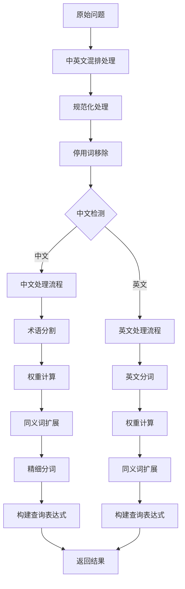

# 问题分析与查询构建方法详解

> **文件位置**: [rag/nlp/query.py](../../../rag/nlp/query.py)
> **核心类**: `FulltextQueryer`
> **核心方法**: `question()`
> **分析时间**: 2026-01-31

---

## 目录

1. [整体架构](#1-整体架构)
2. [核心初始化](#2-核心初始化)
3. [问题分析流程](#3-问题分析流程)
4. [多语言处理策略](#4-多语言处理策略)
5. [查询构建机制](#5-查询构建机制)
6. [关键词提取与扩展](#6-关键词提取与扩展)
7. [查询权重优化](#7-查询权重优化)
8. [特殊字符处理](#8-特殊字符处理)
9. [执行流程示例](#9-执行流程示例)
10. [关键技术点总结](#10-关键技术点总结)

---

## 1. 整体架构

### 1.1 类结构

```python
class FulltextQueryer:
    """全文查询器类"""

    def __init__(self):
        self.tw = term_weight.Dealer()       # 术语权重计算
        self.syn = synonym.Dealer()         # 同义词处理
        self.query_fields = [              # 查询字段权重配置
            "title_tks^10",                # 标题分词，权重10
            "title_sm_tks^5",              # 精细分词标题，权重5
            "important_kwd^30",            # 重要关键词，权重30
            "important_tks^20",            # 重要分词，权重20
            "question_tks^20",             # 问题分词，权重20
            "content_ltks^2",              # 内容分词，权重2
            "content_sm_ltks",             # 精细分词内容，权重1
        ]
```

### 1.2 核心组件

| 组件 | 作用 |
|------|------|
| `term_weight.Dealer` | 计算词汇权重，基于TF-IDF等算法 |
| `synonym.Dealer` | 同义词查找与替换 |
| `rag_tokenizer` | 中文分词与处理工具 |

---

## 2. 核心初始化

### 2.1 查询字段权重配置

**文件位置**: [rag/nlp/query.py:30-38](../../../rag/nlp/query.py#L30-L38)

```python
self.query_fields = [
    "title_tks^10",           # 标题分词，权重最高（10）
    "title_sm_tks^5",         # 精细分词标题，权重5
    "important_kwd^30",       # 重要关键词，权重最高（30）- 文档级关键词
    "important_tks^20",       # 重要分词，权重20 - 段落级关键词
    "question_tks^20",        # 问题分词，权重20 - 问题对应的chunk
    "content_ltks^2",         # 内容分词，权重2 - 普通内容
    "content_sm_ltks",        # 精细分词内容，权重1 - 精细分词内容
]
```

**设计理念**: 重要性越高的字段权重越大，提升检索的准确性。

---

## 3. 问题分析流程

### 3.1 主方法签名

**文件位置**: [rag/nlp/query.py:85-218](../../../rag/nlp/query.py#L85-L218)

```python
def question(self, txt, tbl="qa", min_match: float = 0.6):
    """
    问题分析与查询构建方法

    Args:
        txt: 原始问题文本
        tbl: 表格类型（默认qa）
        min_match: 最小匹配比例（默认0.6）

    Returns:
        MatchTextExpr: 匹配表达式
        keywords: 提取的关键词列表
    """
```

### 3.2 执行流程



---

## 4. 多语言处理策略

### 4.1 中文检测方法

**文件位置**: [rag/nlp/query.py:44-53](../../../rag/nlp/query.py#L44-L53)

```python
@staticmethod
def is_chinese(line):
    arr = re.split(r"[ \t]+", line)
    if len(arr) <= 3:
        return True
    e = 0
    for t in arr:
        if not re.match(r"[a-zA-Z]+$", t):
            e += 1
    return e * 1.0 / len(arr) >= 0.7
```

**判断逻辑**:
- 长度 <= 3 → 中文
- 非纯英文单词比例 >= 70% → 中文
- 其他情况 → 英文

### 4.2 中英文混排处理

**文件位置**: [rag/nlp/query.py:75-83](../../../rag/nlp/query.py#L75-L83)

```python
@staticmethod
def add_space_between_eng_zh(txt):
    # 英文/英文+数字 + 中文
    txt = re.sub(r'([A-Za-z]+[0-9]+)([\u4e00-\u9fa5]+)', r'\1 \2', txt)
    txt = re.sub(r'([A-Za-z])([\u4e00-\u9fa5]+)', r'\1 \2', txt)

    # 中文 + 英文/英文+数字
    txt = re.sub(r'([\u4e00-\u9fa5]+)([A-Za-z]+[0-9]+)', r'\1 \2', txt)
    txt = re.sub(r'([\u4e00-\u9fa5]+)([A-Za-z])', r'\1 \2', txt)

    return txt
```

**处理示例**:
- 输入: "RAGFlow的检索流程"
- 输出: "RAGFlow 的 检索流程"

---

## 5. 查询构建机制

### 5.1 问题规范化

**文件位置**: [rag/nlp/query.py:88-94](../../../rag/nlp/query.py#L88-L94)

```python
txt = FulltextQueryer.add_space_between_eng_zh(txt)
txt = re.sub(
    r"[ :|\r\n\t,，。？?/`!！&^%%()\[\]{}<>]+",
    " ",
    rag_tokenizer.tradi2simp(rag_tokenizer.strQ2B(txt.lower())),
).strip()
```

**处理步骤**:
1. 中英文混排处理
2. 规范化字符（全角转半角，繁体转简体）
3. 统一分隔符
4. 转小写处理

### 5.2 停用词移除

**文件位置**: [rag/nlp/query.py:56-72](../../../rag/nlp/query.py#L56-L72)

```python
@staticmethod
def rmWWW(txt):
    patts = [
        # 中文停用词
        (r"是*(怎么办|什么样的|哪家|一下|那家|请问|啥样|咋样了|什么时候|何时|何地|何人|是否|是不是|多少|哪里|怎么|哪儿|怎么样|如何|哪些|是啥|啥是|啊|吗|呢|吧|咋|什么|有没有|呀|谁|哪位|哪个)是*", ""),

        # 英文停用词（疑问词）
        (r"(^| )(what|who|how|which|where|why)('re|'s)? ", " "),

        # 英文停用词（常用词）
        (r"(^| )('s|'re|is|are|were|was|do|does|did|don't|doesn't|didn't|has|have|be|there|you|me|your|my|mine|just|please|may|i|should|would|wouldn't|will|won't|done|go|for|with|so|the|a|an|by|i'm|it's|he's|she's|they|they're|you're|as|by|on|in|at|up|out|down|of|to|or|and|if) ", " ")
    ]
```

**处理示例**:
- 输入: "请问RAGFlow的检索流程是怎样的？"
- 输出: "RAGFlow检索流程"

---

## 6. 关键词提取与扩展

### 6.1 中文处理流程

**文件位置**: [rag/nlp/query.py:134-217](../../../rag/nlp/query.py#L134-L217)

```python
# 1. 术语分割
for tt in self.tw.split(txt)[:256]:
    if not tt:
        continue
    keywords.append(tt)

    # 2. 权重计算
    twts = self.tw.weights([tt])

    # 3. 同义词扩展
    syns = self.syn.lookup(tt)
    if syns and len(keywords) < 32:
        keywords.extend(syns)

    # 4. 精细分词
    for tk, w in sorted(twts, key=lambda x: x[1] * -1):
        sm = rag_tokenizer.fine_grained_tokenize(tk).split() if need_fine_grained_tokenize(tk) else []
        sm = [re.sub(r"[ ,\./;'\[\]\\`~!@#$%\^&\*\(\)=\+_<>\?:\"\{\}\|，。；‘’【】、！￥……（）——《》？：“”-]+", "", m) for m in sm]
        sm = [FulltextQueryer.sub_special_char(m) for m in sm if len(m) > 1]

        # 5. 关键词收集
        if len(keywords) < 32:
            keywords.append(re.sub(r"[ \\\"']+", "", tk))
            keywords.extend(sm)

        # 6. 同义词再扩展
        tk_syns = self.syn.lookup(tk)
        tk_syns = [FulltextQueryer.sub_special_char(s) for s in tk_syns]
        if len(keywords) < 32:
            keywords.extend([s for s in tk_syns if s])
```

### 6.2 英文处理流程

**文件位置**: [rag/nlp/query.py:96-132](../../../rag/nlp/query.py#L96-L132)

```python
# 1. 分词
tks = rag_tokenizer.tokenize(txt).split()
keywords = [t for t in tks if t]

# 2. 权重计算
tks_w = self.tw.weights(tks, preprocess=False)
tks_w = [(re.sub(r"[ \\\"'^]", "", tk), w) for tk, w in tks_w]
tks_w = [(re.sub(r"^[a-z0-9]$", "", tk), w) for tk, w in tks_w if tk]
tks_w = [(re.sub(r"^[\+-]", "", tk), w) for tk, w in tks_w if tk]
tks_w = [(tk.strip(), w) for tk, w in tks_w if tk.strip()]

# 3. 同义词扩展
syns = []
for tk, w in tks_w[:256]:
    syn = self.syn.lookup(tk)
    syn = rag_tokenizer.tokenize(" ".join(syn)).split()
    keywords.extend(syn)
    syn = ["\"{}\"^{:.4f}".format(s, w / 4.) for s in syn if s.strip()]
    syns.append(" ".join(syn))

# 4. 构建查询
q = ["({}^{:.4f}".format(tk, w) + " {})".format(syn) for (tk, w), syn in zip(tks_w, syns) if tk and not re.match(r"[.^+\(\)-]", tk)]

# 5. 短语查询
for i in range(1, len(tks_w)):
    left, right = tks_w[i - 1][0].strip(), tks_w[i][0].strip()
    if not left or not right:
        continue
    q.append(
        '"%s %s"^%.4f'
        % (
            tks_w[i - 1][0],
            tks_w[i][0],
            max(tks_w[i - 1][1], tks_w[i][1]) * 2,
        )
    )
```

---

## 7. 查询权重优化

### 7.1 权重计算方法

**文件位置**: [term_weight.Dealer](../../../rag/nlp/term_weight.py)

```python
# 基于TF-IDF的权重计算
def weights(self, terms, preprocess=True):
    """
    计算术语权重

    Args:
        terms: 术语列表
        preprocess: 是否预处理

    Returns:
        [(term, weight), ...]: 带权重的术语列表
    """
```

### 7.2 查询表达式构建

**文件位置**: [rag/nlp/query.py:194-217](../../../rag/nlp/query.py#L194-L217)

```python
# 中文查询构建
tms = " ".join([f"({t})^{w}" for t, w in tms])
if len(twts) > 1:
    tms += ' ("%s"~2)^1.5' % rag_tokenizer.tokenize(tt)

syns = " OR ".join([
    '"%s"'
    % rag_tokenizer.tokenize(FulltextQueryer.sub_special_char(s))
    for s in syns
])

if syns and tms:
    tms = f"({tms})^5 OR ({syns})^0.7"
qs.append(tms)

# 英文查询构建
q = ["({}^{:.4f}".format(tk, w) + " {})".format(syn) for (tk, w), syn in zip(tks_w, syns) if tk and not re.match(r"[.^+\(\)-]", tk)]
for i in range(1, len(tks_w)):
    q.append('"%s %s"^%.4f' % (tks_w[i - 1][0], tks_w[i][0], max(tks_w[i - 1][1], tks_w[i][1]) * 2))
```

### 7.3 权重配置

| 类型 | 权重 | 说明 |
|------|------|------|
| 原始术语 | 原始权重 | 主要查询项 |
| 同义词 | 0.7 | 同义词权重较低 |
| 短语查询 | max(w1, w2) * 2 | 短语权重加倍 |
| 精细分词 | 0.5 | 精细分词权重减半 |

---

## 8. 特殊字符处理

### 8.1 特殊字符转义

**文件位置**: [rag/nlp/query.py:41-42](../../../rag/nlp/query.py#L41-L42)

```python
@staticmethod
def sub_special_char(line):
    return re.sub(r"([:\{\}/\[\]\-\*\"\(\)\|\+~\^])", r"\\\1", line).strip()
```

**转义字符列表**: `: {} / [] - * " () | + ~ ^`

### 8.2 精细分词判断

**文件位置**: [rag/nlp/query.py:134-139](../../../rag/nlp/query.py#L134-L139)

```python
def need_fine_grained_tokenize(tk):
    if len(tk) < 3:
        return False
    if re.match(r"[0-9a-z\.\+#_\*-]+$", tk):
        return False
    return True
```

**判断逻辑**:
- 长度 < 3 → 不精细分词
- 纯数字/字母/特定符号组合 → 不精细分词
- 其他情况 → 需要精细分词

---

## 9. 执行流程示例

### 9.1 中文问题示例

```python
# 输入问题
question = "RAGFlow的检索流程是怎样的？"

# Step 1: 预处理
txt = FulltextQueryer.add_space_between_eng_zh(question)
# 输出: "RAGFlow 的 检索流程是怎样的？"

txt = re.sub(r"[ :|\r\n\t,，。？?/`!！&^%%()\[\]{}<>]+", " ",
             rag_tokenizer.tradi2simp(rag_tokenizer.strQ2B(txt.lower()))).strip()
# 输出: "ragflow 的 检索流程是怎样的"

txt = FulltextQueryer.rmWWW(txt)
# 输出: "ragflow 检索流程"

# Step 2: 中文检测
is_chinese = FulltextQueryer.is_chinese(txt)  # 返回 True

# Step 3: 术语分割
tt_list = self.tw.split(txt)
# 输出: ["ragflow", "检索流程"]

# Step 4: 权重计算
for tt in tt_list:
    twts = self.tw.weights([tt])
    # 假设返回: [("ragflow", 0.8), ("检索流程", 0.9)]

    # Step 5: 同义词扩展
    syns = self.syn.lookup(tt)
    # 假设返回: ["检索过程", "搜索流程"]

    # Step 6: 精细分词
    for tk, w in sorted(twts, key=lambda x: x[1] * -1):
        if need_fine_grained_tokenize(tk):
            sm = rag_tokenizer.fine_grained_tokenize(tk).split()
            # 假设返回: ["检索", "流程"]

# Step 7: 构建查询表达式
query = '(ragflow^0.8 (检索过程^0.14 搜索流程^0.14)) OR (检索流程^0.9 (检索^0.25 流程^0.25))'

# Step 8: 返回结果
return MatchTextExpr(
    self.query_fields,
    query,
    100,
    {"minimum_should_match": 0.6, "original_query": question}
), ["ragflow", "检索流程", "检索过程", "搜索流程", "检索", "流程"]
```

### 9.2 英文问题示例

```python
# 输入问题
question = "How does RAGFlow's retrieval process work?"

# 处理后得到:
# 查询: '(ragflow^0.75) (retrieval^0.85) (process^0.8) (work^0.7) "retrieval process"^1.7'
# 关键词: ["ragflow", "retrieval", "process", "work"]
```

---

## 10. 关键技术点总结

### 10.1 核心算法

| 算法 | 作用 | 实现位置 |
|------|------|----------|
| **中英文检测** | 判断文本语言类型 | [query.py:44-53](../../../rag/nlp/query.py#L44-L53) |
| **停用词移除** | 移除无意义词汇 | [query.py:56-72](../../../rag/nlp/query.py#L56-L72) |
| **术语分割** | 分割问题为术语 | [term_weight.py]() |
| **权重计算** | 计算术语重要性 | [term_weight.py]() |
| **同义词扩展** | 扩展查询词汇 | [synonym.py]() |
| **精细分词** | 对长术语进行细分 | [rag_tokenizer.fine_grained_tokenize]() |

### 10.2 设计亮点

1. **多语言支持**: 自动检测中英文，采用不同处理策略
2. **权重优化**: 基于字段重要性和术语权重的查询构建
3. **同义词扩展**: 提高检索召回率
4. **精细分词**: 处理长术语，提升匹配精度
5. **停用词移除**: 减少噪声干扰
6. **特殊字符处理**: 确保查询语法正确性

### 10.3 性能优化

```python
# 限制处理数量
for tt in self.tw.split(txt)[:256]:  # 最多处理256个术语
    ...

# 关键词数量控制
if len(keywords) < 32:  # 最多32个关键词
    keywords.extend(sm)
```

### 10.4 质量控制

```python
# 最小匹配比例
{"minimum_should_match": min_match}  # 默认0.6

# 结果过滤
if not query:
    query = otxt  # 保证至少有一个查询项
```

---

## 总结

### 核心功能

`FulltextQueryer.question()` 方法是 RAGFlow 系统中问题分析和查询构建的核心组件，负责将用户的自然语言问题转化为高效的 Elasticsearch 查询表达式。其主要功能包括：

1. **问题预处理**: 规范化、停用词移除、特殊字符处理
2. **多语言检测**: 自动识别中英文，采用不同处理策略
3. **术语提取**: 分割问题为有意义的术语
4. **权重计算**: 计算术语重要性，优化查询权重
5. **同义词扩展**: 提高检索召回率
6. **查询构建**: 生成复杂的查询表达式，包含字段权重、短语查询等

### 应用场景

该方法广泛应用于 RAGFlow 的各个检索场景：

1. **知识库问答**: 处理用户问题，检索相关文档
2. **语义搜索**: 构建语义查询，提升搜索准确性
3. **文档检索**: 处理各种类型的查询，返回相关文档
4. **问答系统**: 作为问答流程的第一步，为后续处理提供基础

### 技术价值

该方法体现了以下技术价值：

1. **专业性**: 针对中文处理特点，优化了分词、权重计算等
2. **高效性**: 限制处理数量，提高响应速度
3. **准确性**: 多维度优化查询，提升检索准确性
4. **可扩展性**: 模块化设计，便于添加新的处理策略

### 优化建议

1. **权重配置优化**: 可以根据实际场景动态调整字段权重
2. **同义词库更新**: 定期更新同义词库，提升扩展质量
3. **处理策略扩展**: 添加对其他语言（如日文、韩文）的支持
4. **性能优化**: 优化分词和权重计算算法，提升处理速度

---

**文件位置**: [rag/nlp/query.py](../../../rag/nlp/query.py)
**相关文件**: [rag/nlp/term_weight.py](../../../rag/nlp/term_weight.py), [rag/nlp/synonym.py](../../../rag/nlp/synonym.py), [rag/nlp/rag_tokenizer.py](../../../rag/nlp/rag_tokenizer.py)
